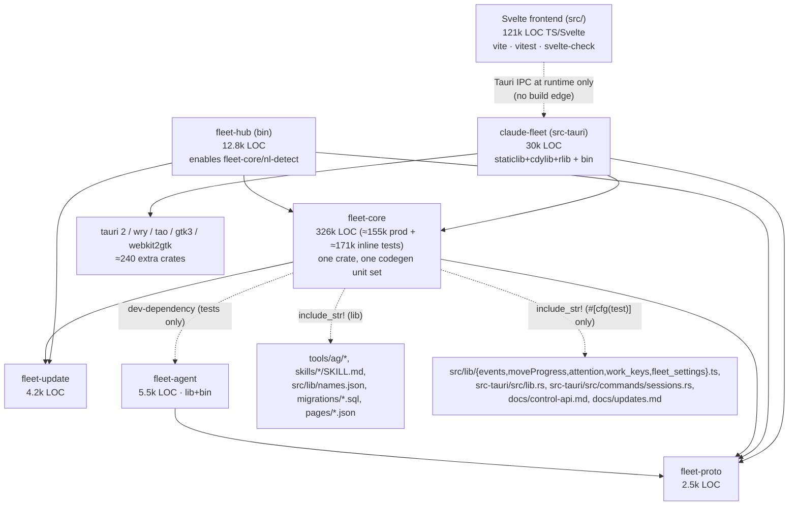

# Cloud Fleet — Rust Build Performance Audit

*Audit date 2026-10-02 · commit `eff5e21` (main) · measured on a 4 vCPU / 15 GB
Firecracker VM (Ubuntu 24.04, rustc 1.97.0, LLD 22) · no project file was
changed; this report is the only addition.*

This is a **baseline**, not a fix. Every number comes from a command run in
this repository (method in §6). Each number is real but machine-specific, so
use the ratios. Estimates are labelled as such, and anything that needs an
A/B benchmark says so.

## 1. Executive dashboard

```
COLD BUILD                      cargo build --workspace           4:00  (3:47 – 4:12, 2 samples)
COLD CHECK                      cargo check --workspace           2:15
COLD TEST BUILD                 cargo test --workspace --no-run   4:52
ZERO-CHANGE BUILD               cargo build --workspace           0.5 s  (18 s once after a cold build)

fleet-core IMPLEMENTATION CHANGE  build 31 s · check 14 s · test-build 39 s
fleet-core API CHANGE             build 38 s · check 14 s · test-build 40 s
SHARED TYPE (fleet-proto) CHANGE  build 59 s · check 33 s · test-build 78 s
TAURI BACKEND CHANGE              build 15 s · check 2.5 s · tauri build --debug 28 s
fleet-agent CHANGE                build 1.5 s · check 0.9 s · test-build 34 s (!)
LEAF (fleet-hub) CHANGE           build 3 s · check 1.2 s
FRONTEND CHANGE                   Rust 0 s (except 6 embedded files: 29–32 s) · svelte-check 19 s · vitest file 3 s

TEST WORKFLOW                   cargo test --workspace (warm)    16 min 14 s   ← dominant
                                  of which fleet-core tests      12 min 37 s
                                  module-filtered fleet-core test  36 s (31 s compile + 4.5 s run)
CI (GitHub Actions, per PR run) ≈ 111 runner-min, 35.5 min wall (macOS cargo test = 30.5 min)

TARGET SIZE                     after build 9.9 GB · + test 21 GB · + check/clippy 25 GB
                                (debug desktop binary 713 MB; unused staticlib 2.0 GB per build)
```

## 2. Top build bottlenecks

1. **Running the tests, not compiling them.** `cargo test --workspace` takes
   16 min 14 s warm; fleet-core's 4,688 unit tests are 12.6 min of it. About
   **73 % of fleet-core's test time sits in ~2,000 tests that each take ~1 s**,
   including trivial ones. The likely cause is a per-test fixture:
   `Store::open_in_memory()` replays 93 migrations, at 972 call sites, against
   an `-O0` SQLite (§7.4).
2. **fleet-core is one 326k-LOC crate (155k production + 171k inline tests) on
   every critical path.** 63 % of commits touch it. Each edit pays its
   single-threaded frontend (12–15 s incremental, 57–65 s cold), then the
   desktop crate's relink. Its *test* target (166 s cold, 29–40 s incremental)
   is the critical path of every test workflow. Integrations (Jira/Asana/…),
   store, MCP and services all share that one unit.
3. **Feature-variant fragmentation.** The same crates compile several times
   depending on *which command* runs: `--workspace` vs `-p fleet-hub` vs
   `-p fleet-core` vs `-p claude-fleet`/`tauri dev` vs `tauri build`, and
   build vs test (`tokio/test-util`). Each first switch costs 1.5–3 min, each
   later edit is paid once per variant in use, and `target/` balloons to
   21–25 GB. Switching desktop variants relinks the app (28–45 s) with **no
   source change at all**.
4. **The desktop crate writes 2.6 GB of unused output on every rebuild.**
   `crate-type = ["staticlib","cdylib","rlib"]` produces a 2.0 GB `.a` and a
   0.6 GB `.so` that no desktop build consumes. `link_crate` is 5.6 s of the
   desktop unit. Together with full DWARF (713 MB binary), link and archive
   output is **~30 % of a fleet-core edit** and **~60 % of a Tauri-only edit**.
5. **CI runs everything for everything, and re-runs it.** No path filters
   (21 % of commits are docs-only and run ~111 runner-minutes anyway). The
   fleet-core suite runs on 4 jobs, twice on Linux with identical features.
   The unpinned `stable` toolchain cold-starts every Rust cache at each
   release and fails unrelated PRs with new lints. The macOS test job (30.5
   min) sets PR latency.

## 3. Highest-impact opportunities

| # | Opportunity | Measured / estimated impact | Effort | Risk |
|---|---|---|---|---|
| 1 | **Validation ladder for agents** (§20): `cargo check` + module-filtered tests in the loop; `cargo test --workspace` only at the gate; **one** package selection everywhere | fleet-core edit: **~16.5 min → 14 s (check) / 36 s (targeted test)**, measured. Avoids the 1.5–3 min variant switches and ~10 GB of `target/` | Low (docs, CLAUDE.md, hook, an alias) | Low |
| 2 | **Fix the ~1 s per-test store fixture** (optimised SQLite in dev and/or migrate-once template DB) | Upper bound 73 % of fleet-core's 12.6 min (≈9 min) if the fixture went to zero. Probe P4: an `-O3` SQLite alone cut two store-heavy subsets by **26–27 %** (45→33 s, 180→132 s). If the whole suite scaled the same way: ~12.6 → ~9.3 min (estimate). The template-DB half is untested. **Needs A/B** | Low–Medium | Low (test-only) |
| 3 | **Desktop crate-type: `rlib` only for desktop builds** (keep staticlib/cdylib for a mobile target, if one is ever added) | −2.6 GB written per desktop rebuild, −~3 s+ of `link_crate`; probe P3: desktop lib unit **8.5 s → 4.1 s per rebuild (−52 %)** | Low | Low–Medium (verify Tauri CLI/bundler never needs the cdylib on desktop) |
| 4 | **Dev debuginfo**: `line-tables-only` and/or no debuginfo for dependencies | probes P1/P2: `line-tables-only`: fleet-core edit **31.4 → 24.2 s (−23 %)**, Tauri edit **14.7 → 8.4 s (−43 %)**, cold 4:00 → 3:25, `target/` 9.9 → 5.8 GB. Deps-only: −10 % on the core edit, 7.4 GB | Low | Low (debugger UX; offer a `dev-debug` profile) |
| 5 | **CI path filters + dedupe** (docs/frontend-only skip Rust; drop the duplicate Linux fleet-core test run; pin the toolchain) | **≈30–40 % of ≈111 runner-min per run**; fewer unrelated failures | Low | Low |
| 6 | **Split fleet-core** along store / trackers / MCP / base, and move cross-crate e2e/contract tests into their own test crate | An integration edit stops recompiling 155k LOC. Agent/`lib.rs`/`.ts` edits stop rebuilding the 326k-LOC test target (−29–34 s each, measured as current cost). **Needs per-step A/B** | High (module cycles) | Medium |

## 4. Verified architecture

Everything below was read from the repository at `eff5e21` (it was not taken
from `CLAUDE.md`, whose LOC figures are out of date).

### 4.1 Workspace members

| Package (dir) | Kind | Rust LOC (all `.rs` under `src/`) | Direct deps → unique transitive (Linux, normal edges) | Build script | Notes |
|---|---|---:|---|---|---|
| `fleet-proto` (`crates/fleet-proto`) | lib | 2,464 | serde, serde_json, base64 → **13** | — | Wire frames. Root of the graph. |
| `fleet-update` (`crates/fleet-update`) | lib + bin `fleet-release` | 4,200 | serde, semver, sha2, minisign-verify, async-trait → **23** | — | `testkit` feature (ring, blake2, base64) only from dev-deps. |
| `fleet-agent` (`crates/fleet-agent`) | lib + bin | 5,546 | fleet-proto, tokio, tokio-tungstenite, tokio-rustls, clap → **84** | — | Deliberately never depends on fleet-core. |
| `fleet-core` (`crates/fleet-core`) | lib (+1 example, +1 integration test) | **326,109** (≈155k production, ≈171k inline `#[cfg(test)]`; ~53 % is test code) | fleet-proto, fleet-update, tokio[full], axum[ws], rmcp, rusqlite[bundled], sysinfo, tokio-rustls, serde_yaml, toml, lingua (opt) … → **177** | — | 337 files, 93 SQL migrations and 22 page JSONs embedded with `include_str!`. **Dev-depends on `fleet-agent`** (unix) and `fleet-update[testkit]`. |
| `fleet-hub` (`crates/fleet-hub`) | bin | 12,775 | fleet-core **[nl-detect]**, fleet-proto, fleet-update, clap, qrcode → **207** | yes (git SHA / build id) | Headless daemon; Docker image. |
| `claude-fleet` (`src-tauri`) | lib `claude_fleet_lib` (**crate-type = staticlib + cdylib + rlib**) + bin | 30,340 | fleet-core, fleet-proto, tauri 2, 3 tauri plugins, portable-pty → **417** | yes (`tauri_build::build()`) | Desktop app. Tests read `commands/*.rs` and `lib.rs` as text. |

Frontend: Svelte 5 + TypeScript under `src/` — 448 `.ts`/`.svelte` files,
121k lines, 202 `*.test.ts` files; Vite 6, Vitest 4 (jsdom), svelte-check 4,
TypeScript 5.6; package manager **pnpm 10.34.5** (`packageManager` pin), Node
22 locally (CI uses Node 20). 406 lockfile entries, `node_modules` = 113 MB.
There is **no ESLint/Prettier**: frontend "lint" is `svelte-check` only.

Total lock graph: **664 packages** (0 git sources), **52 proc-macro crates**,
**131 build scripts** (most are `windows_*` shims that never run on Linux).

### 4.2 Dependency / blast-radius diagram



ASCII version (what rebuilds when you touch a box — arrows point at the
crates that must recompile):

```
 fleet-proto ──┬──────────────► fleet-agent ─────(dev-dep)────┐
   (2.5k)      │                  (5.5k)                       │ test builds only
               ▼                                               ▼
 fleet-update ─► fleet-core (326k LOC, ONE crate) ──┬──► fleet-hub (bin)
   (4.2k)        ▲   ▲                              └──► claude-fleet lib ──► claude-fleet bin
                 │   │                                   (staticlib 2.0 GB + cdylib 0.6 GB + rlib)
   tools/ag/*, skills/*.md, src/lib/names.json            ▲
   (embedded in the shipped lib)                          │
   src/lib/{events,attention,...}.ts, src-tauri/src/lib.rs, docs/*.md
   (embedded only in fleet-core's TEST target)
```

### 4.3 Things that create build edges you would not guess from `Cargo.toml`

1. **fleet-core embeds files from outside its crate** (`include_str!`, tracked
   by cargo's dep-info, so editing them recompiles fleet-core):
   * in the shipped library: `tools/ag/**` (12 shell files, `service/provision.rs`),
     `skills/claude-fleet-control/SKILL.md`, `skills/fleet-friendly-name/SKILL.md`,
     `src/lib/names.json` (**a frontend file**, `service/names.rs`);
   * in the test target only: `src/lib/events.ts`, `src/lib/moveProgress.ts`,
     `src/lib/attention.ts`, `src/lib/work_keys.ts`, `src/lib/fleet_settings.ts`,
     `src-tauri/src/lib.rs`, `src-tauri/src/commands/sessions.rs`,
     `docs/control-api.md`, `docs/updates.md`, `migrations/069_*.sql`.
   These are cross-language contract tests — valuable, but they mean that
   "frontend-only" and "docs-only" edits are *not* always Rust-free (measured in §7).
2. **`fleet-core` dev-depends on `fleet-agent`** (for the in-process hub↔agent
   e2e). Any `fleet-agent` edit therefore recompiles fleet-core's 326k-LOC test
   target, and `tauri dev` watches `crates/fleet-agent` too.
3. **`src-tauri` uses `crate-type = ["staticlib", "cdylib", "rlib"]`** (the
   Tauri mobile template). On desktop only the `rlib` is consumed by the bin;
   every desktop rebuild nevertheless writes a 2.0 GB `.a` and a 0.6 GB `.so`.
4. **`fleet-hub` turns on `fleet-core/nl-detect`** (lingua + 6 language models).
   With resolver 2, `cargo build --workspace` unifies it into fleet-core for
   *every* member, so workspace builds of the desktop carry lingua while
   `cargo build -p claude-fleet` / `tauri build` / `tauri dev` do not — two
   different fleet-core artifacts (§10.3).
5. **Dev-dependency features** (`tokio/test-util`, `rusqlite/{trace,functions}`,
   `fleet-update/testkit`) are unified into the graph whenever a test target is
   built, so `cargo test` compiles a second copy of tokio and everything above
   it (axum, hyper, rmcp, tauri, fleet-core, claude-fleet lib…) (§10.3).

### 4.4 Build scripts, proc macros, native code

| Item | Where | Cost (cold, 4 vCPU) | Notes |
|---|---|---:|---|
| `libsqlite3-sys` build script (bundled SQLite C amalgamation via `cc`) | rusqlite `bundled` | 7.0 s run | Compiled once per profile; not on the incremental path. |
| `ring` (C/asm) | rustls / tokio-rustls / fleet-update testkit | ~3 s | Single TLS stack (rustls+ring); **no OpenSSL, no aws-lc, no native-tls** in the graph. |
| gtk-rs / webkit2gtk / javascriptcore / soup3 `-sys` + bindings | tauri (Linux) | 82 s CPU (14 % of cold) | `pkg-config` probes; needs the Tauri apt packages. Linux-only. |
| `tauri-build` (`src-tauri/build.rs`) | desktop | 0.4 s + codegen | Generates ACL/schema files into `src-tauri/gen/schemas`; causes one extra desktop recompile after a cold build (§7.2). |
| `fleet-hub/build.rs` | hub | <0.1 s | Reads `.git/HEAD` + ref; re-runs on every commit (relinks the hub, 2–3 s). |
| Proc macros on the hot path | serde_derive, async-trait, rmcp-macros (`#[tool]`), schemars_derive, tokio-macros, thiserror, clap_derive (hub/agent), tauri-macros (`generate_context!`/`generate_handler!`) | — | Macro expansion of fleet-core is part of its 12–15 s incremental "frontend" time. `clap_derive` pulls **syn 3.0** in addition to syn 2 (and gtk3-macros pulls syn 1). |

### 4.5 Feature flags (workspace-owned)

| Feature | Crate | Enabled by | Effect on builds |
|---|---|---|---|
| `nl-detect` | fleet-core | fleet-hub's dependency entry | Unified into fleet-core in every `--workspace`/`-p fleet-hub` build; absent for `-p fleet-core`, `-p claude-fleet`, `tauri build/dev` → separate fleet-core artifact per selection. |
| `e2e` | fleet-core, fleet-hub | `cargo build -p fleet-hub --features e2e` (CI, ci-local) | Third fleet-core variant (CI builds it into `target/e2e`). |
| `testkit` | fleet-update | fleet-core dev-deps | Only in test builds. |
| `devtools` | claude-fleet | manual | Release only. |
| `custom-protocol` (tauri, set by tauri-cli) | tauri | `tauri build` | Fourth variant of tauri + desktop crate (§16). |

### 4.6 Platform-specific code

`#[cfg(unix)]` appears ~490 times in fleet-core/src-tauri, `cfg(windows)` /
`cfg(target_os)` ~19 times. `fleet-agent` and `fleet-hub` are Unix-only (CI
excludes them on Windows). macOS-only `security-framework`, Windows-only
`windows-sys`. The Windows desktop bundle adds ConPTY (`scripts/fetch-conpty.sh`).

### 4.7 Generated code / codegen steps

No `build.rs` codegen in fleet-core. "Generated" artifacts are produced *by
tests* with `REGEN_*` env vars and checked in: `docs/control-api-reference.md`,
`src/lib/hub_verdicts.generated.json`, `docs/settings-reference.md`,
`docs/page-spec.schema.json`, `src/lib/pages/*.generated.json`. They are
consistency tests at run time, not build steps; they do not affect compile time.

### 4.8 Docker, CI, profiles, toolchain

* **Docker**: one image, `crates/fleet-hub/Dockerfile` (+ `deploy/hub/*compose*`
  that only *pull* the published image). Analysed in §17.
* **CI** (GitHub Actions): `ci.yml` (every PR/push), `release.yml` (tags),
  `hub-image.yml` (tags), `docs.yml`, `release-drift.yml`, `update-channels.yml`.
  Analysed in §18 with real job timings.
* **Cargo profiles**: **none defined** in the workspace `Cargo.toml`, no
  `.cargo/config.toml`, no `RUSTFLAGS` → stock `dev` (opt 0, full debuginfo,
  incremental for workspace members, 256 CGUs) and stock `release` (opt 3,
  16 CGUs, no LTO). §13.
* **Toolchain**: `rust-toolchain.toml` = `channel = "stable"` (unpinned).
  This audit ran rustc **1.97.0**; CI was already on **1.99.0** the same day
  (§18.4). On x86_64 Linux the default linker is now **rust-lld** (verified in
  the binaries' `.comment`: `Linker: LLD 22.1.6`).
* **Agent tooling in the repo**: `.githooks/pre-commit` (opt-in; runs
  `cargo fmt --check` + `cargo clippy --workspace --all-targets -D warnings` for any
  Rust file, `scripts/ci-local.sh --frontend-only` for any frontend file),
  `scripts/ci-local.sh` (the full CI mirror), `.claude/settings.json` hooks
  (graft index only — no build hooks).

## 5. The build paths developers and agents actually run

All taken from the repository (`CLAUDE.md`, `scripts/ci-local.sh`,
`.githooks/pre-commit`, `ci.yml`, `release.yml`, `tauri.conf.json`,
`package.json`). No alternative tooling was installed. The only system
packages added were the Tauri apt prerequisites `ci.yml` installs, plus GNU
`time`.

| Purpose | Command(s) in this repo |
|---|---|
| Rust type-check | `cargo check --workspace` · `cargo check -p <pkg>` · rust-analyzer default = `cargo check --workspace --all-targets` |
| Rust lint | `cargo clippy --workspace --all-targets -- -D warnings` (pre-commit hook, CI, ci-local) · `cargo fmt --all --check` |
| Rust build | `cargo build --workspace` · `cargo build -p fleet-hub --locked` (headless) · `cargo build -p fleet-agent --locked` · `cargo build -p fleet-hub --features e2e` (into `target/e2e`) |
| Rust test | `cargo test --workspace` (CLAUDE.md, CI) · `cargo test -p fleet-core -p fleet-hub` (hub-headless) · `cargo test -p fleet-core --lib` (what agents ran in recent commits) · `REGEN_*=1 cargo test -p … <name>` (doc generators) |
| Supply chain | `cargo deny check` |
| Tauri dev | `pnpm tauri dev` → `pnpm dev` (Vite on :1420) + **`cargo run --no-default-features`** (measured from the CLI's own log), watching `src-tauri`, `crates/fleet-core`, `fleet-proto`, `fleet-update`, **`fleet-agent`** |
| Tauri backend compile | `cargo build -p claude-fleet` (same feature set as `tauri dev`) |
| Desktop build (CI Windows) | `pnpm tauri build --debug --bundles nsis --config src-tauri/tauri.conpty.conf.json` |
| Production bundle | `pnpm tauri build` (beforeBuildCommand `pnpm build`), release matrix in `scripts/release-assets.sh` (macOS ×2, Linux appimage+deb, Windows nsis) |
| Hub / agent release | `cargo build -p fleet-agent -p fleet-hub --release --locked --target <triple>`; Docker `cargo build -p fleet-hub --release --locked` |
| Frontend | `pnpm install --frozen-lockfile` · `pnpm check` (svelte-check) · `pnpm test` (vitest run) · `pnpm build` (vite build) · `pnpm dev` · `pnpm audit --audit-level=high` · no ESLint |
| Everything | `scripts/ci-local.sh [--rust-only|--frontend-only|--hub-e2e]` |

## 6. Methodology

* **Machine:** Firecracker VM, 4 vCPU Intel Xeon @ 2.1 GHz, 15 GB RAM, ext4 on
  virtio, 30 GB session disk budget; Ubuntu 24.04; rustc/cargo 1.97.0, LLVM 22;
  Node 22.22, pnpm 10.34.5. This is a **small** machine. Absolute times on a
  10–16-core laptop or CI box will be roughly 1.5–3× lower for
  parallel-heavy phases (cold builds). The single-threaded fleet-core
  frontend and the link steps scale far less. Compare *ratios* across rows.
* **Tools:** `cargo … --timings` (HTML parsed for per-unit durations, the
  frontend/codegen split, the critical path and CPU utilisation), GNU
  `/usr/bin/time -v` (wall, user/sys, CPU %, peak RSS), `du`, `readelf`, one
  `-Z time-passes` run, and libtest `--report-time` on an already-built binary.
* **Mode isolation:** because of the disk budget, every mode was measured on its
  own fresh `target/`: **build** (phase B), **check/clippy** (phase C), **test**
  (phase T), **desktop/Tauri** (phase D), **release** (phase R). Each cold
  number is therefore a real cold start for that mode (crates already downloaded;
  `cargo fetch` of all 658 crates took 12 s / 1.4 GB).
* **Incremental scenarios:** a probe function was appended to a real file (a
  private `fn` for "implementation", a `pub fn` for "API", a `pub struct` with
  serde derives for "shared type", a comment for `.ts`, a newline for
  `names.json`). The command was timed, the file was restored with
  `git checkout`, and **the same command was timed again on the restore**,
  which is a second, independent sample of the same kind of change. Every
  pair agreed within ±10 %. `git status` was verified clean after every
  scenario. Every Rust scenario was measured with a warm target for that mode
  and **the same package selection as the warm-up**, so the numbers exclude
  feature-variant churn; that churn is measured separately in §10.3.
* **What was not measured:** macOS and Windows locally (CI timings from
  GitHub are used instead), mold (not installed), sccache (not installed),
  the Docker build itself (disk), interactive Tauri HMR in a real window (no
  display; the Rust half of `tauri dev` was measured).

## 7. Rust benchmark results

### 7.1 Cold builds (fresh `target/`, crates pre-fetched)

| Command | Wall | CPU (avg) | Peak RSS | Units | `target/` after |
|---|---:|---:|---:|---:|---:|
| `cargo build --workspace` (sample 1 / 2) | **4:12 / 3:47** | 271 % / 282 % | 3.7 GB | 470 compiled | **9.9 GB** |
| `cargo check --workspace` | **2:15** | 272 % | 2.3 GB | 274 compiled + 196 checked | — |
| `cargo test --workspace --no-run` | **4:52** | 339 % | **6.5 GB** | 477 | not isolated (≈17 GB together with the `-p fleet-core --lib` test variant built right after) |
| `cargo test --workspace --no-run` *after* a warm `cargo build` | 3:10 | 306 % | 6.3 GB | 29 + every tokio-dependent crate again | 9.9 → **21 GB** |
| `cargo check --workspace` *after* a warm `cargo build` | 2:07 | 264 % | 2.3 GB | 206 host-side units recompiled | — |
| `cargo clippy --workspace --all-targets -D warnings` after warm check | 1:49 | 182 % | 4.2 GB | — | — |
| `pnpm tauri build --debug --no-bundle` (= CI Windows desktop step) | 3:55 | 264 % | 3.4 GB | 440 | — |
| `pnpm tauri build --bundles deb` (release) | **8:11** | 335 % | 3.6 GB | 440 | release 3.2 GB (with hub+agent) |
| `cargo build -p fleet-hub --release --locked` (after desktop release) | 3:43 | 303 % | 3.6 GB | 116 (163 shared) | — |
| `cargo build -p fleet-agent --release --locked` | 0:24 | 370 % | 0.4 GB | 23 | — |

Where the cold build goes (sum of unit durations = 584 CPU-s; sample 2):
gtk/webkit/x11 bindings **14 %**, tauri/wry/tao 7.5 %, dbus/zbus 3.8 %,
image/clipboard 3.3 % (Tauri side ≈ **29 %**); **fleet-core 14 %**, desktop
crate 5.8 %, hub/agent/update/proto 3.4 % (workspace ≈ **24 %**); proc-macro
infrastructure 3.4 %, rmcp/schemars 2.9 %, tokio/hyper/axum 2.8 %,
rustls/ring 1.9 %, bundled SQLite 1.4 %, lingua 0.6 %; the rest 35 % is
spread over ~400 small crates.

**Shape of the cold build:** for the first ~110–118 s all 4 cores are
saturated (95 % CPU) compiling ~450 dependency units. After that the build is
a serial chain: `fleet-core` (84–93 s: 57–65 s single-threaded frontend +
27–29 s codegen) → `claude-fleet` lib (31–37 s) → `claude-fleet` bin (4 s),
running at ~50 % CPU and ending with one active unit. On a machine with more
cores the first phase shrinks and **the fleet-core → desktop chain
(~130 s here) becomes almost the entire cold build**.

### 7.2 Zero-change rebuilds

| Command | Wall |
|---|---:|
| `cargo build --workspace`, first run after a cold build | **17.7–18.3 s** (desktop crate recompiles once: the tauri-build/`generate_context!` outputs written during the cold build are newer than the unit's fingerprint) |
| `cargo build --workspace`, subsequently | **0.5 s** |
| `cargo check --workspace`, first / subsequent | 2.2 s / 0.5 s (same desktop one-shot) |
| `cargo test --workspace --no-run`, first / subsequent | 11.7 s / 0.8 s |
| `cargo clippy --workspace --all-targets`, zero change | 4.0–5.1 s |
| `cargo fmt --all --check` | 4.1 s |

### 7.3 Incremental scenarios (edit → command → done; mean of edit and restore samples)

| # | Change (file) | `cargo build --workspace` | `cargo check --workspace` | `cargo test --workspace --no-run` | What recompiles |
|---|---|---:|---:|---:|---|
| S1 | **leaf crate**: `fleet-hub/src/serve.rs` | **3.0 s** | 1.2 s | 3.4 s | hub bin only |
| S2 | **fleet-core implementation**: `service/health.rs` (private fn) | **31.4 s** | **13.6 s** | **39.4 s** | fleet-core → desktop lib → desktop bin, hub bin; tests: + fleet-core lib-test (39 s unit), desktop lib-test, hub test, example |
| S3 | **fleet-core public API**: `lib.rs` (`pub fn`) | **37.7 s** | 14.3 s | 40.0 s | same units as S2; downstream incremental reuse drops (fleet-core 21 s, desktop 12.7 s) |
| S4 | **fleet-agent**: `conn.rs` | **1.5 s** | 0.9 s | **33.6 s** | build: agent only. Tests: **fleet-core's 326k-LOC test target** (31.5 s), via the dev-dep |
| S5 | **Tauri command**: `src-tauri/src/commands/hosts.rs` | **14.7 s** | 2.5 s | 13.3 s | desktop lib (11.3 s, of which ~5.6 s link/archive) + bin (3.4 s) |
| S5b | **Tauri `lib.rs`** (registers commands) | (≈ S5) | (≈ S5) | **30.7 s** | + **fleet-core lib-test** (`doc_gen` embeds `src-tauri/src/lib.rs`) |
| S6 | **integration (Jira provider)**: `service/trackers/jira.rs` | **31.4 s** | (≈ S2) | (≈ S2) | identical to S2. Integrations live inside fleet-core, so they cannot be cheaper than any other core edit |
| S7 | **shared type**: `fleet-proto/src/lib.rs` (`pub struct` + serde) | **58.8 s** | **33.1 s** | **77.5 s** | proto → agent, fleet-core (35 s, less reuse), desktop, hub; tests: fleet-core lib-test 74 s |
| S8 | **frontend-only**: `src/lib/work_filters.ts` | 0.5 s (no-op) | — | 0.5 s (no-op) | nothing |
| S8b | **frontend file embedded in core lib**: `src/lib/names.json` | **32.2 s** | (≈ S2) | (≈ S2) | same as S2 |
| S8c | **frontend file embedded in core tests**: `src/lib/events.ts` | 0.5 s | — | **29.1 s** | fleet-core lib-test only |

Targeted variants (same scenario S2/S3, warm for that selection):

| Command after a fleet-core edit | Wall |
|---|---:|
| `cargo check -p fleet-core` | **10.6 s** (S2) / 11.1 s (S3) |
| `cargo check --workspace --all-targets` (rust-analyzer default) | **20.1 s** |
| `cargo clippy --workspace --all-targets -- -D warnings` (pre-commit hook) | **44.4 s** |
| `cargo test -p fleet-core --lib --no-run` | **30.7 s** |
| `cargo test -p fleet-core --lib service::health` (compile 31.1 s + run **4.5 s**, 33 tests) | **35.7 s** |
| `cargo build -p fleet-hub` | 21.1 s (after the first, which cost 2:00, see §10.3) |

### 7.4 Test execution (the dominant cost of "run the tests")

`cargo test --workspace` on a warm test build: **16 min 14 s** wall, 256 %
CPU, **992 s of system time** (process spawning: git, tmux, ssh fakes,
sqlite files). All 5,467 tests passed.

| Test binary | Tests | Run time |
|---|---:|---:|
| fleet-core lib (unit tests) | 4,688 (+3 ignored) | **756.6 s (12.6 min)** |
| claude-fleet lib (desktop) | 380 | **195.4 s (3.3 min)** |
| fleet-hub bin | 163 | 11.2 s |
| fleet-agent lib | 107 | 1.4 s |
| everything else (proto, update, wire, frames, decide_cases, local_host_guard, fleet-release, doctests) | ~130 | < 1 s each |

**Where fleet-core's 12.6 minutes go.** The suite was re-run from the built
binary with libtest's `--report-time`; it took 12:33, consistent with
12:37 via cargo. The sum of per-test times is 3,011 s on 4 threads, and the
distribution is strongly **bimodal**:

| Per-test time | Tests | Sum | Share |
|---|---:|---:|---:|
| < 0.1 s | 2,289 | ~5 s | 0 % |
| **0.6 – 1.5 s** | **2,022** | **2,187 s** | **73 %** |
| ≥ 2 s (includes the next row) | 129 | 693 s | 23 % |
| ≥ 10 s | 12 | 299 s | 10 % |

The 0.6–1.5 s band holds trivially small tests, for example
`store::peer_links::tests::debug_never_prints_the_token` (insert one row,
format it). Each of them opens a fresh store: `Store::open_in_memory()`, **972
call sites**, runs `migrate()` over **93 migrations** every time. In `dev`/`test`
builds the bundled SQLite C amalgamation is compiled at `-O0`, because the `cc`
crate follows the profile's opt-level. **The per-test schema setup is the
most likely ~1 s floor, and it accounts for about three quarters of the
suite's runtime.** Probe P4 (§13.4) tests the SQLite half of this hypothesis.
Usual fixes, for the A/B phase: optimise only the SQLite C code in dev
(`[profile.dev.package.libsqlite3-sys] opt-level = 3`, one 7 s C compile);
migrate once per test process and clone the template database per test
(SQLite backup API / `sqlite3_deserialize`); or both.

Slowest individual tests (each runs on one of the 4 threads; they mostly
extend the tail): `service::work::scale_tests::scale_work_view` 63 s,
three `trackers::sync::tests_ring_pressure::*` 22–38 s each,
`scale_work_today` 22 s, two `store::orgs` trigger tests 21 s each,
`move_session::carry_failures_*` 19 s, `scale_work_tickets` 15 s,
`repair::click_driven_entry_points_*` 15 s, `store::scale_fixture` 13 s.
Several of them are the timing-sensitive flakes CLAUDE.md lists on its
`docs/known-rust-test-flakes` branch. Summed by module: `service::work` 365 s,
`service::trackers` 213 s, `service::move_session` 207 s,
`service::sessions` 189 s, `mcp::tools` 189 s, `service::catalog` 152 s.

Upstream CI agrees: `cargo test --workspace` (compile + run) takes 14:20 on
ubuntu-24.04, 30:32 on macos-latest and 19:22 on windows-latest (§18).

## 8. `cargo check` vs `cargo build` vs `cargo test`

| Change | check ws | build ws | test --no-run ws | check -p | test filtered module (compile+run) | full `cargo test --workspace` |
|---|---:|---:|---:|---:|---:|---:|
| fleet-core impl (S2) | **13.6 s** | 31.4 s | 39.4 s | 10.6 s | 35.7 s | **≈ 40 s + 16 min** |
| fleet-core API (S3) | 14.3 s | 37.7 s | 40.0 s | 11.1 s | — | ≈ 40 s + 16 min |
| Tauri command (S5) | 2.5 s | 14.7 s | 13.3 s | — | — | ≈ 13 s + 16 min |
| proto type (S7) | 33.1 s | 58.8 s | 77.5 s | — | — | ≈ 78 s + 16 min |
| hub leaf (S1) | 1.2 s | 3.0 s | 3.4 s | — | — | — |

* `cargo check` is **2.3× faster than `cargo build`** for the dominant edit
  (fleet-core), and **6× faster** for a Tauri-only edit, where the build is
  mostly link and archive output.
* The real gap is **running** tests. For a fleet-core edit, "`cargo test
  --workspace`" costs ~16.5 min. A type-check costs 13.6 s, a module-filtered
  test 35.7 s. That's **~70× and ~28×** less latency, respectively.
* Agents that run `cargo build` after each edit and *then* `cargo test` also
  pay the **build↔test feature split** (`tokio/test-util`, §10.3). The first
  test build after a plain build recompiles the whole tokio-dependent graph
  (3:10 here) and doubles `target/` (9.9 → 21 GB). There is no reason to run
  `cargo build` before `cargo test`.
* **Recommendation:** after a small edit an agent should run
  `cargo check` (or `clippy`) on the touched package plus a module-filtered
  `cargo test`, and leave `cargo test --workspace` to the final gate (§20).
  Measured reduction in edit→validation latency for a fleet-core change:
  from ~16.5 min (full test) or ~31 s (build) to **~14 s (check)**, or
  **~36 s with targeted tests**.

## 9. Cargo timings analysis

| Crate (unit) | Cold time | Incremental time (typical edit) | On critical path? | Rebuilt frequently? | Notes |
|---|---:|---:|---|---|---|
| **fleet-core** lib | 84–93 s (57–65 s frontend, single-threaded; 27–33 s codegen) | 15–21 s (S2/S3), 35 s (S7) | **Yes**, cold and incremental | **Yes**: 63 % of commits touch it | 155k LOC of production code in one crate; every integration, store, MCP and service change lands here |
| **fleet-core** lib **(test)** | **166–171 s** | 29–40 s; 74 s after proto change | **Yes, the test-mode critical path** | Yes, plus every `fleet-agent`, `src-tauri/src/lib.rs` and embedded `.ts` / `.md` edit | 326k LOC compiled as one test crate |
| **claude-fleet** lib (desktop) | 31–49 s | **10.7–18.6 s even with no own change** | Yes (after fleet-core) | Yes (any core/proto edit + 22 % of commits) | staticlib (2.0 GB) + cdylib (0.6 GB) + rlib on every rebuild; `link_crate` 5.6 s |
| claude-fleet lib (test) | 39.5 s | 8–17 s | test mode | yes | 380 tests, 195 s to run |
| claude-fleet bin | 4 s | 3–4 s | last link | every desktop rebuild | ≈ pure link of a 713 MB debug binary |
| fleet-hub bin / bin (test) | 8–9 s / 15–17 s | 2.5–4.5 s / 4.4–5.9 s | parallel to desktop | yes | links 503 MB |
| gtk 0.18 (+ gio, glib, gdk, webkit2gtk, -sys) | 82 s CPU total (gtk 22–24 s) | never | cold only, before fleet-core | no | Linux Tauri stack; on the critical path only through scheduling |
| tauri-utils (×2: host + target) | 12–14 s + 9–11 s | never | no | no | compiled for host (build scripts) and target |
| rmcp 1.7 | 11 s | never | **yes, cold** (fleet-core waits for it) | no | MCP server macros/schemars |
| tokio, axum, hyper | 7–9 s / 4 s / 1 s | never | cold | no | **compiled twice** (with and without `test-util`) |
| libsqlite3-sys (C) | 7 s build-script run | never | no | no | per profile |
| syn 2 (host ×2 variants), syn 3, syn 1 | 4–5 s, 3 s, ~2 s | never | early cold | no | three major versions of syn |
| lingua + 6 models | 3.5 s compile | never | no | no | **linked into the desktop debug binary on `--workspace` builds** (feature unification) |

**Crates preventing parallelism:** fleet-core alone. In the cold build, 4
cores fall to ~2 active units at 150 s and to 1 at 211 s. In every
incremental build fleet-core and the desktop crate run **strictly in sequence**
and nothing else is left to run.

**Codegen-heavy:** fleet-core in release (94 s of 149 s), rustls/ring,
tokio, clap_builder, toml_edit in release. In dev, codegen is 20–35 % of
fleet-core and the frontend dominates.

**Expensive build scripts / native:** libsqlite3-sys (7 s), ring (~3 s), the
gtk `-sys` pkg-config probes. None of them are on the incremental path.

**Crates compiled multiple times in one `target/`:** see §10.3. On a target
used for build+check+test+clippy, fleet-core existed as **5 rlib/rmeta
variants and 5 incremental directories** (lib, lib with test-util, lib-test,
check, check-test), plus one more per `-p` selection.

## 10. Dependency graph audit

### 10.1 Duplicate versions (`cargo tree --workspace --duplicates`, Linux, normal+build edges)

| Family | Versions | Who pulls the odd one out | Build impact |
|---|---|---|---|
| syn | 1.0, **2.0**, **3.0** | syn 1: `proc-macro-error` ← glib-macros/gtk3-macros (Tauri Linux). syn 3: **`clap_derive` 4.6** (fleet-hub, fleet-agent) | +2–3 s cold each; host-only; not on the incremental path |
| toml / toml_edit / winnow | toml 0.8 (fleet-core, system-deps), 0.9 (cargo_toml ← tauri-build), 1.1 (tauri-utils, embed-resource); toml_edit ×3; winnow ×3 | Tauri build tooling | cold only (~5–8 s CPU total) |
| schemars | 0.8 (tauri-build/tauri-utils) and 1.2 (rmcp) | Tauri vs rmcp | cold only |
| thiserror | 1 (json-patch ← tauri tooling), 2 | Tauri | negligible |
| rand / rand_core / getrandom | rand 0.9 (tungstenite) + 0.10 (fleet-core); getrandom 0.2/0.3/0.4 | ecosystem churn | negligible |
| hashbrown / indexmap | 0.12/0.14/0.15/0.17; indexmap 1/2 | schemars 0.8 (Tauri) | negligible |
| base64 | 0.22, 0.23 (plist ← tauri-utils) | Tauri | negligible |
| png / quick-xml / proc-macro-crate / heck / bitflags | 2–3 versions each | Tauri / wayland / gtk | cold only |

**Assessment:** 74 duplicate names. Almost all come from the Tauri/gtk tree,
which the workspace does not control. The ones the workspace *can* influence
(clap's syn 3, fleet-core's `toml 0.8`, `rand 0.10`) cost seconds of cold
CPU and **zero** incremental time. **Not worth acting on for build
performance.**

### 10.2 Families requested by the audit

| Area | What is in the graph (Linux) | Verdict |
|---|---|---|
| TLS | **one stack**: rustls 0.23 + ring (tokio-rustls, rustls-native-certs). No OpenSSL, native-tls or aws-lc-rs. (`libssl-dev` is installed by CI but unused by cargo on Linux.) | already minimal |
| HTTP | hyper 1 + axum 0.8 (server), hand-rolled client over tokio-rustls (`net/`, `http_client/`). `reqwest 0.13` is in the lock only for a non-Linux Tauri target. | already minimal |
| Async runtime | tokio only (`full` in fleet-core/hub/desktop; a subset in fleet-agent) | fine; `full` vs subset makes agent builds a separate variant (§10.3) |
| Serialization | serde/serde_json everywhere, serde_yaml 0.9 (deprecated upstream), toml 0.8 | fine |
| Database | rusqlite 0.32 `bundled` (SQLite C compiled once, 7 s). Tests add `trace`,`functions`, which recompiles rusqlite (not the C code) | fine |
| Git / SSH | **none**. git and ssh are spawned as processes (`proc::command`) | nothing to prune |
| Tauri | tauri 2.11 + wry/tao + gtk3/webkit2gtk + 4 plugins (opener, dialog, clipboard-manager → arboard → **image**, fs) ≈ 240 crates only the desktop needs | the largest block of cold time (≈29 %), confined to the desktop crate, which is correct |
| MCP | rmcp 1.7 (server, macros, streamable-http) + schemars 1 | 11 s cold, on fleet-core's cold critical path |
| NLP | lingua + 6 language models behind `nl-detect` | intent: hub only. Reality: in every `--workspace` dev build of the desktop (feature unification) |
| Proc macros | 52 proc-macro crates; hot path: serde_derive, async-trait, rmcp-macros `#[tool]`, schemars_derive, tokio-macros, tauri-macros | expansion is inside fleet-core's 12–15 s incremental frontend; not separately measurable on stable |

Replacing a dependency **would not materially change the incremental loop**.
Cold builds would shrink by seconds. The workspace's own graph shape
(§10.3, §10.4) is where the time goes.

### 10.3 Feature fragmentation: the same crate compiled many times (measured)

Resolver 2 unifies features **per invocation**, over the selected packages
and, for test/bench/example targets, their dev-dependencies. So the same
`target/` holds a separate copy of a crate (and everything above it) for each
distinct feature set.

| Feature set differs by… | Example selections | Measured cost of switching (first time) | Ongoing cost |
|---|---|---|---|
| `fleet-core/nl-detect` (from fleet-hub) | `--workspace`/`-p fleet-hub` vs `-p fleet-core`, `-p claude-fleet`, `tauri dev`, `tauri build` | `cargo build -p claude-fleet` after ws: **2:13** (35 units); `cargo build -p fleet-core`: **1:31**; `cargo check -p fleet-core`: 58 s; `cargo test -p fleet-core --lib --no-run`: **3:05** (95 units) | each fleet-core edit is compiled **once per selection used**; an agent alternating `-p fleet-core` and `--workspace` pays ~2× |
| Tauri's extra features on shared deps (`libc`, `serde`, `proc-macro2`, `smallvec`, `getrandom`…) | `-p fleet-hub` vs `--workspace` | `cargo build -p fleet-hub` after ws: **2:00, 99 units, the whole hub graph again**; `cargo test -p fleet-hub`: 1:55 | +21 s per fleet-core edit if both are used |
| tokio/serde_json subset | `-p fleet-agent`, `-p fleet-proto` | 12 s (23 units) / 5 s | small |
| **dev-dependency features** (`tokio/test-util`, `rusqlite/{trace,functions}`, `fleet-update/testkit`) | `cargo build` vs `cargo test` / `clippy --all-targets` / `check --all-targets` | `cargo test --no-run` after a warm build: **3:10, target 9.9 → 21 GB** | fleet-core lib and desktop lib are compiled in **both** feature worlds after every edit if an agent runs build *and* test |
| host vs target profile for proc-macros/build deps | `cargo build` vs `cargo check` | `cargo check` after a warm build: **2:07** (206 host units recompiled) | none after the first |
| `custom-protocol` (tauri-cli sets it for `tauri build`) | `tauri build` vs `cargo build -p claude-fleet` / `tauri dev` | 44.5 s (7 units: tauri + plugins + desktop) | **28–45 s on every switch with zero source change**: all variants write the same `target/debug/claude-fleet`, so the uplifted binary is relinked every time |
| `fleet-hub/e2e` | CI `cargo build -p fleet-hub --features e2e` | 1:31 in the same target; CI uses a separate `target/e2e` (a full cold build) | — |

**This is the single biggest source of *unnecessary* compilation for agents.**
Edit costs are reasonable once a target is warm *for one selection*. They
multiply as soon as different tools or habits use different selections. CI,
the pre-commit hook, `tauri dev`, CLAUDE.md and recent agent commits use at
least six distinct selections between them: `--workspace`, `-p fleet-core
--lib`, `-p fleet-core -p fleet-hub`, `-p fleet-hub`, `-p claude-fleet`, and
`--all-targets`.

### 10.4 Platform dependencies

`cargo tree --target all` contains windows-*, objc2-*, android/jni,
wasm-bindgen and webview2 crates. They appear in `Cargo.lock` and `cargo
fetch` downloads them (1.4 GB registry), but on Linux **they are not
compiled** (the build lists 470 units out of 664 packages). No action needed.

## 11. Crate boundary analysis and rebuild blast radius

### 11.1 Blast-radius matrix (measured on 4 vCPU; "→" = must recompile)

| Change in… | Recompiles (build) | build ws | check ws | test build ws | Share of commits touching it* |
|---|---|---:|---:|---:|---:|
| fleet-proto (shared types) | proto → agent, **fleet-core**, hub, desktop lib, desktop bin | 58.8 s | 33.1 s | 77.5 s | 5.8 % |
| fleet-update | → fleet-core, hub, desktop (not measured; same tail as S7 minus agent) | ~≥ S3 | — | — | 1.6 % |
| **fleet-core (any module)** | fleet-core → desktop lib → desktop bin; hub bin | 31–38 s | 13.6–14.3 s | 39–40 s | **62.8 %** |
| └ e.g. Jira/Asana/Linear integration | identical to any core edit | 31.4 s | — | — | (inside the 62.8 %) |
| └ store / migrations / pages JSON | identical | (≈ S2) | | | |
| fleet-agent | agent (build); **fleet-core lib-test** (tests) | 1.5 s | 0.9 s | 33.6 s | 5.8 % |
| fleet-hub | hub bin | 3.0 s | 1.2 s | 3.4 s | 14.6 % |
| desktop command | desktop lib + bin | 14.7 s | 2.5 s | 13.3 s | 21.6 % (all of src-tauri) |
| desktop `lib.rs` | + **fleet-core lib-test** (embed) | ≈ 14.7 s | ≈ 2.5 s | 30.7 s | (inside) |
| frontend `.ts`/`.svelte` | nothing Rust | 0 | 0 | 0 | 30.2 % (7.8 % frontend-only) |
| `src/lib/names.json`, `tools/ag/*`, two `SKILL.md` | **fleet-core** + everything downstream | 32.2 s | ≈ S2 | ≈ S2 | — |
| `src/lib/{events,attention,work_keys,fleet_settings,moveProgress}.ts`, `docs/control-api.md`, `docs/updates.md` | **fleet-core lib-test** | 0 | 0 | 29.1 s | — |

\* from `git log` over the last 514 non-merge commits.

The example the audit brief asked about ("small Jira change → large shared crate
invalidated → agent recompiles → Tauri recompiles") is **real, with one
correction**. A Jira change (`service/trackers/jira.rs`) recompiles all of
fleet-core (15 s), then the desktop lib (11 s) and bin (3.5 s), plus the hub
(3 s) in parallel: **31 s per edit with `cargo build`, 39 s with `cargo test
--no-run`, then up to 16 min of tests**. `fleet-agent` is *not* rebuilt for a
Jira change, since it does not depend on fleet-core. The reverse holds: an
agent change rebuilds fleet-core's test target.

### 11.2 Are the boundaries appropriate?

* **Hub / agent / proto / update separation: good.** It is deliberate,
  documented in the manifests, and CI-enforced (`hub-headless`). fleet-agent
  builds in 1.5 s and fleet-hub in 3 s.
* **fleet-core is the problem.** It is 63 % of commits, 155k production LOC
  plus 171k test LOC in one compilation unit, and everything sits under it:
  integrations, store, MCP, catalog, work graph, decide/Jev. Any edit pays the
  full single-threaded frontend (12–15 s incremental, 57–65 s cold) plus the
  desktop relink.
* **Internal coupling is high.** A crude import scan of production code shows
  module cycles: `store → service/*`, `service/* → mcp`,
  `mcp → service/*`, `net → service/trackers`, `service/trackers → mcp`.
  Extracting crates first requires breaking those cycles, typically by moving
  shared types and traits down into a lower crate. Rough inventory of
  production LOC: `service/*.rs` 27.6k, `store` 25.2k, `mcp` 13.6k,
  `service/work` 12.0k, `service/catalog` 11.7k, `service/decide` 8.3k,
  `service/trackers` 8.2k, `service/sessions` 4.4k, `service/move_session` 4.3k,
  `pages` 3.1k, `agent` 2.5k, `net` 1.8k, `ssh`/`tmux`/`shell`/`proc`/`validate`
  ≈ 4.5k.
* **The desktop crate's `staticlib`+`cdylib` crate types** turn every upstream
  change into a 2.6 GB write (§12).
* **Test code inside fleet-core** (53 % of its lines) means fleet-core's test
  target is twice the size of its library. A single module's tests are
  available only after compiling everything else's tests too.

### 11.3 Proposed boundaries (not implemented; Phase 2)

Order matters. Each step is only worth doing if the A/B after the previous
step says so.

1. **`fleet-base`** (leaf utilities, no service imports): `ipc_error`, `shell`,
   `proc`, `validate`, `humanize`, `home`, `json`, `ssh`/`ssh_config`, `tmux`,
   `wsl`, `cancel`, `rt`. ~6–8k LOC. Small compile win by itself; it is the
   enabler for the rest.
2. **`fleet-store`** (`store/`, migrations, row types; ~25k prod LOC + its
   tests). Requires inverting `store → service` calls (traits or moving the
   called code down).
3. **`fleet-trackers`** (Jira/Asana/Linear/GitHub providers, `net/`,
   conformance suite): 8–10k prod LOC + large test corpora. The cleanest
   "integration" boundary. Once the `TrackerProvider` trait lives below, an
   integration edit would recompile ~10k LOC + relink instead of 155k.
4. **`fleet-mcp`** (tool router, HTTP routes) on top of the service crates. That
   lets the desktop depend on services without the MCP server when hub-client
   mode doesn't need it (needs a design decision).
5. **Move fleet-core's dev-dependency on `fleet-agent`** (the in-process e2e)
   into a dedicated integration-test crate (e.g. `crates/fleet-e2e`), so
   agent edits stop rebuilding fleet-core's test target (33.6 s per agent edit
   today).
6. **Move contract tests that embed frontend/desktop files** into that same
   integration-test crate (or a small `fleet-contracts` test crate). Then a
   `.ts`, `src-tauri/src/lib.rs` or `docs/*.md` edit recompiles a small test
   crate instead of the 326k-LOC fleet-core test target (29–31 s today).

Expected effect: an edit inside an extracted crate stops paying for the rest
of fleet-core's frontend. Rule of thumb from the measurements: fleet-core's
incremental frontend ≈ 12–15 s for 155k LOC. Extracting ~40 % of it would
plausibly cut a typical leaf-module edit to ~6–9 s + downstream relinks.
**This must be A/B-measured per extraction**; Rust incremental cost does not
scale linearly with LOC.

## 12. Linker analysis

### 12.1 What links today

| Platform | Linker in use | Evidence |
|---|---|---|
| Linux x86_64 (dev, CI ubuntu, Docker amd64) | **rust-lld (LLD 22)**, the default for `x86_64-unknown-linux-gnu` since Rust 1.90 | `readelf -p .comment target/debug/fleet-hub` → `Linker: LLD 22.1.6` |
| Linux aarch64 (release tarball leg, Docker arm64) | system `cc` → GNU ld (bfd), since rust-lld is not yet the default for aarch64 | toolchain default; not measured |
| macOS (dev laptops, CI rust/macos, release) | Apple `ld` (ld-prime, Xcode 15+) | toolchain default; not measured |
| Windows (CI rust-windows, release) | MSVC `link.exe` | toolchain default; not measured |

So the classic advice to switch Linux to LLD **is already in effect**, and
nobody configured it.

### 12.2 How much of incremental latency is linking (Linux, measured)

| Step (fleet-core impl change, `cargo build --workspace`, 30 s total) | Time | Link share |
|---|---:|---|
| fleet-core rlib (12.2 s frontend + 3.0 s codegen, incremental) | 15.2 s | ~0.3 s rlib write |
| `claude-fleet` lib unit (no source change of its own) | 10.7 s | **≈5.6 s link/archive**: `link_crate` = 5.6 s, of which `run_linker` (cdylib via LLD) = 2.0 s; the remainder is writing the **2.0 GB staticlib** and the rlib |
| `claude-fleet` bin (`main.rs` is trivial) | 3.5 s | ≈ all link (713 MB debug binary) |
| `fleet-hub` bin (parallel with the line above) | 3.0 s | mostly link (503 MB debug binary) |

On the critical path, roughly **9 of 30 s (~30 %) is link + archive output**,
and about 3 s of that is the staticlib archive that no desktop build consumes.
For a Tauri-only change (S5, 14–15 s) the share is higher: ~5.6 s (lib) +
3.4 s (bin) ≈ **60 %**.

### 12.3 Expected benefit of switching linkers

* **mold on Linux**: replaces LLD for the `run_linker` parts only (~2 s cdylib +
  ~3 s bin per desktop rebuild; ~2.5 s hub bin in parallel). Published
  mold-vs-lld comparisons are typically 1.5–2× on large debug binaries, so
  expect **~2–3 s saved per desktop rebuild** (≈7–10 % of the 30 s core loop,
  ~15–20 % of a Tauri-only change). It does nothing for the staticlib archive,
  `cargo check`, or `cargo test` execution. Needs an A/B. Low risk, but it is
  one more system dependency per developer box and CI image.
* **The larger "link" win is not a linker.** Stop producing outputs nobody
  uses: the desktop `staticlib`/`cdylib` crate types (only needed for
  iOS/Android Tauri builds; this repo has no mobile Tauri target, and
  fleet-mobile is a separate app). Indicative probe in §13.4: **P3**.
  Debuginfo volume also matters, since lld's work scales with DWARF size:
  probes **P1/P2** in §13.4.
* **macOS**: `ld-prime` is already fast. Linking is not the bottleneck there
  for the 30 s loop, but the same staticlib/cdylib and debuginfo volume
  applies. A/B on a developer Mac before acting.
* **Windows**: `link.exe` on a 700 MB+ debug binary is the slowest of the three
  linkers (CI's `rust-windows` clippy+test = 23.7 min vs 16.4 min on Linux,
  but that includes test-runtime differences). `rust-lld` via
  `-C linker=rust-lld` / `lld-link` is the usual candidate. A/B required.
  Windows Defender real-time scanning of `target/` (§22) is often worth more
  than the linker swap.

**Verdict:** linking (including archive writing) is a real but secondary part
of the build loop: ~30 % of a fleet-core rebuild and ~60 % of a Tauri-only
rebuild on Linux. Most of it is avoidable *output* (staticlib, full DWARF), not
linker speed.

## 13. Debug info and Cargo profiles

### 13.1 Current state

No `[profile.*]` anywhere, no `.cargo/config.toml`. Effective `dev` profile:
`opt-level=0`, `debug=2` (**full** DWARF for every crate, deps included),
`incremental=true` (workspace members only), `codegen-units=256`,
`split-debuginfo` = platform default (`unpacked` on macOS, `off` on Linux).
`release`: `opt-level=3`, `codegen-units=16`, `lto=false`, `debug=0`, strip
debuginfo.

### 13.2 What full debuginfo costs here (measured sizes)

| Artifact | Debug (full DWARF) | Release |
|---|---:|---:|
| `claude-fleet` desktop binary | **713 MB** | 70 MB |
| `fleet-hub` binary | **503 MB** | (not separately listed) |
| `libfleet_core-*.rlib` (one variant) | **670–700 MB** | — |
| `libclaude_fleet_lib.a` (unused staticlib) | **2.0 GB** | — |
| `libclaude_fleet_lib.so` (unused cdylib) | 0.57–0.59 GB | — |
| `target/` after `cargo build --workspace` | **9.9 GB** | release dir 3.2 GB (desktop + hub + agent) |
| `target/` after build + `cargo test --workspace --no-run` | **21 GB** | |
| `target/` after build + test + check + clippy | **25 GB** | |
| fleet-core incremental dirs (one per variant: lib / lib-with-test-util / lib-test / check / check-test) | 0.4–1.9 GB **each** | |

### 13.3 Candidate settings (not applied)

| Setting | What it changes | Expected effect |
|---|---|---|
| `[profile.dev] debug = "line-tables-only"` | DWARF for every crate reduced to line tables (backtraces keep file:line; no locals in a debugger) | smaller rlibs/binaries → less codegen time, much less link + I/O. **See P1.** Trade-off: step-debugging the desktop/hub loses variables, so offer a `dev-debug` profile for that. |
| `[profile.dev.package."*"] debug = false` (deps only) | keeps full debuginfo for workspace crates | cold builds faster, link input smaller; incremental loop gains only from link volume. **See P2.** |
| `split-debuginfo = "unpacked"` on Linux | DWARF stays in `.dwo`/objects, not copied into the final binary | link volume drops; support on Linux is newer. A/B needed. |
| `[profile.dev] codegen-units` / `opt-level` | already optimal for compile speed (opt 0, 256 CGUs). Do **not** raise opt-level for deps unless runtime test speed matters (the 12.6 min fleet-core test run might; A/B). | — |
| `[profile.test]` inherits dev | same | — |
| `[profile.release]` | no LTO, 16 CGUs: already compile-friendly; release builds only matter for tags/Docker | — |

### 13.4 Indicative probes (environment / CLI overrides, separate target dir; NOT applied to the repo)

These were run to size the opportunity, not as the A/B the follow-up task
should do. Same machine, same commit, no file changed. Overrides used:
`CARGO_PROFILE_DEV_DEBUG=line-tables-only` (P1), `--config
'profile.dev.package."*".debug=false'` (P2), `cargo rustc -p claude-fleet --lib
[--crate-type rlib]` (P3).

| Probe | Override | Cold `cargo build --workspace` | fleet-core edit (S2), edit / restore | Tauri edit (S5) | `target/` after build | desktop bin / hub bin / staticlib |
|---|---|---:|---:|---:|---:|---|
| **Baseline** | none | 4:00 (3:47 / 4:12) | 30.0 / 32.7 s (31.4) | 14.7 s | 9.9 GB | 713 MB / 503 MB / 2.0 GB |
| **P1** | `CARGO_PROFILE_DEV_DEBUG=line-tables-only` | **3:25 (−11…−19 %)** | **24.3 / 24.1 s (−23 %)** | **8.4 s (−43 %)** | **5.8 GB (−41 %)** | 279 MB / 236 MB / 0.92 GB |
| **P2** | `--config 'profile.dev.package."*".debug=false'` (deps only) | 3:36 (−5…−14 %) | 27.7 / 29.1 s (−10 %) | — | 7.4 GB (−25 %) | 462 MB / 401 MB / 1.43 GB |

| Probe | What was timed | Default (staticlib+cdylib+rlib) | `--crate-type rlib` only | Δ |
|---|---|---:|---:|---:|
| **P3** | desktop lib unit after a `commands/hosts.rs` edit, `cargo rustc -p claude-fleet --lib` (P2 settings, edit / restore) | 8.6 / 8.4 s | **4.0 / 4.1 s** | **−4.4 s (−52 %) per desktop rebuild**, plus 1.4–2.0 GB less written |

| Probe | Test subset (`cargo test -p fleet-core --lib <filter>`, 4 threads) | Default (SQLite C at `-O0`) | `--config 'profile.dev.package.libsqlite3-sys.opt-level=3'` | Δ |
|---|---|---:|---:|---:|
| **P4** | `service::sessions` (289 tests) | 45.1 s | **33.2 s** | **−26 %** |
| **P4** | `store::` (623 tests) | 180.2 s | **132.3 s** | **−27 %** |

P4's one-time cost was a 3:36 rebuild of fleet-core's test target (its
SQLite dependency changed). User CPU dropped from 290 s to 189 s on the
`store::` subset. **System time stayed ~190–230 s**, so roughly half of what
remains of the per-test cost is kernel work, not SQLite compute; profile it
with perf/strace in the A/B phase. A migrate-once template database would
remove the migrations themselves, which this probe did not test.

Reading the probes:

* `line-tables-only` is the largest *cheap* lever on the **build** loop. It
  cuts a fleet-core edit by ~7 s and a Tauri edit by ~6 s, nearly halves
  `target/`, and makes cold builds ~0.5 min faster. The cost is that debuggers
  lose variable inspection. A named `dev-debug` profile keeps full DWARF for
  people who step through code.
* "Deps without debuginfo" (P2) gives less than half of P1's win on the
  loop. The DWARF that matters is fleet-core's and the desktop crate's own,
  re-linked on every edit.
* P3 and P1 attack different parts of the desktop unit: archive/cdylib
  output versus DWARF volume. They should stack, but **that was not
  measured together**; the A/B phase must test the combination.
* None of these change `cargo check` or test *execution* time.

## 14. sccache

**Current use: none** (no `RUSTC_WRAPPER`, no sccache in CI or Docker, not
installed locally).

### 14.1 What sccache can and cannot cache in this workspace

* It caches **non-incremental rlib compilations**: dependencies. Cargo only
  enables incremental for workspace members, so all ~600 dependency units are
  cacheable.
* It **cannot** cache crates that invoke the linker (bin, dylib, cdylib,
  proc-macro), nor **build-script executions**. Here that means the 52
  proc-macro crates, the build scripts, both workspace binaries, and the
  desktop `cdylib`/`staticlib`.
* It **does not help incremental workspace builds**. fleet-core and the
  desktop crate are compiled with `-C incremental`, which sccache does not
  cache. Those two units are the entire edit→build critical path
  (§7: 15 s + 11 s of the 30 s loop).
* Cache keys include the compiler version, the target triple, every `rustc`
  argument (features, `-C` flags, `--cfg`) and the env vars it tracks. So
  every feature variant (§10.3), every toolchain bump (§18.4) and every
  platform is a separate cache population.

### 14.2 Where it would materially help

| Workflow | Today | Would sccache help? |
|---|---|---|
| Agent/dev **edit → build/check/test** loop | 1–60 s, dominated by fleet-core + desktop crate (incremental) | **No.** |
| **New git worktree / new cloud agent session** (cold target) | 4 min build, 2.25 min check, 4.9 min test build (§7) | **Yes**, for the ~75 % of cold CPU that is dependencies, *if* the cache is shared across worktrees/sessions (a local dir or a remote bucket) and the same toolchain + feature variants are used. The fleet-core→desktop tail (~2 min on 4 vCPU) stays. Estimate: cold build 4 min → roughly 2–2.5 min. **A/B required**; hit rate is unknown until measured. The repo's own `.gitignore` notes per-session worktrees "tens of GB" each, so this is the workflow that matters for Claude Code sessions. |
| `cargo clean` / switching branches with lockfile changes | full rebuild | Yes, same as above. |
| **CI** (GitHub-hosted, ephemeral) | rust-cache tarball, all-or-nothing on a key of lockfile hash + rustc version | **Partly.** sccache with the GHA or S3 backend misses only the crates whose inputs changed, instead of the whole tarball on any `Cargo.lock` edit. It does not help on the stable bumps that dominate cold starts today (fix: pin the toolchain), nor for workspace crates (rust-cache already restores deps). |
| Cross-job reuse in CI | ubuntu `rust` vs `hub-headless` use different feature sets → different keys | Little overlap; only crates whose flags coincide. |
| Docker image build | cache mounts lost on ephemeral builders (§17) | Yes, with a remote backend (S3/GCS/GHA) passed into the build as a secret. Or fix the layer structure (§17.3), which is simpler. |
| macOS / Windows | separate cache populations per platform | Same reasoning per platform. Windows benefits most from avoiding cold compiles (slowest per-crate). |

### 14.3 Cache-key strategy, if introduced

Separate namespaces per `{os, arch, rustc version, profile}`; pin the
toolchain so a namespace lives for weeks, not days. Don't share a namespace
between the `--workspace` and `-p fleet-hub` feature worlds; they produce
different keys anyway, and mixing them just inflates the store. Size the
local cache for at least two feature worlds × two profiles (~10–15 GB). Set
`CARGO_INCREMENTAL=0` **only in CI**, where it makes workspace crates
cacheable too, never for local development.

**Bottom line:** sccache is a cold-start tool (new worktrees, fresh agent
containers, CI after a lock change). It won't touch the inner loop, which is
what agents wait on most.

## 15. Frontend build performance (measured independently of Rust)

| Step | Command | Wall | Notes |
|---|---|---:|---|
| Install (empty pnpm store) | `pnpm install --frozen-lockfile` | 2.3 s | 113 MB `node_modules`; fast network here. CI: 1–4 s |
| Install (warm store / no-op) | same | 1.6 s / 1.3 s | |
| Type check | `pnpm check` (svelte-check, whole project) | **18.7 s** (second run 18.4 s) | no incremental mode; 1.7 cores |
| All tests | `pnpm test` (vitest run, jsdom, 3.5k tests) | **1:52.5** | 3.3 cores busy; CI: 1:48 (ubuntu) – 3:17 (windows) |
| One test file | `pnpm exec vitest run src/lib/work_filters.test.ts` | **2.8 s** | the right agent-level step |
| Related tests | `pnpm exec vitest related --run src/lib/work_filters.ts` | 23.9 s | import-graph fan-out is wide (shared stores) |
| Production build | `pnpm build` (vite build) | **10.0 s** cold / 9.5 s warm | 1.3 MB `dist/` |
| Dev server | `pnpm dev` | ready in **0.41 s** (Vite) / 1.1 s (pnpm wrapper) | first requests for `/`, `main.ts`, `App.svelte` 4.4 s (initial dependency pre-bundle + Svelte compile) |
| Lint | — | — | **no ESLint/Prettier configured**; svelte-check is the only static check |
| Audit | `pnpm audit --audit-level=high` | 1.0 s | network; currently fails on 3 high advisories, so it **fails unrelated PRs** (run #1061) |

**Do frontend changes trigger Rust/Tauri work?**

* `cargo build` / `cargo check`: **no** (measured 0.47 s no-op for
  `work_filters.ts`). Exception: `src/lib/names.json` is `include_str!`'d by
  fleet-core's *library*, so it costs 32 s.
* `cargo test`: five `.ts` files are embedded in fleet-core *tests*
  (`events.ts`, `moveProgress.ts`, `attention.ts`, `work_keys.ts`,
  `fleet_settings.ts`). Editing one costs **29 s** of fleet-core test
  recompilation before any test runs.
* `tauri dev`: a frontend edit is Vite HMR only, no cargo. `tauri build`
  always re-runs `pnpm build` (~8–10 s) before cargo.
* CI: a frontend-only PR still runs every Rust job (§18).

**Can Rust and frontend validation run independently?** Yes. They share no
build state, run in parallel in CI already, and `pnpm check` / `vitest` need
no Rust. The coupling is limited to the embedded contract files above and to
the `tauri build` integration step.

## 16. Tauri development loop (Linux, measured)

| Workflow | What dominates | Measured |
|---|---|---:|
| **Frontend-only change** under `tauri dev` | Vite HMR (no Rust) | Vite ready 0.4 s; module transform on request. Rust: 0 s |
| **Tauri Rust change** (`commands/*.rs`) | desktop lib unit: compile + **link_crate 5.6 s** (cdylib + 2 GB staticlib) + bin link 3.4 s | `cargo build` 14.7 s; `tauri build --debug` 27.9 s (incl. `pnpm build`); `cargo check` 2.5 s |
| **Shared Rust change** (fleet-core) | fleet-core frontend 12–15 s → desktop lib 11–13 s → bin 3–4 s | `cargo build --workspace` 31–38 s; under `tauri dev` the same chain for the `-p claude-fleet` variant |
| **Switching between `tauri dev`, `tauri build`, `cargo build -p claude-fleet`, `cargo build --workspace`** | different feature sets writing the **same** `target/debug/claude-fleet` | **28–45 s per switch with no source change** (D02–D05, X06) |
| **Full desktop build** (`pnpm tauri build --debug --no-bundle`, cold) | dependency phase, then fleet-core → desktop chain | **3:55** |
| **Production bundle** (`pnpm tauri build --bundles deb`, cold release) | release codegen (fleet-core 149 s in the hub's release build) | **8:11** (70 MB binary, 21 MB `.deb`) |

`tauri dev` runs `cargo run --no-default-features` and watches `src-tauri`,
`fleet-core`, `fleet-proto`, `fleet-update` **and `fleet-agent`**. The last
one comes from fleet-core's dev-dependency, so agent edits restart the
desktop app even though the desktop binary does not change.

## 17. Docker

There is exactly one Dockerfile: `crates/fleet-hub/Dockerfile` (two stages,
`rust:1-bookworm` → `debian:bookworm-slim`). It is built only by
`hub-image.yml` on tags (amd64 + arm64 native runners, `cache-from/to:
type=gha,mode=max`). `deploy/hub/docker-compose.yml` and
`behind-proxy/docker-compose.yml` only pull the published image.

**Not executed in this audit.** A Docker build needs ~4–5 GB of extra builder
cache, and this session's disk was the binding constraint (§22). The
analysis below is static. The equivalent compile, `cargo build -p fleet-hub
--release --locked` from cold release deps, was measured instead: **3 min 43 s**
on 4 vCPU. 116 units had to compile; 163 more were already shared with the
desktop release build that ran first. fleet-core alone took 149 s
(55 s frontend + 94 s codegen).

### 17.1 Layer walk-through

| # | Instruction | Invalidated by |
|---|---|---|
| 1 | `COPY Cargo.toml Cargo.lock ./` | any manifest/lock change |
| 2 | `COPY crates ./crates` | **any file under `crates/`** (all Rust source, migrations, pages) |
| 3 | `COPY src-tauri/Cargo.toml` + stub `lib.rs` | desktop manifest change |
| 4 | `COPY skills`, `tools/ag`, `src/lib/names.json` | skill / launcher / names edits (they are `include_str!`'d) |
| 5 | `ARG FLEET_GIT_SHA / FLEET_BUILD_ID` + `ENV` | **every commit** (hub-image.yml passes the commit SHA) |
| 6 | `RUN --mount=type=cache,target=/usr/local/cargo/registry --mount=type=cache,target=/src/target cargo build -p fleet-hub --release --locked` | everything above |
| 7 | runtime stage `apt-get install openssh-client git ca-certificates tini` | base image only — the one layer the GHA cache actually saves |

### 17.2 What invalidates what

| Change | Layers rebuilt | Effective cost in CI |
|---|---|---|
| Rust source change | 2 → 6 | full release compile |
| `Cargo.toml` change | 1 → 6 | full release compile |
| `Cargo.lock` change | 1 → 6 | full release compile + registry download |
| Frontend change (except `src/lib/names.json`) | none of the build stage (context only) | cache hit for the build stage, if the SHA ARG did not change, which it always does |
| `package.json` / `pnpm-lock.yaml` | none | — |
| New commit, no source change | 5 → 6 | full release compile (the SHA ARG) |

### 17.3 Findings

1. **The BuildKit cache mounts do not survive in CI.** `--mount=type=cache` lives in
   the builder instance. `docker/setup-buildx-action` creates a fresh builder
   on an ephemeral GitHub runner, and `cache-to: type=gha` exports *layers*,
   not cache mounts. So `/src/target` and the cargo registry start empty on
   every tag build. Every image build is a cold `cargo build --release` plus a
   full crate download. Locally, with a persistent builder, the mounts do work.
2. **Layer 5 makes layer caching moot for the build stage.** The SHA changes on
   every tag, so even an identical tree rebuilds layer 6. That is correct for
   the build identity, but it means the GHA layer cache only helps the runtime
   stage.
3. **No dependency-only layer** (cargo-chef style recipe → `cargo build` deps →
   copy sources). With cache mounts not persisting, this is the one change that
   would make GHA's *layer* cache useful. Dependencies would rebuild only when
   `Cargo.lock` changes.
4. The build context is the whole repo minus `.dockerignore` (`target`,
   `node_modules`, `dist`, `.worktrees`, `.git`). `docs/` (large), `src/`, and
   `src-tauri/` are sent but only the selected paths are `COPY`'d, so the cost
   is context upload, not invalidation.
5. Per-platform: amd64 and arm64 build natively on separate runners (no QEMU).
   That's good. Each leg has its own GHA cache `scope`, and nothing is shared
   with the `agent-hub-binaries` job in `release.yml`, which compiles the **same
   `fleet-hub` release binary** (plus `fleet-agent`) again from scratch for
   x86_64/aarch64 gnu. **A release compiles the hub for linux/amd64 twice and
   for linux/arm64 twice** (Docker leg + tarball leg).

Release-time only. None of this affects the developer or agent loop, so it
ranks low in the roadmap (Phase 3).

## 18. Existing CI (GitHub Actions)

### 18.1 What runs on every pull request and push to `main` (`ci.yml`)

No `paths:` filter. Every job runs for every change, including docs-only ones.
Real timings come from run #1062 (PR #419, 2026-10-02, all green):

| Job | Runner | What it builds/runs | Wall time |
|---|---|---|---:|
| `rust (macos-latest)` | macOS | fmt · clippy ws all-targets (3:25) · **`cargo test --workspace` (30:32)** | **35:22** (critical path) |
| `rust-windows` | Windows | clippy (4:18) · `cargo test` excl. agent/hub (19:22) · `pnpm tauri build --debug --bundles nsis` (3:57) · cache save (1:56) | 30:47 |
| `rust (ubuntu-24.04)` | Linux | apt Tauri deps (0:33) · fmt · clippy (2:03) · `cargo test --workspace` (14:20) · deny | 17:39 |
| `hub-headless` | Linux | build hub (0:59) · **`cargo test -p fleet-core -p fleet-hub` (11:48)** · build agent · test proto/agent/update · release-scripts test · build hub `--features e2e` into `target/e2e` (0:58) · hub-e2e (0:53) | 16:14 |
| `frontend` ×3 | Linux / macOS / Windows | install · check · test · build · audit | 2:30 / 3:33 / 4:25 |
| `ag` ×2, `version-consistency` | | shell tests | <0:15 each |
| **Total** | | | **≈111 runner-minutes, ≈35.5 min wall** |

Swatinem/rust-cache: that run restored nothing on the Linux `rust` leg
(restore step 1 s, then a **1.35 GB** save). The cache key embeds the rustc
version, which had just moved to 1.99.0. With `channel = "stable"` unpinned,
every stable release (every 6 weeks) cold-starts every Rust job on every
platform. rust-cache also deliberately strips workspace crates from the
cache, so fleet-core (85–150 s) and the desktop crate always recompile in CI.

### 18.2 Duplicated and avoidable work

| Source of waste | Evidence | Avoidable runner-min per run (approx.) |
|---|---|---:|
| **Docs-only changes run everything** | 21 % of the last 514 non-merge commits touch no Rust and no frontend file. CI run #1061 (a CLAUDE.md-only PR) failed 6 jobs, all on causes unrelated to the diff (new 1.99 clippy lint, new npm advisories). | 0.21 × 111 ≈ **23** |
| **Frontend-only changes run all Rust jobs** | 7.8 % of commits are frontend-only. The Rust jobs (~100 runner-min) are only needed when an embedded contract file changes (§4.3: `events.ts`, `attention.ts`, `work_keys.ts`, `fleet_settings.ts`, `moveProgress.ts`, `names.json`). | ≈ 0.078 × 100 ≈ **8** |
| **fleet-core + fleet-hub tests run twice on Linux** | `rust (ubuntu)` runs `cargo test --workspace`. `hub-headless` runs `cargo test -p fleet-core -p fleet-hub` on the same OS, with the same fleet-core feature set (both include `nl-detect`). The headless *guarantee* is already proven by `cargo build -p fleet-hub`. A `cargo check -p fleet-core --tests` (~1 min) would prove the dev-deps part. | ≈ **11** on every Rust-touching run |
| `cargo build -p fleet-hub` / `-p fleet-agent` in `hub-headless` | Different feature unification than `--workspace`, so they rebuild their own dependency graph (§10.3). Unavoidable for this job's purpose, but it is why that job needs its own cache key. | — |
| fleet-core's 4.7k tests run on 4 jobs (Linux ×2, macOS, Windows) | macOS (30.5 min) and Windows (19.4 min) are the wall-clock critical path. They exercise real platform code (`cfg(unix)` / Windows client), so this is coverage, not waste. But it could move to a merge queue or nightly with a Linux-only PR gate. | not waste; **wall time 35 → ~18 min** if moved |
| Full `cargo test` on every push to `main` *and* on the PR | merge commits re-run the identical tree | policy choice |

**Roughly 30–40 % of the ≈111 runner-minutes per CI run is avoidable**
without losing any coverage that the change could affect: path filters,
deduplicating the Linux fleet-core test run, and the contract-file-aware
frontend filter. Moving macOS/Windows test legs off the PR gate would further
cut PR wall time by about half; that one is a policy decision, not waste.

### 18.3 Coupling of frontend and backend in CI

* The frontend job does not depend on Rust and vice versa. They run in
  parallel. Good.
* `rust-windows` also runs `pnpm install` + `pnpm tauri build`, which runs
  `pnpm build`. That's the right place for the integration check, but it means
  a frontend-only change still pays a Windows desktop build (~4 min) plus the
  whole Windows Rust test suite (~19 min).
* Package-granular testing is possible today with no code change
  (`cargo test -p <pkg>`; `fleet-core`'s modules are addressable by test
  filters). Nothing in CI selects by change.

### 18.4 Toolchain drift is a build-performance problem too

`rust-toolchain.toml` tracks `stable`. On 2026-10-02 this container had 1.97,
the agent session in commit `73ebffe` had 1.94→1.98, and CI had 1.99.
Consequences: (a) every stable bump invalidates every CI cache (rust-cache
key), every local `target/`, and every sccache entry (if introduced). (b) New
clippy lints fail unrelated PRs (run #1061). Pinning a version and bumping it
deliberately (one PR per bump) is a prerequisite for any caching strategy.

## 19. Buildkite readiness (design only, nothing implemented)

The goal is to stop running `cargo test --workspace` on four OSes for every
diff. Instead, derive the work from the diff and the dependency graph:

```
git diff --name-only <merge-base>..HEAD
        │
        ▼
┌──────────────────────────────┐
│ Affected-Components Detector │  path rules + cargo metadata graph + embed map
└──────────────┬───────────────┘
               ▼
┌──────────────────────────────┐
│ Build Planner                │  emits a Buildkite pipeline (buildkite-agent pipeline upload)
└──────┬─────────┬─────────┬───┘
       ▼         ▼         ▼
  Rust checks  Frontend   Tests (package / module granular)
  (fmt, check, (check,    (cargo test -p …, filtered fleet-core
   clippy on    vitest     modules, vitest related)
   affected)    related)
       └─────────┴─────────┴──► Platform builders (macOS / Windows / Tauri bundle)
                                 only when platform-relevant paths changed or on merge/nightly
```

### 19.1 Changed-file → component map (derivable today)

| Path pattern | Component(s) | Must also run |
|---|---|---|
| `crates/fleet-proto/**` | proto | agent, core, hub, desktop (everything Rust) |
| `crates/fleet-update/**` | update | core, hub, desktop |
| `crates/fleet-agent/**` | agent | **fleet-core tests** (dev-dep), hub-e2e |
| `crates/fleet-core/**` (incl. `migrations/`, `pages/`) | core | hub, desktop, hub-e2e; core test *modules* by path (see 17.3) |
| `crates/fleet-hub/**` | hub | hub tests, hub-e2e, Docker build (tags) |
| `src-tauri/src/lib.rs`, `src-tauri/src/commands/sessions.rs` | desktop | **fleet-core tests** (embedded by `doc_gen`, `repair` tests) |
| `src-tauri/**` (other) | desktop | desktop tests, Windows desktop build |
| `tools/ag/**`, `skills/claude-fleet-control/SKILL.md`, `skills/fleet-friendly-name/SKILL.md` | core (lib embed) | ag tests, core, hub, desktop |
| `src/lib/names.json` | core (lib embed) + frontend | core, hub, desktop, frontend |
| `src/lib/{events,moveProgress,attention,work_keys,fleet_settings}.ts` | frontend + **core test embed** | frontend + the matching fleet-core test modules only |
| `src/**` (other), `index.html`, `vite/vitest/svelte/tsconfig` | frontend | frontend only (+ Windows desktop build on merge) |
| `package.json`, `pnpm-lock.yaml` | frontend deps | frontend, desktop bundle smoke |
| `Cargo.toml`, `Cargo.lock`, `rust-toolchain.toml`, `deny.toml` | everything Rust | full Rust + `cargo deny` |
| `docs/control-api.md`, `docs/updates.md` | **core test embed** | the two fleet-core doc-consistency tests only |
| other `docs/**`, `*.md` | none | nothing (or a markdown link check) |
| `.github/**`, `scripts/**`, `deploy/**` | infra | the matching script tests (ag-test, hub-deploy-scripts, release-update-scripts) |

The embed map in rows 6, 9, 10 and 12 is the part `cargo metadata` cannot
derive. It can be generated mechanically by scanning for
`include_str!("../…")` (done by hand in this audit, §4.3) or, more robustly,
from the `.d` dep-info files cargo already writes for every unit. The
dep-info route is exact and needs no annotations.

### 19.2 Affected-crate detection

* `cargo metadata --format-version 1` → reverse-dependency closure of the
  touched packages, including **dev-dependency edges** (the fleet-core →
  fleet-agent edge).
* Files that map to no package go through the table above.
* Feature-variant awareness: build planners must invoke cargo with the *same*
  package selection every time on a persistent builder, or each selection
  keeps its own artifact copy (§10.3). Prefer `--workspace` plus
  `--exclude` over per-package `-p` lists. The `-p` list changes with
  the diff, and so would the feature set.

### 19.3 Selective tests inside fleet-core

fleet-core is one crate holding 4.7k tests that take 12.6 min. Package-level
selection only gets you as far as "run all of fleet-core". Two options:

1. **Module filters** (no code change): map `crates/fleet-core/src/service/trackers/**`
   to `cargo test -p fleet-core --lib service::trackers`. This is cheap to
   implement and safe as a *pre-merge fast lane*. It is unsafe as the only
   gate, because a module's change can break another module's tests. Keep the
   full fleet-core run on merge/nightly.
2. **Crate split** (Phase 2): turns module filters into real graph edges, so
   the planner gets correctness from cargo instead of from a path table.

Pair with **cargo-nextest**: process-per-test isolation, retries for the known
timing-sensitive flakes, JUnit output for Buildkite's test analytics, and
`--partition count:i/N` to shard the 12.6 min fleet-core suite across agents.
A/B before adopting: process-per-test can be slower than libtest's threads
when per-test setup is cheap.

### 19.4 Cache architecture

| Layer | Recommendation |
|---|---|
| Toolchain | pinned `rust-toolchain.toml`; builder images per pinned version |
| Cargo registry | persistent on builder hosts (or a local registry mirror) |
| Compiled deps | **persistent `target/` per (pipeline, os, profile, feature world)** on long-lived agents. This beats any cache service, and incremental state for workspace crates survives too. Back it with sccache (S3/GCS) for cold agents. |
| Workspace crates | only incremental on persistent agents; sccache cannot help |
| Frontend | persistent pnpm store; `node_modules` per checkout (2 s install) |
| Docker | registry-backed BuildKit cache (`type=registry`) and a dependency layer (§17.3) |
| Artifacts | upload test binaries/hub binary once per commit (`buildkite-agent artifact upload`) and reuse them for e2e, packaging and Docker, instead of rebuilding them per job |

### 19.5 Persistent builders and platform separation

* **Linux x86_64 (primary)**: 2–4 persistent agents, ≥16 cores, NVMe
  `target/`, ≥64 GB RAM. fleet-core's test target peaks at ~6.3 GB RSS for one
  rustc; the full workspace test build peaks at about 6.3 GB, and running
  several in parallel needs headroom. These agents carry fmt/clippy/check,
  Linux tests, hub-e2e, and Docker amd64.
* **Linux aarch64**: release tarballs and the Docker arm64 leg only (tags/nightly).
* **macOS**: desktop-relevant changes (`src-tauri/**`, frontend, `fleet-core`
  `cfg(unix)` paths) on merge/nightly. A persistent Mac mini/Studio pool beats
  GitHub's macOS runner, which takes 30 min for `cargo test` here.
* **Windows**: Windows-relevant paths (`src-tauri/**`, `wsl.rs`, `ssh.rs`,
  `pty`, `backend/token_store.rs`, anything `cfg(windows)`) plus nightly.
  Exclude `target/` from Defender.

### 19.6 What Buildkite should NOT do

* It should not be a remote `cargo build --workspace && cargo test --workspace` for every push. That's what GitHub Actions already does, at ~111 runner-minutes per run.
* It should not use ephemeral, cache-less agents for Rust. A cold fleet-core test build costs minutes before any test runs.
* It should not run the inner edit loop remotely. The local incremental `cargo check` (13 s) beats any remote round-trip (upload + queue + warm-up).
* It should not run alternating `-p` selections on a shared `target/`. Each selection compiles its own variant (§10.3).
* It should not rebuild the hub release binary separately for Docker and for tarballs.
* It should not gate PRs on macOS/Windows full test suites for changes that cannot affect them.
* It should not hide the known flaky tests behind retries without tracking them.

## 20. AI-agent validation ladder (proposed; commands are real for this repo)

Principles drawn from the measurements:

1. **Never alternate package selections** in one `target/`. Pick
   `--workspace` for everything (CLI, hooks, CI-local, rust-analyzer), or pick
   a fixed per-crate convention and never mix it with `--workspace`. Every
   switch re-compiles the selection's own variant (1.5–3 min first time,
   then ~2× per edit).
2. **Never run `cargo build` "to see if it compiles"**. Use `cargo check`
   (2.3× faster for core edits, 6× for Tauri edits), and never `build` right
   before `test`, because they are different feature worlds.
3. **Tests are the expensive part**, not compilation. Filter them.

| Level | When | Command (this repo) | Measured cost (4 vCPU) |
|---|---|---|---:|
| **L1: format/lint/type, seconds** | after every edit | `cargo fmt --all --check` (4 s) · `cargo check --workspace` (fleet-core edit **13.6 s**, desktop edit 2.5 s, hub 1.2 s, agent 0.9 s) · frontend: `pnpm check` (18.7 s) | 1–19 s |
| **L2: check what tests will compile** | after an edit that touches signatures or tests | `cargo check --workspace --all-targets` (20 s for a fleet-core edit) | ~20 s |
| **L3: targeted tests for the touched module** | after a logical change | Rust: `cargo test --workspace --lib -- <module::path>` or `cargo test -p fleet-core --lib <module>` (pick one form permanently, see principle 1). Measured: `service::health` 31 s compile + **4.5 s** run. Frontend: `pnpm exec vitest run <file>.test.ts` (2.8 s) | 3–40 s |
| **L4: affected-graph tests** | before commit | changed crate's tests plus dependents': fleet-core edit → `cargo test --workspace --lib -- <modules>`, plus `cargo test -p fleet-hub` if the hub uses the touched API. fleet-agent edit → `cargo test -p fleet-agent` **plus fleet-core's `agent::` tests**. desktop `lib.rs` → desktop lib tests plus fleet-core `doc_gen`. Embedded `.ts` → the matching Rust contract test *and* vitest. Lint: `cargo clippy --workspace --all-targets -- -D warnings` (**44 s**) | 1–3 min |
| **L5: workspace validation** | before push / PR ready | `scripts/ci-local.sh --rust-only` (fmt, clippy, `cargo test --workspace` **~16.5 min**, deny, hub/agent builds) and `--frontend-only` (~2.5 min) | ~20 min |
| **L6: platform build** | desktop/packaging changes | `pnpm tauri build --debug --no-bundle` (3:55 cold, ~28 s incremental); macOS/Windows in CI | 0.5–4 min |
| **L7: release / bundle** | release only | `pnpm tauri build` (8:11 cold), `cargo build -p fleet-hub -p fleet-agent --release --locked`, Docker | 4–10 min |

**What an agent should run after a small code change:** L1 for the touched
side (Rust: `cargo check --workspace`; frontend: `pnpm check` or the single
vitest file), then L3 for the touched module. Never `cargo build` and never
`cargo test --workspace` in the inner loop. That's **~15–40 s instead of
~16.5 min** for a fleet-core edit.

**Local vs remote:** L1–L4 locally, since incremental state is local and nothing
remote can beat a 13 s warm `check`. L5 is fine either way; on a 4-vCPU cloud
session it is the step to offload. L6 on macOS/Windows and L7 belong
remote (CI/Buildkite with persistent builders).

Agent-specific notes:

* A fresh cloud agent session or worktree pays the cold costs (4 min build /
  2.25 min check / 4.9 min test build, up to 25 GB disk) before its first
  answer. Here, sccache or a seeded `target/` cache pays for itself (§14).
* Cloud sessions with ~30 GB budgets cannot hold build + test + check +
  clippy + a second selection. Choosing **one** selection and **check before
  build** keeps the footprint far smaller: check-only measured **7.1 GB**,
  versus 25 GB+ for the mixed set.
* The `.githooks/pre-commit` hook runs clippy `--workspace --all-targets` (44 s
  per fleet-core commit). It is opt-in and reasonable as L4, but it should
  use the same selection as everything else the agent runs.

## 21. Experimental options (clearly separated; none recommended as default)

| Option | Applicability here | Evidence / expectation | Recommendation |
|---|---|---|---|
| **Cranelift backend** (`-Zcodegen-backend=cranelift`, nightly) | Codegen is ~20 % of fleet-core's incremental time (3.0 of 15.2 s) and ~30 % of a cold fleet-core build (28.5 of 92.9 s). Cranelift would cut codegen, not the 12 s frontend. Tauri/gtk crates have occasionally hit Cranelift gaps (SIMD intrinsics, inline asm in `ring`). Can be scoped to workspace crates only. | Plausibly 2–4 s per fleet-core loop and noticeably faster cold builds, but nightly-only. | Experiment 3 in §25 (Q14). Not for CI. |
| **Parallel rustc frontend** (`-Zthreads=8`, nightly) | **The single most relevant experiment.** fleet-core's frontend is single-threaded, 57–65 s cold and 12–15 s incremental, and it *is* the critical path. The cold-build tail (118–252 s) runs at ~50 % CPU on 4 cores. | Upstream reports up to ~50 % frontend reduction on large crates with 8 threads; this box has 4 vCPU, so the gain will be smaller. | Experiment 1 in §25 (Q14), on an 8–16-core machine. |
| **mold** | §12.3 | ~2–3 s per desktop rebuild | Experiment 2 (cheap, low risk). |
| **Alternative build systems** (Bazel/Buck2 + rules_rust) | Would give hermetic caching of workspace crates at module granularity *only after* fleet-core is split. Tauri's build scripts, pkg-config probing and the cargo-centric Tauri CLI make this costly. | Large effort, high risk. | Not justified until Phase 2 is done and CI is still the bottleneck. |
| **RAM-backed `target/`** (tmpfs) | Measured `target/` is 10–25 GB, and this VM has 15 GB RAM. A full build+test target does not fit. Incremental I/O pressure was low here (PSI io "some" < 1 %). | Little gain on NVMe; risky on RAM. | Not recommended. Fixing the output volume (staticlib, DWARF) is the better I/O lever. |
| **Dedicated NVMe `target/`** | Relevant for Windows/macOS laptops with antivirus/Spotlight, and for agent hosts running many worktrees. | Sizing matters more than speed: 25 GB per worktree. | Yes for persistent CI agents and agent hosts. |
| **Distributed compilation** (sccache-dist, icecream-style) | Distributes non-incremental units only. The critical path is two sequential incremental crates. | Helps cold builds on weak machines; no help for the loop. | No. |

## 22. Storage and filesystem

* **The disk footprint is the most immediate practical limit for cloud agent
  sessions.** In this session (30 GB budget), a single `build + test + check +
  clippy` cycle produced a **25 GB** `target/`, and a fleet-core recompile
  failed with `No space left on device` while writing the 700 MB rlib. A
  per-session Claude worktree inherits the same footprint (the repo's
  `.gitignore` already warns about "tens of GB").
* Where the bytes go: 2.0 GB unused staticlib (+ a second copy whenever cargo
  cannot hardlink the uplifted file), 0.6 GB unused cdylib, 0.7 GB per
  fleet-core rlib variant (×3–4 variants), 0.4–1.9 GB per fleet-core
  incremental dir (×5 variants), 0.5–0.7 GB per debug binary. Most of this
  comes from full DWARF times feature/profile variants.
* Filesystem here: ext4 on a virtio block device inside a Firecracker VM.
  `/proc/pressure/io` stayed below 1 % "some" during builds, so I/O was **not**
  the limiter on Linux; CPU was (95 % utilisation in the dependency phase,
  ~50 % in the fleet-core/desktop tail). `sys` time was 11–18 % of cold-build
  CPU and 28–51 % of incremental desktop rebuilds (writing GBs of artifacts).
* **Windows**: Defender real-time scanning of `target/` and of every `ssh.exe`
  / test-spawned process is a well-known multiplier. The test suite spawns
  many processes; this run used 992 s of `sys` time in 16 min on Linux. Exclude
  the repo, `~/.cargo` and `~/.rustup`. Expect a large effect on `rust-windows`;
  measure it.
* **WSL boundary**: a checkout on `/mnt/c` built from WSL is pathologically slow
  (9p/drvfs). The Windows docs (`docs/windows.md`) use WSL distributions as
  *hosts*, not as build environments. If any developer builds inside WSL, the
  checkout must live in the Linux filesystem.
* **macOS**: `split-debuginfo=unpacked` is the default there, so link volume is
  lower than on Linux. Spotlight indexing of `target/` is worth excluding.
* **Docker**: the build stage writes `target/` into a cache mount (overlay
  bypassed); fine locally, irrelevant in CI (§17).

## 23. Quantified optimisation opportunities

"Measured" means taken from this audit's runs. "Probe" means an indicative
env/CLI override run (§13.4), which still needs a proper A/B. "Estimate"
means reasoned from measured breakdowns. "A/B" means it cannot be estimated
reliably without one.

| Optimization | Expected impact | Effort | Risk | Confidence |
|---|---|---|---|---|
| **Agent validation ladder + single package selection** | fleet-core edit feedback 16.5 min → 14–36 s; no 1.5–3 min variant rebuilds; `target/` ~12 GB instead of 25 GB+ (measured components) | Low | Low | **High** (measured) |
| **Test fixture: optimised SQLite in dev / template DB** | up to ~9 of 12.6 min of fleet-core test time (the 73 % band); probe P4: an `-O3` SQLite alone cut two store-heavy subsets by **26–27 %** (45→33 s, 180→132 s). If the whole suite scaled the same way: ~12.6 → ~9.3 min (estimate). The template-DB half is untested | Low–Med | Low | Medium (hypothesis + probe) |
| **Desktop `crate-type` rlib-only on desktop** | −2.6 GB per desktop rebuild; link_crate −~3 s; probe P3: desktop lib unit **8.5 s → 4.1 s per rebuild (−52 %)** | Low | Low–Med | Medium–High |
| **dev profile: debuginfo** | probe P1 (`line-tables-only`): fleet-core edit **−23 %** (31.4 → 24.2 s), Tauri edit **−43 %** (14.7 → 8.4 s), cold −11…−19 %, `target/` −41 %; probe P2 (deps without debuginfo): fleet-core edit −10 %, cold −5…−14 %, `target/` −25 % | Low | Low | Medium (probe) |
| **Faster linker (mold on Linux)** | ~2–3 s per desktop rebuild (≈7–10 % of a core edit, 15–20 % of a Tauri edit); nothing for check/test-run | Low | Low | Low–Medium (A/B) |
| **sccache** | **0 s** on the incremental loop (workspace crates are incremental). Cold build in a new worktree/agent container ≈ 4:00 → ~2:00–2:30 (estimate: deps ≈ 75 % of cold CPU; the fleet-core→desktop tail stays). CI: smaller misses on lock changes | Medium | Low | Low (hit rate needs A/B) |
| **Pin the toolchain** | removes the 6-weekly full cold start of every CI cache and local `target/`; stops new-lint failures on unrelated PRs | Low | Low | High |
| **CI path filters + dedupe** | ≈ 30–40 % of ≈111 runner-min per run (≈ 23 docs-only + 8 frontend-only + 11 duplicate Linux test, averaged) | Low | Low | High (from CI data and git history) |
| **Move macOS/Windows full tests off the PR gate** (merge queue / nightly) | PR wall time 35.5 → ~18 min | Low | Medium (later detection of platform bugs) | High |
| **Dependency pruning / dedup** | seconds of cold CPU; **0 s** incremental | Med | Med | High that it is *not* worth it |
| **Crate restructuring (fleet-core split, e2e/contract test crate)** | test-crate move: −29–34 s per agent/`lib.rs`/`.ts` edit (measured current cost). Core split: plausibly 30–50 % off a leaf-module edit's fleet-core time. **A/B per step** | High | Medium | Low–Medium |
| **Selective builds/tests in CI (affected-graph)** | for the 37 % of commits that don't touch fleet-core, most Rust work disappears; for fleet-core commits only module-level selection helps (fleet-core is one test binary) | Medium | Medium | Medium |
| **Docker caching** (dependency layer / registry cache) | tag builds only: release hub compile ≈ 3:43 → dependency-free rebuild ≈ fleet-core + hub (~2:50) when only sources changed (estimate from R02 timings) | Low–Med | Low | Medium |
| **Parallel rustc frontend (nightly)** | targets the single biggest serial unit (fleet-core frontend 12–65 s) | Low to try | High (nightly) | A/B |
| **Cranelift (nightly)** | codegen only: ~3 s of 15 s incremental, ~28 s of 93 s cold for fleet-core | Low to try | High | A/B |

## 24. Prioritised roadmap

### Phase 0: Measurement (do first; ~1 day)

* Check the benchmark harness used for this report into `scripts/` (Appendix A):
  per-mode fresh target, the edit/restore scenarios, `--timings` parsing,
  `--report-time` per-test profiling. Run it on the developers' real machines
  (an Apple-silicon Mac, a Linux box) and on one CI runner, so each later A/B
  has a baseline on hardware that matters.
* Record per-test durations in CI (libtest JSON or nextest JUnit) and keep
  the top-N list visible.
* **Benefit:** every later change becomes a measurable A/B. **Effort:** low.
  **Risk:** none. **Prerequisites:** none.

### Phase 1: Low-risk, high-return (each easy to revert; A/B each one)

1. Agent validation ladder in `CLAUDE.md` + one canonical package selection.
   Align the pre-commit hook, `ci-local.sh`, and the rust-analyzer config
   (`rust-analyzer.check.command`/`extraArgs`) on it.
2. Test fixture: optimised SQLite C in dev/test, then a migrate-once template DB.
3. `src-tauri` crate-type → `rlib` for desktop (keep `staticlib`/`cdylib` only if
   a mobile Tauri target ever appears).
4. Dev debuginfo (`line-tables-only`, or deps without debuginfo) with an
   opt-in `dev-debug` profile for debugger sessions.
5. Pin `rust-toolchain.toml` to an explicit version; bump it in a dedicated PR.
6. CI path filters (docs-only → nothing; frontend-only → frontend +
   contract-file guard), drop the duplicate `cargo test -p fleet-core -p fleet-hub`
   in `hub-headless` (keep its *build* checks).
7. Windows: Defender exclusions for the checkout and `target/` on dev boxes and CI.

* **Expected benefit:** inner loop to seconds for agents; test runtime
  possibly halved; desktop rebuild −20–40 %; ~⅓ fewer CI minutes.
  **Effort:** days. **Risk:** low. **Prerequisites:** Phase 0 baselines.

### Phase 2: Build architecture

1. New `fleet-e2e` (or `fleet-integration`) test crate: hub↔agent e2e and the
   cross-language contract tests (`events.ts`, `lib.rs`, `docs/*.md`) move out
   of fleet-core's unit-test target. Removes the fleet-core → fleet-agent
   dev-edge.
2. Feature hygiene: keep `nl-detect` out of non-hub builds. For example,
   build the hub's language detector into a small crate only `fleet-hub`
   depends on, so `--workspace` and `-p claude-fleet` agree on fleet-core's
   features. Make dev-only features (`tokio/test-util`) not leak into
   normal builds where possible.
3. Break fleet-core module cycles, then extract `fleet-base` → `fleet-store`
   → `fleet-trackers` → `fleet-mcp`, measuring after each.

* **Expected benefit:** integration/store edits recompile a fraction of
  155k LOC; agent/contract edits stop rebuilding the 326k-LOC test target;
  feature variants collapse. **Effort:** weeks. **Risk:** medium (large
  refactor, merge conflicts with active work). **Prerequisites:** Phase 1
  ladder (so agents don't regress), Phase 0 A/B harness.

### Phase 3: CI intelligence

1. Affected-components detector (path table §19.1 + `cargo metadata` reverse
   deps + dep-info-derived embed map) → generate the job list.
2. Module-level test selection inside fleet-core as a fast lane; full
   fleet-core suite on merge/nightly. cargo-nextest with partitioning (A/B).
3. Cache strategy: pinned toolchain, sccache (S3/GHA) for deps, one feature
   world per job, `CARGO_INCREMENTAL=0` in CI.
4. Build the hub release binary once per tag and reuse it for the tarball
   and the Docker image. Docker gets a dependency layer and a registry cache.
5. macOS/Windows full suites on merge queue / nightly; PR gate on Linux.

* **Expected benefit:** PR wall time ~35 → ~10–18 min for typical changes;
  CI minutes −40–60 %. **Effort:** 1–2 weeks. **Risk:** medium (selection
  bugs → missed failures; keep full runs on main). **Prerequisites:**
  Phase 1 toolchain pin; Phase 2 makes selection more precise but is not
  required.

### Phase 4: Distributed Buildkite infrastructure

1. Persistent Linux x86_64 builders (≥16 cores, NVMe, ≥64 GB) with
   per-pipeline persistent `target/` (one feature world each), sccache
   backing for cold agents.
2. A persistent macOS pool (desktop) and Windows pool (desktop client) used
   only when platform-relevant paths change, plus nightly.
3. A dynamic pipeline uploaded by the planner (§19), artifact reuse
   (test binaries, hub binary) across steps, Buildkite Test Engine fed by
   nextest JUnit for flaky-test tracking.

* **Expected benefit:** predictable minutes-level PR feedback and warm
  platform builders. **Effort:** weeks plus ongoing ops. **Risk:** medium
  (infra cost, ops). **Prerequisites:** Phases 1 and 3, which make the
  pipeline worth distributing. Without them Buildkite would just run the
  same ~111 minutes faster.

### Phase 5: Experimental

1. Parallel rustc frontend (`-Zthreads`) on fleet-core, on an 8–16-core
   machine. It attacks the one serial unit.
2. mold on Linux dev boxes (cheap; needs an A/B).
3. Cranelift for workspace crates in dev.
4. `split-debuginfo=unpacked` on Linux.

* **Expected benefit:** unknown until measured; potentially large for #1.
  **Effort:** low to try. **Risk:** high for nightly-only features; never the
  CI default without compelling evidence. **Prerequisites:** Phase 0.

## 25. Answers

**1. What currently dominates Cloud Fleet development latency?**
Running tests. `cargo test --workspace` is 16 min warm, of which fleet-core's
tests are 12.6 min, and ~73 % of that is ~2,000 tests each paying a ~1 s
setup. Among compile steps, fleet-core dominates: 12–15 s of single-threaded
frontend per edit, then 11–15 s of desktop relink/archive. A fleet-core edit
costs 31 s to build, 14 s to check, and 39 s to rebuild test binaries.

**2. What causes the largest recompilation blast radius?**
In absolute time, `fleet-proto` (59 s build, 78 s test-build: everything
recompiles). In practice, fleet-core: 63 % of commits touch it, and every one
of them recompiles fleet-core plus the desktop and hub (31–38 s build, 39–40 s
test-build). The hidden radii are `fleet-agent` → fleet-core's test target
(34 s for a 1.5 s crate), `src-tauri/src/lib.rs` and five frontend `.ts` files
→ fleet-core's test target (29–31 s), and `src/lib/names.json` / `tools/ag` →
fleet-core's library (32 s).

**3. Which optimization would produce the largest immediate improvement?**
For agents: the validation ladder with a single package selection. It needs
no code change and is measured: 16.5 min → 14–36 s per fleet-core edit, and
it avoids 1.5–3 min variant rebuilds. For humans and CI running the full
suite: fixing the per-test store fixture (up to ~9 of 12.6 min; A/B
required). Indicative probes already size the cheap compile-side wins: `debug = "line-tables-only"` cut a fleet-core build edit by 23 % and a Tauri edit by 43 %; an `-O3` SQLite cut store-heavy test subsets by 26–27 %.

**4. Which architectural change would produce the largest long-term improvement?**
Splitting fleet-core. First, move its cross-crate e2e and contract tests into
a separate test crate. Then break the module cycles and extract
store / trackers (integrations) / MCP / base. That turns the 155k-LOC
single unit, and its 326k-LOC test unit, into a graph cargo can skip parts
of, and it gives CI real affected-crate selection.

**5. How much time is currently wasted by unnecessary workspace-wide builds?**
Locally, per fleet-core edit: `cargo test --workspace` instead of check +
targeted test wastes ~16 min. `cargo build` instead of `check` wastes ~18 s.
Each switch between package selections or build↔test costs 1.5–3.2 min the
first time and doubles per-edit compile work afterwards. In CI: about 30–40 %
of ≈111 runner-minutes per run (docs/frontend-only runs, the duplicate Linux
fleet-core test run), plus a full cold start of every cache at each toolchain
bump.

**6. Where would sccache materially help?**
New worktrees, new cloud agent containers, `cargo clean`, and CI after
lockfile changes. Those are cold builds, where dependencies are ~75 % of
CPU; the estimate is 4:00 → ~2:00–2:30, which needs an A/B. Docker builds
would benefit with a remote backend. It would **not** help the edit loop:
fleet-core and the desktop crate are incremental, and sccache does not
cache incremental, linked or proc-macro units.

**7. Is linking currently a significant bottleneck?**
Secondary but real. Linux already uses LLD. Link plus archive output is
~9 of 30 s (~30 %) of a fleet-core edit and ~9 of 15 s (~60 %) of a
Tauri-only edit. The biggest part is *avoidable output*: the 2.0 GB staticlib
and 0.6 GB cdylib nobody uses, and full DWARF. Linker speed matters less;
mold would save an estimated ~2–3 s per desktop rebuild.

**8. Are crate boundaries appropriate?**
At the edges, yes: proto / update / agent / hub / desktop are well separated
and CI-enforced. At the core, no: fleet-core is one 326k-LOC unit holding 63 %
of all changes, with internal module cycles. Its dev-dependency on
`fleet-agent` and its `include_str!` of desktop/frontend/docs files create
blast radii nobody would guess from `Cargo.toml`.

**9. Are frontend and Rust builds sufficiently independent?**
Mostly. A plain `.ts`/`.svelte` edit costs 0 s of Rust and the two halves
validate independently. The exceptions: `src/lib/names.json` (embedded in
fleet-core's library, 32 s), and `events.ts`, `moveProgress.ts`,
`attention.ts`, `work_keys.ts`, `fleet_settings.ts` (embedded in fleet-core's
tests, 29 s). CI doesn't use this independence: frontend-only PRs run every
Rust job.

**10. What should an AI agent run after a small code change?**
Rust: `cargo check --workspace` (13.6 s for a fleet-core edit; 0.9–2.5 s
elsewhere), then the touched module's tests (`cargo test -p fleet-core --lib
<module>` ≈ 36 s, or the `--workspace --lib -- <module>` form, but always the
same form). Frontend: `pnpm check` or the single `vitest run <file>` (2.8 s).
Before commit: `cargo clippy --workspace --all-targets -- -D warnings` (44 s)
and the affected crates' tests. Never `cargo build` as a compile check,
never `cargo build` then `cargo test`, and never `cargo test --workspace`
in the inner loop.

**11. What should run locally versus remotely?**
Locally: L1–L4 (fmt, check, clippy, targeted tests, affected-crate tests),
because incremental state lives there and a warm 13 s check beats any remote
round trip. Remotely: the full workspace test suite on small cloud sessions
(16 min on 4 vCPU), macOS/Windows builds and tests, release bundles, Docker
images.

**12. What should Buildkite eventually do?**
Plan from the diff: affected components, dependency graph and embed map,
then module-level test selection. Run on persistent, warm, per-platform
builders with one feature world per pipeline. Build each artifact once (hub
binary, test binaries) and reuse it. Keep full suites for merge and nightly,
and track flaky and slow tests through nextest/JUnit.

**13. What should Buildkite explicitly NOT do?**
Run `cargo build --workspace && cargo test --workspace` on every push.
Use ephemeral cache-less Rust agents. Run the inner edit loop remotely.
Mix `-p` selections on a shared `target/`. Compile the hub twice per tag.
Gate every PR on macOS/Windows full suites. Paper over flaky tests with
silent retries.

**14. What are the top three experiments worth A/B benchmarking?**
1. **Per-test store fixture**: dev-optimised SQLite (`--config
   'profile.dev.package.libsqlite3-sys.opt-level=3'`), then a migrate-once
   template DB. Metric: fleet-core test wall time, today 12.6 min. Probe: −26–27 % on two subsets from the SQLite flag alone.
2. **Dev output volume**: desktop `crate-type = ["rlib"]` plus `debug =
   "line-tables-only"` (or deps without debuginfo). Metrics: S2/S5 incremental
   build, cold build, `target/` size. Probes: line-tables-only −23 % (core edit) / −43 % (Tauri edit); rlib-only −52 % on the desktop lib unit. Not yet measured together.
3. **Parallel rustc frontend** (`-Zthreads=8`) on fleet-core on an 8–16-core
   machine. Metrics: fleet-core cold (57–65 s frontend) and incremental
   (12–15 s frontend) unit times. Runner-up: mold on Linux.

## Appendix A — Reproducing these measurements

The harness used for this report lived in a scratch directory, not the repo.
Here it is verbatim, so Phase 0 can check it in (e.g. `scripts/bench/`).
Run each mode on a **fresh `target/`**: `rm -rf target`, then the mode's
cold command, then the scenarios.

`bench.sh` (one measured command):

```bash
#!/bin/bash
# usage: bench.sh <label> <cmd...>   (runs in repo root)
label="$1"; shift
cd "$REPO"
/usr/bin/time -v -o "$OUT/$label.time" "$@" > "$OUT/$label.out" 2>&1; rc=$?
wall=$(grep Elapsed "$OUT/$label.time" | awk '{print $NF}')
cpu=$(grep 'Percent of CPU' "$OUT/$label.time" | awk '{print $NF}')
rss=$(grep 'Maximum resident' "$OUT/$label.time" | awk '{print $NF}')
printf '%s\trc=%s\twall=%s\tcpu=%s\tmaxrss_kb=%s\tcompiling=%s\n' "$label" "$rc" "$wall" "$cpu" "$rss" \
  "$(grep -c '^\s*Compiling' "$OUT/$label.out")" | tee -a "$OUT/results.tsv"
cp target/cargo-timings/cargo-timing.html "$OUT/$label.html" 2>/dev/null || true
```

`scenario.sh` (edit → measure → `git checkout` → measure the restore as a second sample):

```bash
#!/bin/bash
# usage: scenario.sh <id> <file> <priv|pub|struct|ts|nl> -- "<label>=<command>" ...
id=$1; sid=$(printf %s "$1" | tr -c "A-Za-z0-9" "_" | tr "A-Z" "a-z"); file=$2; kind=$3; shift 3; [ "$1" = "--" ] && shift
cd "$REPO"; trap 'git checkout -- "$file"' EXIT
case $kind in
  priv)   printf '\n#[allow(dead_code)]\nfn __bench_probe_%s() -> u64 {\n    %s\n}\n' "$sid" "$RANDOM" >> "$file" ;;
  pub)    printf '\n/// bench probe\npub fn __bench_probe_%s() -> u64 {\n    %s\n}\n' "$sid" "$RANDOM" >> "$file" ;;
  struct) printf '\n/// bench probe\n#[derive(Debug, Clone, serde::Serialize, serde::Deserialize)]\npub struct BenchProbe%s {\n    pub a: u64,\n}\n' "$RANDOM" >> "$file" ;;
  nl)     printf '\n' >> "$file" ;;
  ts)     printf '\n// bench probe %s\n' "$RANDOM" >> "$file" ;;
esac
for spec in "$@"; do bench.sh "$id-${spec%%=*}" bash -c "${spec#*=}"; done
git checkout -- "$file"; trap - EXIT
for spec in "$@"; do bench.sh "$id-revert-${spec%%=*}" bash -c "${spec#*=}"; done
```

The scenario files used: `crates/fleet-hub/src/serve.rs` (S1),
`crates/fleet-core/src/service/health.rs` (S2), `crates/fleet-core/src/lib.rs`
(S3), `crates/fleet-agent/src/conn.rs` (S4), `src-tauri/src/commands/hosts.rs`
(S5), `src-tauri/src/lib.rs` (S5b), `crates/fleet-core/src/service/trackers/jira.rs`
(S6), `crates/fleet-proto/src/lib.rs` (S7), `src/lib/work_filters.ts` (S8),
`src/lib/names.json` (S8b), `src/lib/events.ts` (S8c).

`--timings` parsing (per-unit duration, frontend/codegen split, critical path):
the HTML report embeds `const UNIT_DATA = [...]`. Each unit has `start`,
`duration`, `sections` (frontend/codegen), `features` and `unblocked_units`.
The critical path is found by walking back from the last-finishing unit to
whichever unblocking unit finished latest. CPU utilisation comes from
`const CPU_USAGE`.

Per-test durations (no cargo state touched): run the already-built test
binary from the package directory with
`RUSTC_BOOTSTRAP=1 <bin> -Z unstable-options --report-time --format json`.
Do **not** set `RUSTC_BOOTSTRAP` for a `cargo` invocation: cargo fingerprints
it, so it rebuilds the whole graph (this audit hit that once and discarded
the run).

Caveats learnt the hard way:

* `pkill -f <pattern>` from a shell whose own command line contains the
  pattern kills the shell. Kill by PID.
* On a ~30 GB disk budget, measuring build + test + check + clippy + `-p`
  variants in one `target/` runs out of space (§22). Isolate the modes.

## Appendix B — Raw results

Every measured command in execution order, from the harness's `results.tsv`.
`wall` is m:ss.ss; `cpu` is a % of one core; `compiling`/`checking` count
cargo's status lines. `### … edited` / `### … reverted` mark the
scenario boundaries. Aborted runs (a probe-identifier bug, a disk-full run,
an `X11` crate-type comparison that was invalid because changing `--crate-type`
discards the incremental cache) are excluded. `X12` (`-Z time-passes`) rebuilt
the whole graph because `RUSTC_BOOTSTRAP` is fingerprinted. It is kept only for
its link-phase breakdown (§12.2); its wall time is not a scenario measurement.
P3 in §13.4 is the valid crate-type comparison.

<details><summary>results.tsv (click to expand)</summary>

```text
### PHASE 0 (initial run on one shared target: build → test → check → clippy)
01-cold-build-workspace	rc=0	wall=4:11.85	cpu=271%	maxrss_kb=3730700	compiling=470
02-zero-change-build-ws	rc=0	wall=0:17.67	cpu=130%	maxrss_kb=3225344	compiling=1
02b-zero-change-build-ws-repeat	rc=0	wall=0:00.51	cpu=97%	maxrss_kb=140616	compiling=0
03-test-norun-ws-after-build	rc=0	wall=3:09.74	cpu=306%	maxrss_kb=6338216	compiling=29
04-test-run-ws	rc=0	wall=16:14.41	cpu=256%	maxrss_kb=973340	compiling=0
05-check-ws-after-build	rc=0	wall=2:07.10	cpu=264%	maxrss_kb=2250116	compiling=206	checking=234
06-check-ws-alltargets-after-test	rc=0	wall=1:36.92	cpu=190%	maxrss_kb=4066488	compiling=0	checking=29
07-clippy-ws-alltargets-after-check	rc=0	wall=1:50.30	cpu=181%	maxrss_kb=4181224	compiling=2	checking=4
07b-clippy-zero-change	rc=0	wall=0:03.99	cpu=100%	maxrss_kb=636348	compiling=0	checking=1
05b-check-zero-change	rc=0	wall=0:02.30	cpu=98%	maxrss_kb=476988	compiling=0	checking=1
### PHASE B (build mode), fresh target
B00-cold-build-ws-sample2	rc=0	wall=3:46.77	cpu=282%	maxrss_kb=3580520	compiling=470
B01-settle-build	rc=0	wall=0:18.28	cpu=124%	maxrss_kb=3226960	compiling=1
B02-zero-change	rc=0	wall=0:00.52	cpu=93%	maxrss_kb=140864	compiling=0
### B-S1-hub-leaf: edited crates/fleet-hub/src/serve.rs (priv)
B-S1-hub-leaf-build	rc=0	wall=0:03.04	cpu=142%	maxrss_kb=1970000	compiling=1
B-S1-hub-leaf-again	rc=0	wall=0:00.48	cpu=100%	maxrss_kb=140864	compiling=0
### B-S1-hub-leaf: reverted
B-S1-hub-leaf-revert-build	rc=0	wall=0:03.01	cpu=154%	maxrss_kb=1969676	compiling=1
B-S1-hub-leaf-revert-again	rc=0	wall=0:00.47	cpu=100%	maxrss_kb=140932	compiling=0
### B-S2-core-impl: edited crates/fleet-core/src/service/health.rs (priv)
B-S2-core-impl-build	rc=0	wall=0:29.99	cpu=125%	maxrss_kb=3228244	compiling=3
B-S2-core-impl-again	rc=0	wall=0:00.50	cpu=100%	maxrss_kb=141132	compiling=0
B-S2-core-impl-hub-only	rc=0	wall=2:00.49	cpu=199%	maxrss_kb=3591232	compiling=99
### B-S2-core-impl: reverted
B-S2-core-impl-revert-build	rc=0	wall=0:32.72	cpu=119%	maxrss_kb=3225000	compiling=3
B-S2-core-impl-revert-again	rc=0	wall=0:00.55	cpu=94%	maxrss_kb=140692	compiling=0
B-S2-core-impl-revert-hub-only	rc=0	wall=0:21.10	cpu=96%	maxrss_kb=2216820	compiling=2
### B-S3-core-api: edited crates/fleet-core/src/lib.rs (pub)
B-S3-core-api-build	rc=0	wall=0:37.64	cpu=124%	maxrss_kb=3225980	compiling=3
B-S3-core-api-again	rc=0	wall=0:00.51	cpu=100%	maxrss_kb=140916	compiling=0
### B-S3-core-api: reverted
B-S3-core-api-revert-build	rc=0	wall=0:37.77	cpu=120%	maxrss_kb=3226992	compiling=3
B-S3-core-api-revert-again	rc=0	wall=0:00.52	cpu=94%	maxrss_kb=140924	compiling=0
### B-S4-agent: edited crates/fleet-agent/src/conn.rs (priv)
B-S4-agent-build	rc=0	wall=0:01.57	cpu=118%	maxrss_kb=432188	compiling=1
B-S4-agent-again	rc=0	wall=0:00.47	cpu=100%	maxrss_kb=140924	compiling=0
### B-S4-agent: reverted
B-S4-agent-revert-build	rc=0	wall=0:01.48	cpu=125%	maxrss_kb=431748	compiling=1
B-S4-agent-revert-again	rc=0	wall=0:00.47	cpu=100%	maxrss_kb=140920	compiling=0
### B-S5-tauri-cmd: edited src-tauri/src/commands/hosts.rs (priv)
B-S5-tauri-cmd-build	rc=0	wall=0:15.27	cpu=131%	maxrss_kb=3225064	compiling=1
B-S5-tauri-cmd-again	rc=0	wall=0:00.51	cpu=99%	maxrss_kb=140776	compiling=0
### B-S5-tauri-cmd: reverted
B-S5-tauri-cmd-revert-build	rc=0	wall=0:14.20	cpu=130%	maxrss_kb=3228128	compiling=1
B-S5-tauri-cmd-revert-again	rc=0	wall=0:00.52	cpu=100%	maxrss_kb=140920	compiling=0
### B-S6-jira: edited crates/fleet-core/src/service/trackers/jira.rs (priv)
B-S6-jira-build	rc=0	wall=0:31.60	cpu=117%	maxrss_kb=3234500	compiling=3
B-S6-jira-again	rc=0	wall=0:00.49	cpu=100%	maxrss_kb=140692	compiling=0
### B-S6-jira: reverted
B-S6-jira-revert-build	rc=0	wall=0:31.22	cpu=122%	maxrss_kb=3236596	compiling=3
B-S6-jira-revert-again	rc=0	wall=0:00.52	cpu=100%	maxrss_kb=140992	compiling=0
### B-S7-proto-type: edited crates/fleet-proto/src/lib.rs (struct)
B-S7-proto-type-build	rc=0	wall=0:57.99	cpu=128%	maxrss_kb=3632692	compiling=5
B-S7-proto-type-again	rc=0	wall=0:00.47	cpu=100%	maxrss_kb=141000	compiling=0
### B-S7-proto-type: reverted
B-S7-proto-type-revert-build	rc=0	wall=0:59.62	cpu=125%	maxrss_kb=3632920	compiling=5
B-S7-proto-type-revert-again	rc=0	wall=0:00.50	cpu=100%	maxrss_kb=141064	compiling=0
### B-S8-frontend-ts: edited src/lib/work_filters.ts (ts)
B-S8-frontend-ts-build	rc=0	wall=0:00.47	cpu=100%	maxrss_kb=142504	compiling=0
### B-S8-frontend-ts: reverted
B-S8-frontend-ts-revert-build	rc=0	wall=0:00.47	cpu=100%	maxrss_kb=142576	compiling=0
### B-S8b-frontend-embedded: edited src/lib/names.json (nl)
B-S8b-frontend-embedded-build	rc=0	wall=0:31.95	cpu=119%	maxrss_kb=3223712	compiling=3
### B-S8b-frontend-embedded: reverted
B-S8b-frontend-embedded-revert-build	rc=0	wall=0:32.42	cpu=123%	maxrss_kb=3230880	compiling=3
X01-build-p-fleet-agent-after-ws	rc=0	wall=0:12.08	cpu=290%	maxrss_kb=438340	compiling=23
X02-build-ws-after-p-agent	rc=0	wall=0:00.47	cpu=100%	maxrss_kb=140932	compiling=0
X03-build-p-fleet-hub-after-ws	rc=0	wall=0:18.05	cpu=101%	maxrss_kb=2107420	compiling=3
X04-build-p-claude-fleet-after-ws	rc=0	wall=2:12.78	cpu=193%	maxrss_kb=3445796	compiling=35
X05-build-p-fleet-core-after-ws	rc=0	wall=1:31.45	cpu=156%	maxrss_kb=3466944	compiling=11
X06-build-ws-again	rc=0	wall=0:15.55	cpu=123%	maxrss_kb=3223060	compiling=1
X07-build-p-fleet-proto-after-ws	rc=0	wall=0:05.37	cpu=143%	maxrss_kb=262736	compiling=6
X08-build-hub-e2e-feature-same-target	rc=0	wall=1:31.31	cpu=156%	maxrss_kb=3593028	compiling=2
X10-desktop-lib-touch-all-crate-types	rc=0	wall=0:10.11	cpu=102%	maxrss_kb=2892780	compiling=1
X12-desktop-lib-time-passes	rc=0	wall=3:04.82	cpu=242%	maxrss_kb=3461796	compiling=171
### PHASE F (frontend)
F01-pnpm-install-cold-store	rc=0	wall=0:02.25	cpu=182%	maxrss_kb=337132	compiling=0
F02-pnpm-install-warm-store	rc=0	wall=0:01.60	cpu=161%	maxrss_kb=248280	compiling=0
F03-pnpm-install-noop	rc=0	wall=0:01.34	cpu=111%	maxrss_kb=198004	compiling=0
F04-svelte-check	rc=0	wall=0:18.66	cpu=174%	maxrss_kb=941524	compiling=0
F05-svelte-check-again	rc=0	wall=0:18.40	cpu=182%	maxrss_kb=934312	compiling=0
F06-vitest-all	rc=0	wall=1:52.51	cpu=333%	maxrss_kb=560948	compiling=0
F07-vite-build-cold	rc=0	wall=0:10.03	cpu=159%	maxrss_kb=653596	compiling=0
F08-vite-build-again	rc=0	wall=0:09.49	cpu=161%	maxrss_kb=656832	compiling=0
F09-vitest-one-file	rc=0	wall=0:02.80	cpu=132%	maxrss_kb=180704	compiling=0
F10-vitest-related	rc=0	wall=0:23.94	cpu=241%	maxrss_kb=456020	compiling=0
F11-tsc-only	rc=2	wall=0:07.99	cpu=192%	maxrss_kb=509912	compiling=0
F12-pnpm-audit	rc=1	wall=0:01.03	cpu=98%	maxrss_kb=121256	compiling=0
113M	node_modules
1.3M	dist
F20-vite-dev-ready	wall=1.14s	(vite says: ready in 408 ms)	first-requests(main.ts+App.svelte)=4.43s
### PHASE D (desktop / tauri), fresh target
D01-tauri-build-debug-nobundle-cold	rc=0	wall=3:54.99	cpu=264%	maxrss_kb=3427672	compiling=440
D02-tauri-build-debug-nobundle-touch-tauri	rc=0	wall=0:27.90	cpu=130%	maxrss_kb=3152344	compiling=1
D03-cargo-build-p-claude-fleet-after-tauri-build	rc=0	wall=0:44.48	cpu=169%	maxrss_kb=3144948	compiling=7
D04-tauri-build-debug-after-cargo-build	rc=0	wall=0:27.74	cpu=132%	maxrss_kb=3150636	compiling=1
D05-tauri-dev rc=0
5:     Running BeforeDevCommand (`pnpm dev`)
15:     Running DevCommand (`cargo  run --no-default-features --color always --`)
21:   Compiling claude-fleet v0.4.5 (/home/user/claude-fleet/src-tauri)
22:    Building [=======================> ] 666/670: claude-fleet(build.rs)      
    Building [=======================> ] 667/670: claude-fleet(build)         
    Building [=======================> ] 668/670: claude-fleet                
    Building [=======================> ] 669/670: claude-fleet(bin)           
    Finished `dev` profile [unoptimized + debuginfo] target(s) in 43.22s
23:     Running `/home/user/claude-fleet/target/debug/claude-fleet`
### PHASE R (release), debug target present, release cold
R01-tauri-build-release-deb-cold	rc=0	wall=8:11.43	cpu=335%	maxrss_kb=3578788	compiling=440
R02-hub-release-locked	rc=0	wall=3:43.38	cpu=303%	maxrss_kb=3581628	compiling=116
R03-agent-release-locked	rc=0	wall=0:24.05	cpu=370%	maxrss_kb=445416	compiling=23
### PHASE C (check/clippy mode), fresh target
C00-cold-check-ws	rc=0	wall=2:14.59	cpu=272%	maxrss_kb=2253980	compiling=274	checking=196
C01-zero-change-check	rc=0	wall=0:02.17	cpu=100%	maxrss_kb=475760	compiling=0	checking=1
C02-zero-change-check-again	rc=0	wall=0:00.48	cpu=100%	maxrss_kb=142600	compiling=0
C03-check-p-fleet-core-first	rc=0	wall=0:58.02	cpu=164%	maxrss_kb=2174076	compiling=22	checking=65
C04-check-ws-alltargets-first	rc=0	wall=1:36.96	cpu=189%	maxrss_kb=4069096	compiling=0	checking=29
C05-clippy-ws-alltargets-first	rc=0	wall=1:49.12	cpu=182%	maxrss_kb=4179068	compiling=2	checking=4
C06-clippy-zero-change	rc=0	wall=0:05.05	cpu=166%	maxrss_kb=719788	compiling=0	checking=1
C07-fmt-check	rc=0	wall=0:04.12	cpu=99%	maxrss_kb=252196	compiling=0
### C-S1-hub-leaf: edited crates/fleet-hub/src/serve.rs (priv)
C-S1-hub-leaf-check	rc=0	wall=0:01.16	cpu=100%	maxrss_kb=272616	compiling=0	checking=1
### C-S1-hub-leaf: reverted
C-S1-hub-leaf-revert-check	rc=0	wall=0:01.15	cpu=99%	maxrss_kb=271064	compiling=0	checking=1
### C-S2-core-impl: edited crates/fleet-core/src/service/health.rs (priv)
C-S2-core-impl-check	rc=0	wall=0:13.27	cpu=105%	maxrss_kb=1503068	compiling=0	checking=3
C-S2-core-impl-check-core	rc=0	wall=0:10.47	cpu=99%	maxrss_kb=1449368	compiling=0	checking=1
C-S2-core-impl-check-alltargets	rc=0	wall=0:19.94	cpu=182%	maxrss_kb=2442916	compiling=0	checking=3
C-S2-core-impl-clippy	rc=101	wall=0:44.03	cpu=182%	maxrss_kb=2489472	compiling=0	checking=3
### C-S2-core-impl: reverted
C-S2-core-impl-revert-check	rc=0	wall=0:13.88	cpu=103%	maxrss_kb=1501872	compiling=0	checking=3
C-S2-core-impl-revert-check-core	rc=0	wall=0:10.63	cpu=97%	maxrss_kb=1447156	compiling=0	checking=1
C-S2-core-impl-revert-check-alltargets	rc=0	wall=0:20.33	cpu=180%	maxrss_kb=2445704	compiling=0	checking=3
C-S2-core-impl-revert-clippy	rc=0	wall=0:44.74	cpu=179%	maxrss_kb=2673924	compiling=0	checking=3
### C-S3-core-api: edited crates/fleet-core/src/lib.rs (pub)
C-S3-core-api-check	rc=0	wall=0:14.57	cpu=103%	maxrss_kb=1524796	compiling=0	checking=3
C-S3-core-api-check-core	rc=0	wall=0:11.10	cpu=97%	maxrss_kb=1470328	compiling=0	checking=1
### C-S3-core-api: reverted
C-S3-core-api-revert-check	rc=0	wall=0:14.02	cpu=103%	maxrss_kb=1519728	compiling=0	checking=3
C-S3-core-api-revert-check-core	rc=0	wall=0:11.12	cpu=98%	maxrss_kb=1465772	compiling=0	checking=1
### C-S4-agent: edited crates/fleet-agent/src/conn.rs (priv)
C-S4-agent-check	rc=0	wall=0:00.81	cpu=100%	maxrss_kb=188504	compiling=0	checking=1
C-S4-agent-check-alltargets	rc=0	wall=0:20.92	cpu=170%	maxrss_kb=2525240	compiling=0	checking=4
### C-S4-agent: reverted
C-S4-agent-revert-check	rc=0	wall=0:00.93	cpu=98%	maxrss_kb=187352	compiling=0	checking=1
C-S4-agent-revert-check-alltargets	rc=0	wall=0:21.03	cpu=101%	maxrss_kb=2519112	compiling=0	checking=2
### C-S5-tauri-cmd: edited src-tauri/src/commands/hosts.rs (priv)
C-S5-tauri-cmd-check	rc=0	wall=0:02.55	cpu=98%	maxrss_kb=515024	compiling=0	checking=1
### C-S5-tauri-cmd: reverted
C-S5-tauri-cmd-revert-check	rc=0	wall=0:02.43	cpu=97%	maxrss_kb=511196	compiling=0	checking=1
### C-S7-proto: edited crates/fleet-proto/src/lib.rs (struct)
C-S7-proto-check	rc=0	wall=0:33.25	cpu=104%	maxrss_kb=2199020	compiling=0	checking=5
### C-S7-proto: reverted
C-S7-proto-revert-check	rc=0	wall=0:32.93	cpu=104%	maxrss_kb=2198296	compiling=0	checking=5
### PHASE T (test mode), fresh target
T00-cold-test-norun-ws	rc=0	wall=4:51.53	cpu=339%	maxrss_kb=6508304	compiling=477
T01-zero-change-test-norun	rc=0	wall=0:11.66	cpu=91%	maxrss_kb=2969664	compiling=1
T02-zero-change-test-norun-again	rc=0	wall=0:00.84	cpu=57%	maxrss_kb=142140	compiling=0
T03-test-p-fleet-core-lib-norun-first	rc=0	wall=3:04.70	cpu=184%	maxrss_kb=6329324	compiling=95
### T-S1-hub-leaf: edited crates/fleet-hub/src/serve.rs (priv)
T-S1-hub-leaf-test	rc=0	wall=0:03.53	cpu=142%	maxrss_kb=1996716	compiling=1
### T-S1-hub-leaf: reverted
T-S1-hub-leaf-revert-test	rc=0	wall=0:03.21	cpu=149%	maxrss_kb=1998012	compiling=1
### T-S2-core-impl: edited crates/fleet-core/src/service/health.rs (priv)
T-S2-core-impl-test	rc=0	wall=0:39.93	cpu=199%	maxrss_kb=3777144	compiling=3
T-S2-core-impl-test-core	rc=0	wall=0:30.66	cpu=104%	maxrss_kb=3592612	compiling=1
### T-S2-core-impl: reverted
T-S2-core-impl-revert-test	rc=0	wall=0:38.87	cpu=209%	maxrss_kb=3683344	compiling=3
T-S2-core-impl-revert-test-core	rc=0	wall=0:30.69	cpu=101%	maxrss_kb=3515040	compiling=1
### T-S3-core-api: edited crates/fleet-core/src/lib.rs (pub)
T-S3-core-api-test	rc=0	wall=0:41.65	cpu=207%	maxrss_kb=3707524	compiling=3
### T-S3-core-api: reverted
T-S3-core-api-revert-test	rc=0	wall=0:38.41	cpu=218%	maxrss_kb=3721080	compiling=3
### T-S4-agent: edited crates/fleet-agent/src/conn.rs (priv)
T-S4-agent-test	rc=0	wall=0:34.63	cpu=115%	maxrss_kb=3770396	compiling=2
### T-S4-agent: reverted
T-S4-agent-revert-test	rc=0	wall=0:32.47	cpu=120%	maxrss_kb=3770032	compiling=2
### T-S5-tauri-cmd: edited src-tauri/src/commands/hosts.rs (priv)
T-S5-tauri-cmd-test	rc=0	wall=0:14.52	cpu=144%	maxrss_kb=3028236	compiling=1
### T-S5-tauri-cmd: reverted
T-S5-tauri-cmd-revert-test	rc=0	wall=0:12.12	cpu=161%	maxrss_kb=3025372	compiling=1
### T-S5b-tauri-librs: edited src-tauri/src/lib.rs (priv)
T-S5b-tauri-librs-test	rc=0	wall=0:30.62	cpu=163%	maxrss_kb=3725192	compiling=2
### T-S5b-tauri-librs: reverted
T-S5b-tauri-librs-revert-test	rc=0	wall=0:30.70	cpu=163%	maxrss_kb=3715824	compiling=2
### T-S7-proto: edited crates/fleet-proto/src/lib.rs (struct)
T-S7-proto-test	rc=0	wall=1:16.95	cpu=224%	maxrss_kb=6235896	compiling=5
### T-S7-proto: reverted
T-S7-proto-revert-test	rc=0	wall=1:18.04	cpu=216%	maxrss_kb=6217100	compiling=5
### T-S8-frontend-ts: edited src/lib/work_filters.ts (ts)
T-S8-frontend-ts-test	rc=0	wall=0:00.55	cpu=99%	maxrss_kb=143692	compiling=0
### T-S8-frontend-ts: reverted
T-S8-frontend-ts-revert-test	rc=0	wall=0:00.50	cpu=100%	maxrss_kb=143752	compiling=0
### T-S8c-frontend-embedded-in-tests: edited src/lib/events.ts (ts)
T-S8c-frontend-embedded-in-tests-test	rc=0	wall=0:29.41	cpu=105%	maxrss_kb=3735624	compiling=1
### T-S8c-frontend-embedded-in-tests: reverted
T-S8c-frontend-embedded-in-tests-revert-test	rc=0	wall=0:28.76	cpu=105%	maxrss_kb=3721040	compiling=1
T20-run-core-filtered-health	rc=0	wall=0:35.65	cpu=122%	maxrss_kb=3486912	compiling=3
T21-run-hub	rc=0	wall=1:55.06	cpu=175%	maxrss_kb=3574576	compiling=21
T22-run-agent-proto-update	rc=0	wall=0:19.84	cpu=317%	maxrss_kb=505844	compiling=28
### PHASE P (indicative probes; env/CLI overrides only)
P1-cold-build-ws-line-tables-only	rc=0	wall=3:24.89	cpu=273%	maxrss_kb=3226396	compiling=470
P1-target-size 5.8G	/home/user/claude-fleet/target/probe-linetables
P1-size 279384720 /home/user/claude-fleet/target/probe-linetables/debug/claude-fleet
P1-size 236390656 /home/user/claude-fleet/target/probe-linetables/debug/fleet-hub
P1-size 916260546 /home/user/claude-fleet/target/probe-linetables/debug/libclaude_fleet_lib.a
### P1-S2-core-impl: edited crates/fleet-core/src/service/health.rs (priv)
P1-S2-core-impl-build	rc=0	wall=0:24.29	cpu=110%	maxrss_kb=2213188	compiling=3
### P1-S2-core-impl: reverted
P1-S2-revert-build	rc=0	wall=0:24.10	cpu=111%	maxrss_kb=2184100	compiling=3
### P1-S5-tauri: edited src-tauri/src/commands/hosts.rs (priv)
P1-S5-tauri-build	rc=0	wall=0:08.35	cpu=104%	maxrss_kb=1568440	compiling=1
### P1-S5-tauri: reverted
P2-cold-build-ws-deps-nodebug	rc=0	wall=3:36.08	cpu=272%	maxrss_kb=3567104	compiling=470
P2-target-size 7.4G	/home/user/claude-fleet/target/probe-depsnodebug
P2-size 461585968 /home/user/claude-fleet/target/probe-depsnodebug/debug/claude-fleet
P2-size 401182432 /home/user/claude-fleet/target/probe-depsnodebug/debug/fleet-hub
P2-size 1426123226 /home/user/claude-fleet/target/probe-depsnodebug/debug/libclaude_fleet_lib.a
### P2-S2-core-impl: edited crates/fleet-core/src/service/health.rs (priv)
P2-S2-core-impl-build	rc=0	wall=0:27.65	cpu=112%	maxrss_kb=2304056	compiling=3
### P2-S2-core-impl: reverted
P2-S2-revert-build	rc=0	wall=0:29.14	cpu=110%	maxrss_kb=2299744	compiling=3
### P3a-lib-all-types: edited src-tauri/src/commands/hosts.rs (priv)
P3a-lib-all-types-lib	rc=0	wall=0:08.62	cpu=101%	maxrss_kb=1986836	compiling=1
### P3a-lib-all-types: reverted
P3a-revert-lib-all-types	rc=0	wall=0:08.40	cpu=103%	maxrss_kb=1986804	compiling=1
### P3b-lib-rlib-only: edited src-tauri/src/commands/hosts.rs (priv)
P3b-lib-rlib-only-lib	rc=0	wall=0:04.02	cpu=97%	maxrss_kb=901184	compiling=1
### P3b-lib-rlib-only: reverted
P3b-revert-lib-rlib-only	rc=0	wall=0:04.13	cpu=100%	maxrss_kb=893656	compiling=1
### PHASE P4 (sqlite opt-level probe; --config override only)
P4a-build-core-tests-default	rc=0	wall=3:11.68	cpu=201%	maxrss_kb=6362032	compiling=202
P4a-run-sessions-default	rc=0	wall=0:45.75	cpu=280%	maxrss_kb=159180	compiling=0
P4a-run-store-default	rc=0	wall=3:00.47	cpu=287%	maxrss_kb=352948	compiling=0
P4b-build-core-tests-sqliteO3	rc=0	wall=3:36.05	cpu=138%	maxrss_kb=6393048	compiling=3
P4b-run-sessions-sqliteO3	rc=0	wall=0:33.73	cpu=275%	maxrss_kb=159244	compiling=0
P4b-run-store-sqliteO3	rc=0	wall=2:12.63	cpu=283%	maxrss_kb=350872	compiling=0
P4a-run-sessions-default 289 passed; 0 failed; 0 ignored; 0 measured; 4292 filtered out; finished in 45.05s
P4a-run-store-default 623 passed; 0 failed; 0 ignored; 0 measured; 3958 filtered out; finished in 180.15s
P4b-run-sessions-sqliteO3 289 passed; 0 failed; 0 ignored; 0 measured; 4292 filtered out; finished in 33.24s
P4b-run-store-sqliteO3 623 passed; 0 failed; 0 ignored; 0 measured; 3958 filtered out; finished in 132.31s
```

</details>
