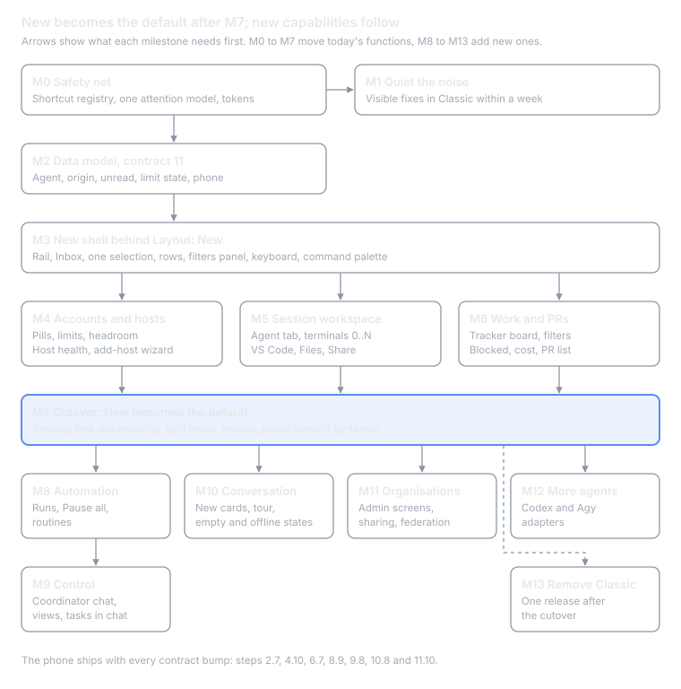
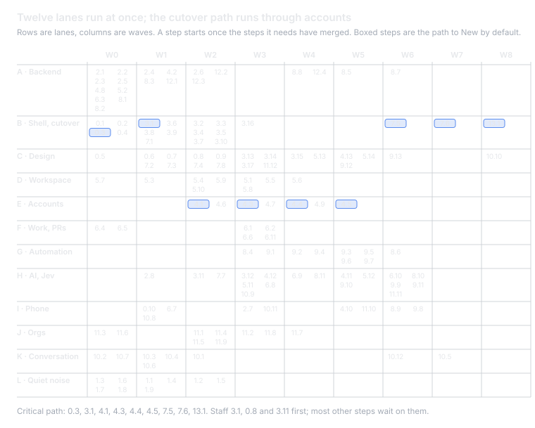

# Orbit Fleet redesign: transition plan A to Z

Oct 8, 2026 · @Martin

Orbit Fleet gets from 0.5.4 to the redesigned app in 15 milestones and about 165 PR-sized steps, and nothing a user can do today is lost on the way. The new layout grows behind a Classic/New switch; New becomes the default at M7, once every function of today has a home there, and features the code lacks (routines, Control, terminals 0..N, more agents, org screens) follow after. AI runs through all of it in one way: a rule first, Jev for quick closed choices, an LLM for drafts, and always a proposal a person confirms. The Orbit Fleet design manual is the source for tokens, components, rail order, copy and chords, and the steps run in 13 parallel lanes over 9 waves (see Task graph and parallel work). One decision is needed before work starts: whether accounts go before the session workspace.

**Changes in this version.** The Orbit Fleet design manual is folded in: six new steps (0.9 component kit, 0.10 phone tokens, 3.16 Toolkit, 3.17 header and brand, 6.11 Add project, 7.8 copy pass), wizards generated in the chat with the kit and loaders (10.12), the manual's rail order and chords in 3.2, 3.5, 5.3, 5.5 and 5.6, tokens from its snapshot in 0.5, Today moving to Control in 9.1, an eighth ground rule, two new decisions, a table of design changes, and a task graph with lanes, waves and the critical path, and M14, the phone app redesign from the Mobile app boards.

## At a glance

M0 and M1 can start tomorrow with no visible risk; M2 is the one backend milestone everything else waits on.

## Ground rules

Every step below obeys eight rules. They come from Martin's constraints and the plan doc, and each PR is checked against them.

1. **Nothing is lost, only moved.** Each PR carries a parity checklist: the rows of the plan doc's "Nothing is removed, only moved" table it touches, where each moved function lives now, and the test that proves it. A deleted test needs a replacement that covers the moved function.
2. **Classic and New side by side.** The new shell ships behind `ui.layout` (Classic, New). Classic stays the default until the parity checklist is complete and Martin has used New for a week. Classic is removed only in the last milestone, in its own PR.
3. **Shortcuts are frozen.** A shortcut registry starts from today's chords, and a test asserts each one still resolves to the same action on Mac and on Linux/Windows. A new chord is added only if the registry shows it free on every platform.
4. **Agent-agnostic from the data model up.** A session has an agent kind (Claude Code first, Codex and Agy next). Tab names, icons, the New session picker and the hub contract read it; nothing in the UI hard-codes "Claude".
5. **Orchestration first.** Sessions stay the primary object and the default view. Tasks, missions and routines exist to start and steer sessions, and every automation run lands in a session.
6. **Backend before UI, one source of truth.** A screen that needs data the backend lacks waits for a backend PR with its MCP action, Tauri command and tests. Attention, filters and status come from one derived model each, never per-screen copies.
7. **The phone stays in step.** A change to a shared contract (attention states, agent kind, origin, routines) bumps the hub contract revision and ships with its fleet-mobile PR in the same release.
8. **The design system is the source of truth.** Colours, type, spacing, radii, durations, components, status words, copy and chords come from the Orbit Fleet design manual. A screen that needs something the manual lacks adds it to the manual first, then to the tokens and the kit; no component styles itself by hand.

## Where we start

About two thirds of what the 48 boards show already exists in the backend; most of the work is UI, plus about 20 migrations for the parts that are truly new. Six checks read the code on `main` at 0.5.4 (`fc57cff`). **Exists** means it works today, **Partial** means the data or a first cut is there, **Missing** means nothing in code. The biggest structural facts:

- `App.svelte` (1,442 lines) is the layout: a fixed five-column grid with boolean overlay flags for Files, Hosts, Assets and Board, and no destination model. `Sidebar.svelte` (2,034 lines) also owns the Work switch, Settings, Add project, Tidy, bulk actions and the theme button.
- The PTY layer holds exactly one terminal (`pty.rs:47`), and every tmux command targets the session's active window (`tmux.rs:24`). Shell terminals 0..N need both changed.
- Tokens exist but are unused: `var(--text-*)` 2 uses and `var(--space-*)` 0 in 141 components, about 144 raw font sizes, 513 raw paddings and 150 hex colours.
- Attention has two classifiers, `attention.ts` for the sidebar and `service/attention.rs` for Today and the phone, kept in step only by bucket order. Unread (`done_unread`) is stubbed to false.
- Sessions have no agent kind, origin or last-viewed time; the hub contract is at revision 10 and the phone accepts up to 10.

| Area | Screen or feature | Backend | UI | What exists, what is missing |
| --- | --- | --- | --- | --- |
| Shell | Classic/New layout switch | Missing | Missing | No `ui.layout`; UI prefs live in localStorage (`prefs.ts`), so it needs no migration |
| Shell | Rail with Control, Inbox, Sessions, Work, Automation, Accounts, Toolkit | n/a | Partial | Sessions/Work segment only; views are overlay flags in `App.svelte:529-572` |
| Shell | Account pills in the top bar | Exists | Partial | Per-account 5h and weekly usage exists; footer shows only the worst account (`usage_glance.ts:238`) |
| Shell | Automation pill with Pause all | Partial | Missing | Only missions have Pause all (`orchestrate/mod.rs:1150`) |
| Shell | Density, text size, motion settings | n/a | Missing | Only Row details; no motion tokens; reduced motion handled in 5 files |
| Shell | Theme and light mode | n/a | Exists | Light tokens complete; picker is a text button in the sidebar footer |
| Shell | Shortcut registry and ? sheet | n/a | Missing | Chords in `app_views.ts`, `quick_switcher.ts` and 8 per-view tables |
| Shell | ⌘K with session and settings commands | Partial | Partial | Switcher has sessions, projects, hosts, tickets, assets and 3 commands; "set X to Y" lives only in Settings |
| Shell | Toasts, notification centre, Downloads | Partial | Partial | Toasts with Undo exist; no centre; Downloads has no progress or retry |
| Shell | Tour and Get started checklist | Exists | Partial | 7 coach marks and a 5-step onboarding card; no sequenced tour |
| Shell | Offline, empty, loading, no-results states | Exists | Partial | Hub banners exist with static retry text; no skeletons or shared empty state |
| Inbox | Seven attention states, one source | Partial | Partial | 12 buckets in `attention.ts:132`; no host or account Blocked signal; lost rows inflate the badge |
| Inbox | Inbox view | Partial | Missing | Today (⌘⇧T) exists with Copy standup; no attention-only list |
| Inbox | Unread and New divider | Missing | Missing | Needs `sessions.last_viewed_at` |
| Sessions | Group by host, state, agent | n/a | Missing | Group by project or work only (`sessions.ts:384`) |
| Sessions | Two-line rows, folded "N stopped" | Exists | Partial | 2 lines today but monospace titles and many badges; lost rows not folded |
| Sessions | Agent kind (Claude Code, Codex, Agy, Shell) | Missing | Partial | `kind` is work, review, shell, bg, external; launch, status parsing and transcript are Claude-only |
| Sessions | Origin chip | Missing | Missing | Only `started_at` null hints "not started by fleet" |
| Sessions | Tidy up by reason | Exists | Exists | Failed is protected (`tidy.rs:358`); no bulk Archive, no "reopened" reason |
| Sessions | Row ⋯ menu, right-click, bulk actions | n/a | Partial | Hover strip and work menu; bulk bar has only Send prompt and Kill |
| Sessions | Kill warns about uncommitted files | Exists | Partial | Only Safe remove inspects the tree; plain and bulk Kill do not |
| Sessions | Lost and found, adopt outside tmux | Partial | Partial | Restore and discover exist in Host detail; Outside fleet is read-only |
| Session | Agent tab named after the agent | Exists | Partial | Attach path is agent-neutral; the tab is called Terminal |
| Session | Shell terminals 0..N, split, pop out | Missing | Missing | One global PTY; no tmux windows, no extra webview windows |
| Session | Open in VS Code | Partial | Partial | `local_sync/open.rs` opens local workspace links only; no `--remote ssh-remote` |
| Session | Conversation header, find, turn stepper, reply actions | Exists | Exists | ⌘F, \[ \], Copy, Quote, Retry, Fork, Rewind all exist |
| Session | Answer with 1/2/3 keys | Exists | Partial | Answers go to the pane as keys; no keyboard handler in the conversation |
| Session | Slash menu per agent and project | n/a | Partial | 22 fixed Claude commands (`conversation.ts:774`) |
| Session | Files: committed but unpushed, branch vs base | Missing | Missing | Changed is `git status` only (`repo_read.rs:374`) |
| Session | Files: Push in Changed, Go to file, Blame, Mention in chat | Partial | Partial | Push only under History and Branches; no blame; no merged-branch filter |
| Session | Share from the session | Exists | Partial | Only from Details (`SessionDetails.svelte:877`); levels watch and drive, no answer level |
| Session | Fork to another host, Resume picker, Review with reviewer and scope | Partial | Partial | Fork stays on its host; Review takes a prompt only |
| New session | Every 0.5.3 option | Exists | Exists | Name, type, ticket, brief, also start in, work note, model, effort, profile, host usage, worktree, tmux name; mounted twice |
| New session | Agent picker, account with headroom | Missing | Missing | Usage known but never used to pick or warn |
| Accounts | Account list and detail | Partial | Partial | `accounts` table from host logins; usage only in memory; no cost per account |
| Accounts | Limit handling, pause threshold, move sessions | Missing | Missing | Only manual `restart_session { profile }` |
| Hosts | Host table and detail health | Partial | Partial | Disk, load, uptime, versions collected; no latency, worktree size, guard-hook or drift checklist |
| Hosts | Add-host wizard, install fleet-agent, open a shell, re-provision one host | Missing | Partial | Picker from `~/.ssh/config`; agent install is manual |
| Toolkit | Skills, MCP, hooks, agents, secrets, layers, changesets | Exists | Exists | No prompts kind; no skills × host version matrix |
| Toolkit | Add project: several repos, hosts, org, tracker | Partial | Partial | One repo onto one host; org derived from rules |
| Work | List, Grouped, Board | Exists | Exists | List and Board use different status rules (`task_list.ts:18` vs `:71`) |
| Work | Tracker columns on the board, assignee and column filters, group-by | Partial | Missing | Board has 3 fixed columns; only "mine" |
| Work | Blocked state, cost per task, PR list | Partial | Missing | Blocked only inside missions; cost only per mission; PR data on session rows only |
| Work | Review with confidence %, task detail, placement | Partial | Exists | Strong or weak, no number |
| Missions | Waves, verification, planner cards, grant, levels, Go | Exists | Exists | Grant form lacks hosts; wake interval not editable; brakes only in the log |
| Automation | Registry with last run, next run, global pause | Partial | Missing | About 15 loops; only reconcile, trackers and Jev report |
| Automation | Routines | Missing | Missing | Nothing; a continuous mission is the closest |
| Automation | Runs list | Partial | Missing | Buildable as a union of `tasks`, `orchestration_events`, `decision_runs` |
| Automation | Agent identities | Missing | Missing | Operator is a setting; grants are per mission |
| Automation | Planner and summary cost booked | Missing | n/a | `claude -p` runs are not costed |
| Control | Coordinator chat that hands work off | Partial | Partial | The operator (⌘E) is a Claude session with fleet MCP; confirms are modals and refused on a hub |
| Control | Views panel, session in panel, Library | Missing | Missing | No Library index, no Drive |
| Control | Tasks in chat | Partial | Missing | `propose_tree` and accept exist; no chat cards, no /task commands |
| Conversation | Forms with all field types, wizard steps, expiry | Exists | Exists | Receipt lacks an answer summary |
| Conversation | Progress, results, error and settings-change cards | Partial | Missing | Only report, steps, guide, callout, facts, choices, form |
| Orgs | Overview, members, roles, devices, per-org settings, budgets | Exists | Partial | Built from generic pages; no KPI tiles or "needs an admin" |
| Orgs | Remove member with revoke, narrow or keep | Exists | Missing | Backend actions are unused by the desktop |
| Orgs | Spend chart and spend by person | Partial | Missing | Daily org rows exist; no person table |
| Sharing | Answer level, read-only link, presence, private shown as existing | Missing | Missing | Each needs a contract change |
| Federation | Linked hubs and Link a hub | Partial | Missing | `list_peer_links` exists; pairing is CLI only |
| Devices | Debug devices claim, install, logs, screenshot | Exists | Partial | Buttons missing on the desktop page |
| Settings | Search, "set X to Y", generated pages, pairing QR | Exists | Exists | Ctrl+, missing off Mac; no Appearance, Notifications matrix, Shortcuts page |
| Phone | Same states, fields and forms | n/a | Partial | No Inbox screen, no form answering, no share; contract ceiling 10 |

## What the UX critique changes

The [UX critique](https://claude.ai/artifact/K1zRZTmZmjRgs8t5qhpmHX) found 60 issues in the boards, 21 serious. Eight of them change the plan, so they are folded in as prerequisites or steps rather than left as design notes. The canvas should be corrected for the same points before the screens they touch are built.

| Finding | What the plan does | Step |
| --- | --- | --- |
| Shortcuts break the parity rule: ⌘I is Hosts today but Inspector on the boards; ⌘E and ⌘⇧W lose their home; ⌘P is the switcher but Go to file on a board; Ctrl+Shift+E is already the agent chord on Linux and Windows | The registry and its freeze test come first. ⌘I stays Hosts (Accounts & hosts), ⌘E opens Control, ⌘⇧W toggles Sessions and Work, ⌘P stays the switcher. Inspector, Go to file, Open in VS Code and New terminal get chords the registry shows free on both platforms | 0.1, 3.8 |
| Four places answer "what needs me" with different items | One attention query owned by Inbox, built in Rust and shared by desktop, Control, Today and the phone. Inbox lists only Action required, Failed and Blocked plus a quiet "6 running" link | 0.4, 3.3 |
| "Mission control" names both the rail item and Work › Missions | The rail item is **Control** everywhere; Missions keeps its name; a "Sent to a mission" receipt links to that mission | 9.3 |
| Sharing has no entry from a session; a Steer grant to an untrusted device silently fails | Share moves into the session header and inspector, a "Shared with me" group appears, and Share warns when the person's device is still read-only | 5.8 |
| Account limits have no session state | A "Paused · limit" state raises the Inbox with Switch account and Wait inline | 2.4, 4.4 |
| Features with no home: switcher pin, hide and groups; find and turn stepping; group by Project, friendly names, row details; link review keys; ten Settings sections | Each gets a named place in the parity checklist; the canonical Settings tree carries the ten sections | 0.2, 7.1 |
| No focus style, colour-only selection, missing aria states | A global `:focus-visible` rule and selection bar ship with the tokens; the a11y pass before cutover checks labels, aria-current, aria-selected and aria-expanded | 0.5, 7.2 |
| Status colours bypass the tokens, so Light breaks | `--waiting-soft`, `--waiting-line`, `--failed-soft`, `--on-accent` and the other missing tokens land before any restyle; chips and banners use classes, not inline hex | 0.5 |

The remaining findings are copy and consistency fixes that ride the step touching each screen: "Clean up (commit and push first)" and "Force kill" instead of three names for one action, one primary button per view, danger fills at 5.6:1, 24px minimum targets, an 11px text floor, and plain words instead of "wave" or raw `E_*` codes outside Details.

## AI: rule first, then Jev, then an LLM

Every idea from the [AI map](https://claude.ai/artifact/JZsDwLPdMJdh97jPb6g92Y) is in this plan. The top 10 are steps in the milestones below, and the rest ride the step that builds their screen. Each question goes to the first engine that can answer it:

- **Rule** for hard facts: CI, git, exit codes, account limits, disk, latency. When a rule knows the answer, no model is asked.
- **Jev** for a frequent closed choice that must be instant: one of N options, "unsure" included. It runs through the envelope fleet already has in `service::decide` (kill switch, org consent, breaker, daily budget), in `shadow` or `assist` only. It never runs `auto` and never grants a permission.
- **LLM** for writing and explaining: summaries, drafts, mission plans, the Control chat. It runs `claude -p` through `service/claude_print.rs` on a host of the same org, and its output is always an editable draft.

Two UI patterns carry all of it, built once in step 3.11:

- **Proposed by Jev · why · Change**: a pre-selected default with its reason. Below the confidence floor or on "unsure", nothing is pre-selected and the UI asks as it does today.
- **Drafted · by haiku on mercury · from 3 changed files · Regenerate · Clear**: an editable draft that names the model and the host it ran on.

A Jev use case ships the same way every time: a `Feature` variant with its `decide.jev.<name>` setting (default `off`, then `REGEN_SETTINGS_DOCS`), a benchmark set in `fleet-hub decide bench`, shadow until its acceptance lines pass, then assist. Answers are recorded in `decision_runs`, whose `feature` column is free text, so a new use case needs no migration.

### Every idea and where it lands

| Top | Idea | Engine | Screen | Today | Step |
| --- | --- | --- | --- | --- | --- |
| 1 | Suggested link between a session and a ticket, with its reason (J1) | Jev | Sessions, Review, Details | Planned; offline benchmark only (D32) | 6.8 |
| 2 | A turn's outcome sets the Inbox state when hooks are silent (J2) | Jev | Inbox | Planned | 5.11 |
| 2 | The same question for routine runs (N6 routine\_run\_outcome), so empty runs stay out of the Inbox | Jev | Automation | New | 8.10 |
| 3 | Default project wherever a session starts (K1) | Jev | New session, palette, ⌘↵, empty search | Built for the first start of a task | 3.12 |
| 3 | Default host when no rule decides (N5 host\_placement) | Jev | New session | New | 4.11 |
| 4 | Route a Control message to a mission or session (K2) | Jev | Control | Planned | 9.9 |
| 5 | Triage a stuck mission: Jev picks outcome and next step, the LLM writes the card (K3) | Jev and LLM | Missions, Today's Nudge | Planned | 9.10 |
| 6 | "May duplicate TASK-236 · Merge / Keep both" (K4) and two sessions on one thing (N1 related\_session) | Jev | Planner drafts, Task, Related sessions, Tidy | Planned and new | 6.9 |
| 7 | Commit message from the diff; "What changed" on Resume | LLM | Files, Resume | New; Summarise is built | 5.12 |
| 7 | Draft brief from a ticket, with context order (J4) | LLM and Jev | Task, New session | New | 6.10 |
| 7 | Release note in Finish; Today's morning brief with its time and Refresh | LLM | Missions, Today | New | 9.11 |
| 7 | "Since 13:20" summary for a watcher, checked against the transcript (J9) | LLM and Jev | Watch, Details | New | 11.11 |
| 8 | Likely answer first in an agent's question (J5); never Approve on push, permission or a risky step | Jev | Agent tab, forms | Planned | 10.9 |
| 9 | A recovered transcript gets its project or ticket (J10); a foreign tmux pane gets a prefilled Adopt (N4 adopt\_target) | Jev | Host › Lost and found | Planned and new | 4.12 |
| 10 | After repeated identical confirmations, offer "Add rule PD-\* → papaya-pos?" | Rule | Automation, every proposal | New | 8.11 |
| — | Settings › Decisions: each use case off, shadow or assist, today's budget, breaker state, org consent | Setting | Settings | Built as a page; missing on the boards | 7.7 |
| — | Main ticket among several keys (J6); local or tracker duplicate (J7) | Jev | Review | Planned | Rides 6.8 |
| — | Warning when rules cannot read the agent's prompt (J8) | Jev | Agent tab | Planned | Rides 5.11 |
| — | Task group (K5) | Jev | Work | Planned | Rides 6.9 |
| — | Resume or start fresh (N2 resume\_or\_new) | Jev | New session, Resume | New | Rides 6.6 |
| — | Which sibling repo to also start in (N3 sibling\_repos) | Jev | New session | New | Rides 3.12 |
| — | Assign a task in plain words ("for me, by Friday") with Undo | LLM | Control | Planner is built | Rides 9.6 |
| — | One-line summaries of runs | LLM | Automation | Built | Rides 8.6 |
| — | Asana section to column mapping (J3) | Jev | Board | Built | Rides 6.1 |
| — | Summary at the top of Details › Facts | LLM | Details | Summarise is built | Rides 11.11 |

### Where AI never decides

These stay rules or a person's choice. The test from step 3.11 fails if a proposal ever feeds one of them.

- Approving a push or a permission: Jev never pre-selects Approve.
- Device trust, roles, sharing and access level.
- A task's organisation (`assign_org`).
- Mission autonomy, `orchestrator.max_level` and any other settings change.
- Mission completion and "Verified": CI, tests and commits only.
- Force kill and Clean up readiness: git only.
- Host and account choice by numbers (limit, disk, latency). N5 only answers when these leave a choice.
- Priority, task size and the order of Needs you.
- Add-host checks and error reports.

Two board fixes ride their steps. OrgSpend's consent becomes "Allow Jev (decision model) for \<org>'s work" in 7.7, and Review's "Fleet guessed" becomes "Proposed by Jev · why" in 6.8.

On the canvas, the AIPatterns board shows both patterns and the never-AI list, and the SettingsSections board shows the Decisions page. The UX plan doc carries the same ideas as its Phase 9 (steps 38 to 47), with the same labels.

## Logo motion and loaders

Martin took all 24 loaders from the canvas: the 12 logo behaviours on the LogoMotion board and the 12 particle loaders on the Loaders board, placed as the LoadersInUse board shows. They replace today's one loader, `SpiralLoader.svelte` (used in six files), and land as one kit in step 0.8, then screen by screen in the steps below.

The rules from the boards hold for every step:

- Pick by meaning, not by looks. Work of known length uses Progress ring; work of unknown length uses the loader for its job.
- One loader per screen, never one in every row. Inside rows, buttons and the status bar only Comet and the 16 px Orbit are allowed.
- Below 24 px only Orbit and Breathe are used.
- A loader appears only after 400 ms, so quick loads never flash. The skeleton in 10.6 moves to the same 400 ms.
- With Motion set to Reduced or Off, or when the OS asks for less motion, every loop becomes a 2.4 s opacity fade and Draw-on shows the finished mark.
- CSS or SVG only (no canvas), under 100 nodes, paused while the window is hidden.
- A loader always sits next to a real fact: a count, a step, a host, a time. Signal lost never spins.

The Startup board (step 3.15) and the Loaders in wizards and chats board (LoadersInFlows, 12 cases) add four rules:

- In a wizard or a chat there is no full-screen overlay: the step or message keeps its place and the loader sits inline, where the answer will appear.
- A wait on a person (a grant, an approval, a scan) says who and what, never with a spinner.
- Jev gets no loader: its proposal appears when ready, or nothing does.
- At startup each stage shows the loader for what is really happening, and a stage under 400 ms shows none.

| Loader | Job | Board | Step |
| --- | --- | --- | --- |
| Orbit | Default loader: app start, view loading; 16 px in rows | LogoMotion | 0.8, 3.13 |
| Chase | Hub connecting | LogoMotion | 3.14, 3.15 |
| Pulse sequence | Session starting: worktree, tmux, agent | LogoMotion | 5.13 |
| Draw-on | Splash, once on launch | LogoMotion | 3.15 |
| Progress ring | Download, update, hub sync with a known size | LogoMotion | 3.15, 10.10 |
| Comet trails | Long work: a mission running, a big search | LogoMotion | 9.12 |
| Breathe | Idle and connected: tray and status bar | LogoMotion | 3.14, 3.15 |
| Gravity well | Reconnecting after the network dropped | LogoMotion | 3.14 |
| Signal lost | Hub or host offline | LogoMotion | 3.14, 3.15 |
| Wordmark reveal | Splash and About | LogoMotion | 3.13, 3.15 |
| Halo | Waiting for you, on the dock and tray icon | LogoMotion | 3.14, 11.12 |
| Counter-orbit | Two hubs syncing | LogoMotion | 11.12 |
| Particle swarm | Fleet overview loading: hosts and sessions arriving | Loaders | 3.13 |
| Assemble | Splash: particles gather into the Orbit mark | Loaders | 3.15 |
| Radar | Discovering hosts on the network or over SSH | Loaders | 3.15, 4.13 |
| Sonar | Waiting for a host to answer | Loaders | 4.13, 5.14 |
| Dot wave | Loading a list or a table | Loaders | 3.13, 5.14 |
| Constellation | Fleet sync, with a real count | Loaders | 9.13, 11.12 |
| Data rain | Downloading or importing | Loaders | 10.10 |
| Atom | Agent thinking, next to what it reads | Loaders | 3.11, 5.13, 9.13 |
| Galaxy | First run: building the fleet | Loaders | 10.10 |
| Comet | Inline and buttons: Start, Save, Refresh | Loaders | 3.13, 5.14, 9.13 |
| Hex field | Building or checking: worktree setup, health check | Loaders | 4.13, 5.13 |
| Liquid orbit | Merging work: fork, rebase, combining sessions | Loaders | 5.13 |

## Milestones and steps

Fifteen milestones, about 165 PR-sized steps: 18 AI steps from the AI map, 12 loader steps, 7 from the design manual and wizards in chat, and 22 for the phone app redesign (M14) among them. Milestones 0 to 7 bring today's functions into the new shell and end with New as the default; 8 to 13 add what does not exist yet. Steps in one milestone can run in parallel unless the Needs column says otherwise, and the task graph after M13 shows which steps across milestones can run at once. Every step is in `martin-janci/claude-fleet` unless it says phone (`fleet-mobile`).

A step is done when: `scripts/verify.sh full` passes; its parity checklist is filled; the shortcut freeze test is green; any `REGEN_*` file it touches is regenerated; a contract change has its golden file and phone PR; and the screen matches its canvas board in both themes.

### M0 · Safety net (nothing visible changes)

| # | Step | Layer | Migration or contract | Needs | Verified by |
| --- | --- | --- | --- | --- | --- |
| 0.1 | Shortcut registry in `lib/shortcuts.ts` from `app_views.ts`, `quick_switcher.ts` and the 8 per-view tables; freeze test for every chord on Mac and Linux/Windows | UI | none | — | Vitest: each 0.5.4 chord resolves to the same action; a duplicate chord fails |
| 0.2 | Parity checklist: the plan doc's inventory as `docs/redesign/parity.md` plus a PR template section; the critique's "no home" items get rows | Docs | none | — | Template present; checklist rows link to tests |
| 0.3 | `ui.layout` pref (Classic, New) and a hand-written Appearance section in Settings; theme picker moves there, the sidebar "theme: auto" line stays until 1.4 | UI | none (localStorage) | — | App test: switching layout keeps the selected session |
| 0.4 | One attention model: the 12 buckets map to 7 states in Rust; `attention.ts` reads the same table through a shared fixture; badge counts only Action required, Failed, Blocked; lost and ghost rows leave the count | Both | none | — | Shared fixture test in Rust and Vitest, like `work_keys`; crashed session still counts |
| 0.5 | Tokens from the Orbit Fleet design system (tokens.json snapshot in docs/design/, drift test against app.css and tokens.ts): status soft, line and on-colour tokens, `--code`, `--org-1..n`, danger fill at 5.6:1, global `:focus-visible`, selected-row bar; `tokens.test.ts` checks both themes | UI | none | — | Contrast test in light and dark |
| 0.6 | Motion tokens, `lib/motion.ts`, Motion pref (Full, Reduced, Off, follows the OS) | UI | none | 0.3 | Test: no transition uses a raw duration |
| 0.7 | `controls.css` gains tabs, segmented control, badge and chip variants; one `SegmentedControl` | UI | none | 0.5 | Component tests; no visual change in Classic |
| 0.8 | Loader kit: one Loader component with all 24 canvas loaders by name (12 from LogoMotion, 12 from Loaders), sizes 16 to 48 px, the 400 ms delay, the reduced-motion fade, pause while hidden; SpiralLoader's label, paused and test id carried over, its six callers moved | UI | none | 0.6 | Vitest: every loader under 100 nodes, nothing rendered before 400 ms, Reduced and Off render the fade; a loader-use test fails on any loader but Comet or the 16 px Orbit inside a row, button or status bar |
| 0.9 | Design-system kit in Svelte: Button, Kbd, StatusChip, Banner, QuestionCard, SessionRow, ListFilters, Rail, AppHeader, StatusBar, Tabs, KeyValue, Meter and OrbitMark, with the manual's of- classes and its 16-unit, 1.5 px icon set; Loader comes in 0.8 and AISuggestion in 3.11. Nothing in Classic uses them yet | UI | none | 0.5, 0.7 | Vitest snapshot of each component in light and dark against the manual's bundle.css; contrast test on every state |
| 0.10 | Phone tokens: FleetTheme.kt takes the same colour, type and radius values from the tokens.json snapshot | Phone | none | 0.5 | A drift test fails when FleetTheme.kt and the snapshot differ |

### M1 · Quiet the noise (visible in Classic within a week)

| # | Step | Layer | Migration or contract | Needs | Verified by |
| --- | --- | --- | --- | --- | --- |
| 1.1 | Honest badge; a mass loss folds into one "12 stopped on trn · Restore" row using `restore_host_sessions` | UI | none | 0.4 | Today's fleet shows a single-digit badge |
| 1.2 | One attention line replaces the link bar and the Tidy chip; fix the native white buttons (`.pill` undefined in `LinkReview.svelte`) | UI | none | 0.7 | White bar gone; j/k/y/n still work |
| 1.3 | Human error copy in missions: planner error with Retry and Details; no config keys in user text | UI | none | — | Snapshot of the error state |
| 1.4 | Remove permanent rows: theme line, Board instruction as a one-time hint, empty task sections as one line, neutral status bar | UI | none | 0.3 | Chrome above the first row measured |
| 1.5 | Action hierarchy: one primary per view, destructive actions last behind a confirm, three quick chips plus ⋯, a distinct disabled style | UI | none | 0.7 | Parity: every chip still reachable |
| 1.6 | One task status for List and Board (`task_list.ts` `sectionOf` and `boardColumnOf` share one rule) | UI | none | — | Unit test: TASK-224 lands in the same column in both |
| 1.7 | Kill lists uncommitted files and offers Clean up; bulk bar gains Archive and Clean up; Undo toast after archive | UI | none | — | Component test with a dirty tree |
| 1.8 | Mission header "L3 asked · L1 ceiling" in words; grant form gains hosts; wake interval and parallel runs editable | UI | none | — | `mission_save` round-trip test |
| 1.9 | Ctrl+, opens Settings on Linux and Windows; New session dialog mounted once through `newSessionRequest` | UI | none | 0.1 | Freeze test extended; both entry points open one dialog |

### M2 · Data model for the redesign (backend first, phone in step)

| # | Step | Layer | Migration or contract | Needs | Verified by |
| --- | --- | --- | --- | --- | --- |
| 2.1 | `sessions.agent` (claude, codex, agy, shell; default claude); `agent` on `NewSessionArgs`, the MCP schema and the wire row; only claude and shell accepted for now | Backend | 121 · contract 11 | — | Upgrade test; `REGEN_DOCS`, `REGEN_HUB_CONTRACT` |
| 2.2 | `sessions.origin` and `origin_ref` written on every start path (person, operator, mission, background, token; routine later) | Backend | 122 · contract 11 | — | Test per start path |
| 2.3 | `sessions.last_viewed_at` and `touch_session_viewed`; `done_unread` stops being a stub | Backend | 123 · contract 11 | — | Attention fixture gains Completed-unread rows |
| 2.4 | Host down, no credentials and account-at-limit become Blocked reasons; new "Paused · limit" state | Backend | none · contract 11 | 0.4 | Fixture rows for each reason |
| 2.5 | Persist account usage: `account_usage_snapshots` with history and reset times | Backend | 124 | — | Poll writes a row; restart keeps the last value |
| 2.6 | Contract 11 released together: golden file, `docs/hub.md`, hub-e2e section | Backend | contract 11 | 2.1–2.4 | `scripts/hub-e2e.sh` |
| 2.7 | Phone: `MAX_HUB_CONTRACT` 11, seven states in `Triage.kt` and `StatusTone.kt`, agent, origin and account on `SessionRow` | Phone | contract 11 | 2.6 | Phone tests; same release tag |
| 2.8 | Proposals on the wire: one proposal shape (value, source rule, Jev or LLM, reason, confidence) on session, task and start rows, read from decision\_runs; sessions.turn\_outcome for J2. Lands before 2.6 so it ships in contract 11 | Backend | 141 · contract 11 | 0.4 | Golden file carries a proposal; a row with no decision carries none; the phone build from 2.7 ignores it |

### M3 · The new shell (behind Layout: New)

| # | Step | Layer | Migration or contract | Needs | Verified by |
| --- | --- | --- | --- | --- | --- |
| 3.1 | Destination store replaces the overlay flags; Classic is rewired onto it with no visible change; the terminal stays mounted under overlays | UI | none | 0.3 | All existing App tests pass unchanged |
| 3.2 | Rail in the design manual's order (Control, Inbox, Sessions, Work, Automation, Accounts, Toolkit, then Settings at the bottom); an item whose step has not landed stays hidden. Top bar details are in 3.17 | UI | none | 3.1, 2.5 | Snapshot against the Main board |
| 3.3 | Inbox: attention-only list from 0.4, "6 running" link, Today as its second tab until 9.1 moves it to Control (⌘⇧T unchanged); Sessions becomes the "All sessions" list | UI | none | 3.1, 2.4 | Same items as the phone and Today |
| 3.4 | Selection drives every pane: one selection store for sessions and tasks | UI | none | 3.1 | Test: picking TASK-223 never shows TASK-225's conversation |
| 3.5 | Session header and one tab bar: Conversation · agent tab · Terminals · Files · Details; inspector pane on ⌥⌘B (Ctrl+Alt+B), 280 to 320 px wide; ⌘I stays Accounts & hosts | UI | none | 0.7, 3.1 | Freeze test; tab underline component |
| 3.6 | Rows: two lines, sans titles, density setting (Comfortable equals today), group by state, host, agent, project or work; split `SessionRowItem.svelte` | UI | none | 2.1, 0.5 | 20 rows at 1080p in Compact; Comfortable shows every 0.5.4 badge |
| 3.7 | Left panel: one collapsible Filters section and Group control shared by Sessions and Work; one engine (`rowMatches` plus `work_filters`) with typed schemas; saved views stay local | UI | none | 3.6 | Every 0.5.4 facet present; closed panel is one row |
| 3.8 | Keyboard: j/k, Enter, x in every list; next-needs-you, ⌘ 1–9 on Mac, 1–9 to answer when the composer is not focused; ? sheet from the registry | UI | none | 0.1 | Freeze test plus new chords free on both platforms |
| 3.9 | ⌘K command registry: session commands (approve, push, open in editor), settings commands from `settings_nl`, Pause all, prefixes > # @; pin, hide and groups kept | UI | none | 0.1 | Switcher tests extended |
| 3.10 | Row ⋯ menu and right-click with every Details action; Board as a Work view, not an overlay; fixed Work tabs with Review as a count | UI | none | 3.1 | Parity rows for row actions |
| 3.11 | Two AI components: ProposedBy ("Proposed by Jev · why · Change"; nothing pre-selected under the confidence floor or on unsure) and DraftField ("Drafted · by haiku on mercury · from 3 changed files · Regenerate · Clear"); the never-decides list as one table with a test; the ai-pre focus ring token (named in the manual's ai.md, missing from its tokens.json) added to app.css; a small Atom beside a Drafted field while the LLM writes; no loader for Jev, whose proposal appears when ready or not at all | UI | none | 0.7, 2.8 | Vitest in both themes; the never-list test fails if a proposal reaches Approve, sharing, roles, assign\_org, autonomy, Verified, Force kill or priority |
| 3.12 | K1 everywhere a session starts: the start\_project proposal pre-selects the project in New session, the palette's "Start from work", ⌘↵ from free text and an empty search result; N3 pre-ticks "Also start in papaya-api" as its own use case | Both | settings row (sibling\_repos) | 3.9, 3.11 | One chip on all four entry points; a rule match beats Jev; unsure leaves the field empty |
| 3.13 | Loaders in the new shell: Particle swarm for the first fleet overview; Dot wave instead of a centred spinner in lists ("loading 48 rows from 4 hosts"); Comet and the 16 px Orbit in buttons and rows; About gets the Wordmark reveal; ⌘K shows local results at once and a Dot wave for hosts still answering | UI | none | 0.8, 3.1 | App test: one loader per screen |
| 3.14 | Connection states with loaders: hub connecting with Chase; hub reconnecting as a Gravity well banner ("Lost at 14:52 · try 3 · your sessions keep running on their hosts · Retry now") while the list stays usable; host offline with Signal lost, last seen, paused sessions, Show sessions and Wake host where the host can be woken; Breathe in the tray and status bar when idle; Halo on the dock and tray icon when something waits for you; the tray and menu bar use only Breathe, Chase, Halo and Signal lost; a lost hub turns from Gravity well to Signal lost after 6 s | UI | none | 0.8, 3.2, 0.4 | Vitest for each state; Signal lost never loops; Halo follows the Inbox count |
| 3.15 | Startup as on the Startup board, each stage with the loader for what is really happening: Draw-on while the store opens; Progress ring only if a migration runs ("Upgrading the database · 3 of 5"); Chase while connecting to the hub (standalone skips it); Radar with one blip per host that answers; Assemble with one particle per session ("22 sessions · 4 need you"); then the mark shrinks into the header logo, Inbox fades in and the last host keeps loading in the status bar. Warm start within 8 h: no splash, the last screen at once, Breathe while it re-syncs. After an update: Wordmark reveal once with "Orbit Fleet \<version> · What's new". Hub unreachable: Signal lost after 6 s with Open offline (local hosts only, new for a paired desktop), Retry and Hub settings | Both | none | 0.8, 3.1, 3.14 | App test: stages advance on real events, not timers; a stage under 400 ms shows no loader; cold start about 1.6 s on the bench machine; warm start shows the last screen with no splash; Open offline lists only local hosts |
| 3.16 | Toolkit rail item: today's Assets workspace becomes Toolkit with two tabs, Skills (synced across hosts, drift shown per host) and Assets (layers and changesets); the old entry points open the same screen | UI | none | 3.1, 3.2, 0.9 | Parity rows for Assets pass; a host with a drifted skill shows it |
| 3.17 | AppHeader and brand: Orbit mark, the name at weight 600, the ⌘K field, account and Automation pills, StatusBar at 25 px, and tray icon states (Breathe idle, Chase working, Halo needs you, Signal lost) | UI | none | 0.8, 0.9, 3.2 | Snapshot against the Main board; the tray test switches through all four states |

### M4 · Accounts and hosts like a Swiss watch

This is the project's own goal, so it comes straight after the shell. Accounts stay derived from host logins and profiles; nothing here adds a credential vault.

| # | Step | Layer | Migration or contract | Needs | Verified by |
| --- | --- | --- | --- | --- | --- |
| 4.1 | Accounts page: list and detail with 5h and weekly history, reset times, plan, hosts and profiles using it, sessions on it | Both | none | 2.5, 3.1 | Page renders from snapshots; matches Accounts board |
| 4.2 | Cost per account and per model: `usage_daily_account` rollup | Backend | 125 | 2.5 | Rollup test against `usage_daily` totals |
| 4.3 | Account on every row and palette row; pills turn amber at 80% and red at the limit; a pill opens its account | UI | none | 3.2, 4.1 | Snapshot with one account at limit |
| 4.4 | Limit handling: `accounts.pause_at` setting (default 90%); starting on an account over it asks first and offers the one with headroom; "Paused · limit" rows offer Switch account (`restart_session { profile }`) and Wait; bulk move to another account | Both | settings row | 2.4, 4.3 | Service test: refused start offers the account with headroom; `REGEN_SETTINGS_DOCS` |
| 4.5 | New session: agent picker (Claude Code and Shell enabled, Codex and Agy shown as coming), account and profile picker with live usage defaulting to headroom; Background becomes "Run: in background" while its old entry points stay | UI | none | 2.1, 4.4 | Every 0.5.4 option still present (parity list from `NewSessionDialog.svelte`) |
| 4.6 | Hosts page split from accounts: latency, sessions, disk, agent version, accounts signed in; probe gains latency, CPU, total memory, worktree size, boot time | Both | 126 | 3.1 | Probe test; table matches the Accounts board |
| 4.7 | Host detail health checklist (SSH, tmux, agent, agents on PATH, guard hook, skills drift); re-provision one host; New session here | Both | none | 4.6 | Checklist test with a failing hook |
| 4.8 | Lost and found: adopt a tmux pane started outside fleet; Restore stays | Backend | none | — | Adopt test creates a row with origin person |
| 4.9 | Add-host wizard with live checks, resumable, and a fleet-agent install job | Both | 127 | 4.7 | Wizard resumes after app restart; hub-e2e installs the agent |
| 4.10 | Phone: account on rows and the limit state | Phone | none | 2.7, 4.4 | Phone UI test |
| 4.11 | N5 host placement: a proposed host only when neither a project rule nor the account limit from 4.4 decides; candidates are the org's online hosts | Both | settings row (host\_placement) | 4.4, 4.6, 3.12 | Benchmark on past starts; a host over its limit or offline is never proposed |
| 4.12 | Lost and found with proposals: a recovered transcript gets its project or ticket (J10); a foreign Claude pane gets a prefilled Adopt (N4) | Both | settings rows (J10, adopt\_target) | 4.8, 3.11 | Adopt still asks to confirm; unsure leaves the form blank |
| 4.13 | Host loaders: Radar while discovering hosts and Sonar while waiting for one to answer in the add-host wizard; Hex field during the health checklist and re-provision | UI | none | 0.8, 4.7, 4.9 | Wizard test: each live check shows its own step text next to the loader |

### M5 · The session workspace

| # | Step | Layer | Migration or contract | Needs | Verified by |
| --- | --- | --- | --- | --- | --- |
| 5.1 | Agent tab: today's Terminal named and iconed from `sessions.agent` ("Claude Code", orange); ⌘J unchanged; `subtab-terminal` test id kept as an alias | UI | none | 2.1, 3.5 | Freeze test; existing terminal tests |
| 5.2 | PTY map: `PtyState` becomes an id-keyed map with its own reader, writer and 1 MiB cap per entry; the five PTY commands take an id; review against the hardening doc | Backend | hub verdict rows | — | PTY tests; `REGEN_HUB_VERDICTS`; no lock held across I/O |
| 5.3 | Shell terminals 0..N: each in its own tmux session (`<name>--shN`) so `exact_pane` never points at a shell; reconcile and discover ignore them; list with + New, Split, Clear; closing never stops the session; ⌥⌘T (Ctrl+Alt+T) opens a terminal and ⌘\` goes to the next one | Both | none | 5.2 | Reconcile test: shells never become ghost rows |
| 5.4 | Pop out a terminal into its own window | UI | Tauri capability | 5.3 | Manual check on Mac and Windows |
| 5.5 | Open in VS Code: `open_session_in_editor` opens the worktree locally or with `--remote ssh-remote+<alias>`; ⌘⇧E on Mac, Ctrl+Alt+E on Linux and Windows | Both | hub verdict (local only) | 0.1, 3.5 | Command test for local and SSH hosts |
| 5.6 | Files: `repo_branch_diff` shows committed-but-unpushed and branch vs base under Changed; Push and Commit in Changed; Go to file on ⌥⌘P (Ctrl+Alt+P), Files tab only; Copy path, Mention in chat, Open in VS Code in the viewer | Both | hub verdict | 5.5 | Repo tests on a branch two commits ahead |
| 5.7 | Files: `repo_blame`; merged flag, filter and "delete merged" in Branches | Both | none | — | Repo tests |
| 5.8 | Share from the session header and inspector; "Shared with me" group; Share warns when the person's device is read-only | UI | none | 3.5 | Watch-only recipient never mounts the terminal |
| 5.9 | Conversation: one approval card everywhere; after Approve focus moves to the next item with Undo; New divider from 2.3; slash menu lists project skills | Both | none | 2.3, 3.8 | Answer test: card and agent tab stay in step |
| 5.10 | Dialogs in one pattern: Fork with a host choice, Resume with a list of earlier sessions, Review with reviewer skill and scope, Send prompt that waits for idle sessions | Both | 128 (deferred prompts) · `REGEN_DOCS` | 3.1 | Dialog tests; queued prompt delivered when the session goes idle |
| 5.11 | J2 turn outcome: when hooks stay silent at a turn's end, Jev picks finished, asked, stuck, still working or unsure from the pane tail, and the answer sets the Inbox state; hooks always win; J8 warns when the rules cannot read the prompt | Both | settings row (turn\_outcome) | 0.4, 2.8, 3.3 | Benchmark from captured pane tails; Rust test that a hook event overrides a Jev answer |
| 5.12 | LLM drafts in the workspace: commit message from the diff in Files › Changed, and "What changed" on Resume, both through claude\_print on the session's own host and account | Both | none | 5.6, 5.10, 3.11 | Test that the call runs on the session's host; Clear empties the field; cost booked once 8.2 lands |
| 5.13 | Session loaders: Pulse sequence tied to the three real start steps (worktree, tmux, agent) with "Setting up worktree · 2 of 3"; Atom beside what the agent is reading ("Thinking · reading hub/pair.rs · 14 s"); Hex field for worktree setup; Liquid orbit for Fork, rebase and combining sessions; moving a session to another host streams particles from one host to the other; Tidy's worktree scan runs a Hex field over the list | Both | none | 0.8, 5.1, 5.10 | The start path emits its three steps (added where missing); test that the pulse advances on events, not on time |
| 5.14 | Loaders in session chats and wizards (LoadersInFlows): New session closes into the Pulse sequence on the new row under Running; in the conversation only the running tool call shows a Comet and finished calls go still; voice input shows a Sonar that follows the mic level, then a Dot wave while it transcribes | UI | none | 0.8, 5.13 | Vitest: only the running tool call animates; nothing else waits on the new row |

### M6 · Work and pull requests

| # | Step | Layer | Migration or contract | Needs | Verified by |
| --- | --- | --- | --- | --- | --- |
| 6.1 | Board columns from tracker status names; a drag writes back only where write-back is allowed, otherwise the card refuses as today | Both | none | 1.6, 3.10 | Board test with a Jira column map |
| 6.2 | Work filters for a named assignee and a tracker column; group by org, person, mission, account or repo | Both | none | 3.7 | Tree query test with `status_name` |
| 6.3 | Derived Blocked on every task with dependencies; cost per task summed from its sessions; spend on org rows | Backend | none | — | Graph and cost tests |
| 6.4 | Pull requests: `pull_requests` table upserted by reconcile with state, CI, merged time and the session that opened it; `prs { list }`; a PRs view in Work | Both | 129 · contract 12 | — | Reconcile test marks a PR merged |
| 6.5 | Review: numeric confidence from detection, shown as %; "Confirm all high-confidence" | Both | 130 | — | Detection test pins scores |
| 6.6 | One "Continue / Start new ▾" split button wherever a session starts from a task, landing on "Setting up worktree…" | UI | none | 3.4 | Five start points use one component |
| 6.7 | Phone: PR list and Blocked state | Phone | contract 12 | 6.3, 6.4 | Phone tests |
| 6.8 | J1 suggested link with its reason: chip on Sessions rows, the Review queue and the Details timeline; Review drops "Fleet guessed"; J6 main ticket and J7 duplicate in Review. Live only after J1 passes acceptance (D32), shadow until then | Both | none (work\_link exists) | 3.11, 6.5 | fleet-hub decide bench work-link acceptance lines PASS; Vitest for the Review label |
| 6.9 | Duplicates: "May duplicate TASK-236 · Merge / Keep both" on planner drafts and session-proposed tasks (K4); N1 feeds Related sessions and Tidy › Duplicates; K5 task group | Both | settings rows (duplicate, related\_session) | 3.11, 6.2 | Benchmark on known duplicates; Merge is always a person's click |
| 6.10 | Draft brief from a ticket in Task and New session, with context order from J4 | Both | none | 3.11, 5.12 | The brief is editable and never sent without the person starting the session |
| 6.11 | Add project with four sources (GitHub, URL, folder, new) as on the AddProject board; a source today's AddProjectDialog lacks is added to add\_project.rs first (to be checked; inferred from the board) | Both | none | 0.9, 5.10 | A Rust test per source; the dialog keeps today's fields |

### M7 · Cutover: New becomes the default

| # | Step | Layer | Migration or contract | Needs | Verified by |
| --- | --- | --- | --- | --- | --- |
| 7.1 | One Settings tree (about 15 sections, one 240px nav, active item marked) holding Appearance, Notifications, Shortcuts, Voice, Downloads, Decisions, Playbooks, Retention, Error reports, Workspace repair, Project roots; Settings holds preferences and links to rail pages | UI | none | 0.3 | Every generated page reachable; `REGEN_PAGE_DOCS` |
| 7.2 | Accessibility pass: labels on every control, aria-current, aria-selected, aria-expanded, status as word plus shape, 24px targets, 11px floor | UI | none | 0.5 | axe check in component tests |
| 7.3 | Light-mode pass with the tokenised status colours | UI | none | 0.5 | Contrast test; Light board compared |
| 7.4 | Motion catalog applied: rows slide between groups, one wash on a state change, toasts with a timer bar | UI | none | 0.6 | Reduced mode turns all of it into 80ms fades |
| 7.5 | Parity sign-off: checklist 100%, freeze test green, Martin uses New for a week | All | none | M3–M6, 0.9, 7.1–7.3, 7.8 | Checklist and Martin's OK |
| 7.6 | Default flips to New; Classic stays one switch away for one release | UI | none | 7.5 | Release notes say how to switch back |
| 7.7 | Settings › Decisions in the Settings tree: each use case its own off, shadow or assist row (no auto), today's budget used, breaker state, per-org consent; OrgSpend's consent renamed "Allow Jev (decision model) for \<org>'s work" | UI | settings rows · page docs | 7.1 | REGEN\_SETTINGS\_DOCS and REGEN\_PAGE\_DOCS current; a paired desktop shows the rows read-only |
| 7.8 | Copy pass from the manual's content rules: status words (Needs you, Working, Failed, Done, Paused, Idle), short ages, sentence case, "…" on labels that open a dialog | UI | none | 0.4, 7.1 | A Vitest lint fails on a status word outside the six and on a dialog label without "…" |

### M8 · The automation home

| # | Step | Layer | Migration or contract | Needs | Verified by |
| --- | --- | --- | --- | --- | --- |
| 8.1 | Every loop reports: one registry gives each of the \~15 loops its last run, next run and result in `fleet_health`; `automation.paused` is checked by every loop that acts; the observers that keep running (reconcile, usage polls, update check, bookkeeping) say why in the registry and the Automation view | Backend | settings row | — | Test per pausable loop (`pause_all_stops_*`); Pause all stops missions, GC writes and catalog sync |
| 8.2 | Planner, summary and Jev `claude -p` runs are booked as cost with their origin; the mission budget brake counts them | Backend | 131 | — | Planner run adds a cost row |
| 8.3 | Runs read API: a union of `tasks`, `orchestration_events` and `decision_runs` with indexes; `runs { list }` | Backend | 132 · contract 13 | 8.2 | Each run links to its sessions |
| 8.4 | Automation rail item, read-only: built-in agents (operator, orchestrator, Jev), built-in routines (the loops), Runs; the top-bar pill shows active count, today's spend and Pause all | UI | none | 8.1, 8.3, 3.2 | Matches the Automation board with real data |
| 8.5 | Routines backend: `routines` and `routine_runs`, a scheduler tick, cron and event triggers, Run now, Skip next, per-routine account, host, budget and overlap rule; sessions get origin routine | Backend | 133 · contract 13 | 8.1, 2.2, 4.4 | Scheduler tests with a fake clock; isolation matrix rows |
| 8.6 | Routines UI with the first template, Morning PR sweep; a failed run lands in the Inbox with Fix, Retry and Pause | UI | none | 8.4, 8.5 | Failed run raises the badge |
| 8.7 | Account-aware automation: grants, routines and background sessions name an account; the mission loop checks usage before a run; catalog auto-writes show a card | Backend | none | 4.4, 8.5 | Loop skips an account under its threshold |
| 8.8 | Agent identities table, only if 8.4 shows the settings-based list is not enough | Backend | 134 | 8.4 | Decision at 8.4 review |
| 8.9 | Phone: Runs list, routine toggles, Pause all | Phone | contract 13 | 8.5 | Phone tests |
| 8.10 | N6 routine run outcome: did work, nothing to do, failed, needs a person; nothing-to-do runs stay out of the Inbox (may share J2's use case) | Both | settings row (routine\_run\_outcome) | 8.5, 5.11 | Benchmark on recorded runs; a failed exit code wins over Jev |
| 8.11 | From AI to rule: after five identical confirmations fleet offers "Add rule PD-\* → papaya-pos?"; rules are listed and edited in Automation; a rule beats Jev and saves the call | Both | 142 · contract 13 | 8.4, 3.12 | Rust test that a rule match records no Jev call; edit and delete a rule from Automation |

### M9 · Control (the coordinator chat)

| # | Step | Layer | Migration or contract | Needs | Verified by |
| --- | --- | --- | --- | --- | --- |
| 9.1 | Control rail item: today's operator panel promoted; ⌘E opens it; Today moves here from Inbox as a Control tab, ⌘⇧T unchanged; all six blocked states get a next-step button | UI | none | 3.1 | Each blocked state has an action |
| 9.2 | Confirms become cards in the transcript (the M9.7 rule stays: starts and kills always confirmed); confirms work on a hub | Both | contract 14 | 9.1 | Confirm test on desktop and through the hub |
| 9.3 | Handoff receipts: `control_handoffs` records what was sent where; chips "Sent to a session" and "Sent to a mission" link to the target with live state | Both | 135 · contract 14 | 9.2, 2.2 | Chip follows the session's state |
| 9.4 | Views panel: Needs you, Tasks, Pull requests, Library and the session in focus by default; Missions, Routines, Hosts and Usage as optional views; + Views toggles and reorders | UI | none (local pref) | 6.4, 8.4 | Panel uses the same attention query as Inbox |
| 9.5 | Session opened inside the panel with its checklist, New divider and "done · Reopen"; ⤢ opens the full session | UI | none | 9.4, 2.3 | Esc returns to the panel |
| 9.6 | Tasks in chat: `propose_tree` rendered as a card (untick, Create tasks, Create as a mission, Undo for 10 minutes); live `#TASK` cards; `/task`, `/plan`, `/done`, `/assign`, `/start` in Control only | Both | none | 9.2 | Undo removes created tasks |
| 9.7 | Library: `library_items` indexes downloads, attachments, session outputs and linked repos per host, with Upload | Both | 136 | 9.4 | Library lists a download from a session |
| 9.8 | Phone: Control chat with handoff chips | Phone | contract 14 | 9.3 | Phone tests |
| 9.9 | K2 Control routing: each message gets "Sent to Hub federation v2 · Proposed by Jev · Change"; a short or unclear message makes Control ask instead | Both | settings row (control\_route) · contract 14 | 9.3, 3.11 | Benchmark on recorded Control chats; Change re-routes and records the follow-up |
| 9.10 | K3 mission triage: for a stuck mission Jev picks the outcome (done, partial, blocked, failed) and next step (retry, split, give up, ask), the LLM writes the card; confirm in Missions or Today's Nudge; Verified stays proof only | Both | settings row (mission\_triage) | 9.2, 3.11 | Test that triage never sets Verified or completes a mission |
| 9.11 | LLM drafts in Control: release note in Finish; Today's morning brief with its time and Refresh instead of a new run on every open | Both | none | 9.10, 3.3 | The brief regenerates only on Refresh; its cost is booked with its origin |
| 9.12 | Comet trails for long work: a running mission in Control and Missions, and a big search; always beside the mission's current step | UI | none | 0.8, 9.4 | Vitest: trails stop when the mission waits on a person |
| 9.13 | Loaders in the Control chat: a small Atom as the typing indicator with what it reads ("Planning · reading 3 sessions and 2 PRs"); planning a mission goes from Atom to Constellation as work is sent to sessions; on "Sent to a session" a comet flies from the message to the session in the side panel, then the chip settles | UI | none | 0.8, 9.3, 9.4 | Vitest: the flight ends on the chip; with reduced motion the chip appears without it |

### M10 · Conversation components and onboarding

| # | Step | Layer | Migration or contract | Needs | Verified by |
| --- | --- | --- | --- | --- | --- |
| 10.1 | Form receipt with an answer summary; options answered with 1–9; expiry shown | UI | none | 3.8 | Form card tests |
| 10.2 | New chat kinds: progress (updates in place), results (numbers, chart, table from page widgets), error (code and next step); docs and schema | Both | `REGEN_FORM_DOCS` | — | Validation tests in Rust and TS |
| 10.3 | Settings-change card with Apply, routed through the `set_setting` guard and a confirm | Both | none | 10.2 | Apply writes once; Not now writes nothing |
| 10.4 | Guides open as a card in chat as well as in Settings | UI | none | 10.2 | Same guide, both places |
| 10.5 | First-run tour (6 steps with "try it") and Get started (host, account, first session, GitHub, phone, routine); the onboarding card leaves the sidebar | UI | none | 3.1, 8.6 | Tour test; Skip remembered |
| 10.6 | States kit: skeleton after 400 ms, one empty-state component, hub banner with a live countdown and Retry now, host offline inside its group, no-results with a way out | UI | none | 0.5 | Component tests per state |
| 10.7 | Notification centre and Downloads with progress, Show in Finder, Retry | Both | none | — | Downloads test with a failed transfer |
| 10.8 | Phone: answer `pending_form`, render the new chat kinds | Phone | none | 10.2 | Phone tests |
| 10.9 | J5 quick answer: Jev moves the likely option first in an agent's question or a form; push, permission and risky options are never pre-selected | Both | settings row (quick\_answer) | 10.1, 5.9, 3.11 | The never-list test covers the approval card; 1–9 numbering follows the shown order |
| 10.10 | Loaders for first run and transfers: Galaxy while the first fleet is built in Get started; Data rain for downloads and imports of unknown size; Progress ring for downloads, updates and hub syncs of known size; a long job's toast carries a 28 px Progress ring that opens the job; a form in chat shows Comet in its submit button while its fields stay readable | UI | none | 0.8, 10.5, 10.7 | Test: a known size always picks Progress ring |
| 10.11 | Phone: pull to refresh draws the Orbit as you pull and runs Chase while it fetches; fleet-mobile follows the kit's reduced-motion rule through Android's animation scale | Phone | none | 0.8 | fleet-mobile UI test with animations off and on |
| 10.12 | Wizards in chat: each wizard (Add host, Add project, New session, phone pairing, hub link, Get started) is one form spec that renders as a dialog or as a chat form that Control or any agent can generate; in chat it uses the kit components and the wizard's own inline loaders (Sonar on host checks, Halo round the pairing code, Counter-orbit for a hub link, Comet on the submit button, Pulse when a session starts), never a full-screen overlay. 10.5's Get started runs on it. Built on today's chat forms (fleet.form/1) with the manual's ChatForm component (of-form, of-steps, of-field, of-opt, of-toggle, of-skel) and the canvas board "Wizards built in chat": Building (Control streams the spec while it writes it; skeleton fields and a small Atom with what Control reads), Open (step chrome from two steps; Jev may propose one choice per field with ✦), Sending (Comet in the button), Answered or Declined (one line, then Pulse for a new session), an agent asking inside its session, and a phone bottom sheet. Nothing runs until the last step's button is pressed; never a modal or overlay. The new backend part is streaming a spec while it is still being written | Both | form spec · REGEN\_FORM\_DOCS | 10.1, 0.9, 4.9, 6.11, 5.14 | The same spec passes in the dialog and in chat; a form generated by Control validates against form-spec.schema.json; the phone renders it as a form (10.8) |

### M11 · Organisations, people, sharing, federation

Most of the backend exists; these steps give it designed screens and fill the gaps.

| # | Step | Layer | Migration or contract | Needs | Verified by |
| --- | --- | --- | --- | --- | --- |
| 11.1 | Org overview with KPI tiles, a 14-day spend series from `usage_daily_org`, and a derived "Needs an admin" list | Both | none | 7.1 | Series test; untrusted device appears in the list |
| 11.2 | Members: `shares_since` on `MemberSummary`; remove-member dialog using `member_grants`, revoke and narrow; Add member mints a pairing code | Both | none | 11.1 | Removing a member with 6 grants offers all three choices |
| 11.3 | Devices: rename a device, change its mode | Both | none | — | Org admin tests |
| 11.4 | Control API tokens table: host tokens gain last used and rotated time; client tokens listed beside them | Both | 137 | 7.1 | Rotate test |
| 11.5 | Federation page: linked hubs with state, latency and message counts; Link a hub through a new hub tool | Both | 138 · contract 15 | 7.1 | hub-e2e federation section |
| 11.6 | Debug devices: claim, install APK, logs and screenshot buttons on the desktop page | UI | none | — | Page test with a fake device |
| 11.7 | Sharing: an Answer level between Watch and Drive; presence (who is viewing); a private session shown only as existing to admins | Both | 139 · contract 15 · `REGEN_HUB_VERDICTS` | 5.8 | Isolation matrix rows for each level |
| 11.8 | Spend by person with the all-or-nothing privacy rule | Both | 140 | 11.1 | A non-admin never sees partial spend |
| 11.9 | Notifications matrix (state × desktop, phone, sound) and quiet hours stored on the hub; Updates page lists hosts' agents and the phone | Both | settings rows | 7.1 | Phone reads the same matrix |
| 11.10 | Phone: share and watch, member actions on Company, debug devices page | Phone | contract 15 | 11.2, 11.7 | Phone tests |
| 11.11 | "Since 13:20" summary for whoever watches a shared session, only at Read level with org consent; Jev checks it against the transcript (J9) before it shows; the same summary tops Details › Facts | Both | settings row (summary\_check) | 11.7, 5.12 | A failed J9 check hides the summary; no summary without consent |
| 11.12 | Federation loaders: Constellation with a real count ("412 of 1 280 rows · 18 s") while syncing with a peer hub; Counter-orbit when two hubs sync both ways; in the Link two hubs wizard Counter-orbit runs during the key exchange and stops once it waits on a person, saying who ("waiting for Peter to sign"); Pair a phone shows a Halo around the code with its expiry | UI | none | 0.8, 11.5 | Vitest: the count comes from the link's message counters |

### M12 · Agents beyond Claude Code

The data model is ready from 2.1; each agent needs an adapter before it is offered. Until an adapter exists, the agent would get only its terminal tab, so it stays disabled in the picker.

| # | Step | Layer | Migration or contract | Needs | Verified by |
| --- | --- | --- | --- | --- | --- |
| 12.1 | Agent adapter trait: launch line, resume, model and effort lists, slash commands, pane-state parser, transcript reader; Claude Code moved behind it with no behaviour change | Backend | none | 2.1 | Every existing Claude test passes through the adapter |
| 12.2 | Codex adapter, with captured TUI fixtures for its prompts and states | Backend | none | 12.1 | Fixture tests; a Codex session answers a prompt card |
| 12.3 | Agy adapter, same pattern | Backend | none | 12.1 | Fixture tests |
| 12.4 | Picker enables an agent per host when it is on that host's PATH (host health from 4.7) | UI | none | 12.2, 4.7 | Picker greys an agent a host lacks |

### M13 · Remove Classic

| # | Step | Layer | Migration or contract | Needs | Verified by |
| --- | --- | --- | --- | --- | --- |
| 13.1 | One release after 7.6, delete Classic's layout code and the `ui.layout` switch; overlay flags and the duplicate sidebar paths go | UI | none | 7.6 plus one release | All tests pass; parity checklist archived |

### M14 · The phone app redesign (fleet-mobile)

The Mobile app row on the canvas (MobileNav, MobileSession, MobileControl, MobileNewSession, MobileWork, MobileMore, MobileSettings, MobileStates, MobileRecovery, MobileSessionsTools, MobileTidyTickets, MobileMissions, MobileSessionFiles, MobileSessionExtras, MobileOrgsSettings, MobileFullscreenLoaders, MobileLight, MobileUpdate, MobileInstall, MobileWizards, MobileChatForms, MobileFullscreen, MobileTutorials, MobileTutorialModes) and the manual's "On the phone" section. Every step is in `fleet-mobile`, behind its own Classic/New switch, and each carries the parity rows from the mobile analysis notes (`/mnt/project-files/mobile-redesign/`). The bottom bar changes from Sessions, Work, Files, Hosts, Settings to Inbox, Sessions, Control, Work, More; nothing is removed, only moved.

| # | Step | Layer | Migration or contract | Needs | Verified by |
| --- | --- | --- | --- | --- | --- |
| 14.1 | Phone kit in Compose: BottomBar, PhoneRow, BottomSheet and the phone tokens from the manual (touch-min 48, phone-gutter 16, phone-bar-h 56, tab-bar-h 72, phone-row-min 72, radius-sheet 22, radius-phone-card 14), with the six status words and dark theme first | Phone | none | 0.10 | Compose previews of each component in both themes; the drift test from 0.10 covers the new tokens |
| 14.2 | New navigation behind a phone layout switch (Classic or New, like the desktop): bottom bar Inbox, Sessions, Control, Work, More; only Inbox carries a badge; one New session button; Control replaces the agent button; Files, Hosts and Settings move into More and the session | Phone | none | 14.1, 2.7 | Parity checklist from the mobile analysis notes for the nav; every old destination opens from New |
| 14.3 | Inbox and Sessions: Needs you sorted by when it asked; Sessions grouped by host; the filters sheet keeps filters and grouping; PhoneRow with dot, title, age and what it waits on; Orbit pull to refresh from 10.11; search, bulk select with a per-row outcome and Retry, and Today (MobileSessionsTools) | Phone | none | 14.2 | UI test that grouping and filters survive a restart; row parity from analysis-sessions.md |
| 14.4 | One session: conversation, permission question card (Approve never pre-selected), the agent tab named after the agent, Details sheet, and a Files tab that replaces the worktree browser (Changes, History, Files, diff with line numbers, commit, rendered file; MobileSessionFiles) | Phone | none | 14.2, 2.7 | Parity rows of analysis-session.md Part A; the never-list test covers the question card |
| 14.5 | Recovery on the phone: failed-session card, "Not sent" keeping the text with Retry, the repair result, and Move with no host pre-selected | Phone | none | 14.4 | UI tests for each state on the MobileRecovery board |
| 14.6 | New session as a three-step wizard (Where, Project, Review) that ends in the Pulse sequence on the new row; worktree, ticket, several projects, branch validation and the multi-start confirm and result all kept | Phone | none | 14.2 | Parity rows of analysis-session.md Part B; Start stays disabled on an invalid branch |
| 14.7 | Control on the phone: the coordinator chat, ChatForm (fleet.form/1, nothing runs until the last button) as on MobileChatForms: building with a skeleton and Atom, a one-step form as an inline card, a multi-step form full screen, and answered, declined and expired states; mission detail | Phone | none | 14.2, 9.8, 10.12 | A form from Control shows each MobileChatForms state and validates against the schema; Decline sends the note back |
| 14.8 | Lock-screen notifications for Needs you with no Approve action; tapping opens the question card in the session | Phone | none | 14.4 | Test that no notification action approves anything; the deep link lands on the card |
| 14.9 | Work: My work with session status words, task detail, To review with the cross-org warning, and drafted summaries marked "Drafted · source · Regenerate · Clear" | Phone | none | 14.2, 6.7 | Parity rows of analysis-work-hosts-settings.md for Work |
| 14.10 | More: Hosts with Signal lost and the host recovery plan, Accounts with quota meters, and Files (downloads) with the Progress ring | Phone | none | 14.2, 4.10 | Parity rows for Hosts and Files; quota meters show their numbers |
| 14.11 | Settings and pairing: settings in the desktop groups plus "This phone"; QR-first pairing with the Orbit mark, paste for the code, a notification-permission step, re-pair that keeps the hub address, and a signed-out banner that says why; after pairing, a full-screen Hex field while the fleet check runs (MobileFullscreenLoaders) | Phone | none (who and when for a removed phone ride lane A's next contract bump if the hub lacks them; inferred) | 14.1 | Parity rows for pairing and settings; pairing works with QR and with a typed code |
| 14.12 | Phone states: offline banner, Gravity well while reconnecting, skeleton only after 400 ms; the full-screen loaders from MobileFullscreenLoaders: Hex field for the fleet check after a repair, Radar while adding a host, Galaxy for the first import, each with what it is doing and Cancel | Phone | none | 14.1 | UI tests for offline and reconnect; no loader under 400 ms |
| 14.14 | Session extras (MobileSessionExtras): shell terminals 0..N with a key bar (Esc, Tab, Ctrl, arrows), Send later, find in the conversation, and the full session ⋮ menu with every Details action | Phone | none | 14.4 | Parity rows of analysis-session.md for the ⋮ menu; a terminal survives switching tabs; Send later fires once at its time |
| 14.15 | Tidy and tickets (MobileTidyTickets): Tidy with nothing pre-ticked and rule suggestions marked "Suggested by rule", the Tidy result with Undo and Retry, the Tickets list, and one ticket with its tasks as a sheet | Phone | none | 14.9 | Test that Tidy opens with nothing ticked; Undo restores every row the result lists |
| 14.16 | Missions on the phone (MobileMissions): missions list, the spend ask as a card with Approve and Deny (never pre-selected), the background agent screen, and Pause all | Phone | none | 14.2, 9.8, 8.6 | A spend ask approves only on a tap; Pause all stops every routine and mission the desktop shows as active |
| 14.17 | Organisations and AI settings (MobileOrgsSettings): an organisation with its budget meter, Automation, Decisions (Jev) with off, shadow and assist, and a proposed change arriving as an Inbox item | Phone | none | 14.11, 11.1, 8.4 | Parity rows for organisations; the Jev mode never offers auto; a proposed change only applies after a tap |
| 14.18 | Updates on the phone (MobileUpdate): the update-ready card, the download with the Progress ring, the signature check and the Android install, the Wordmark once after an update, and a banner when the hub is older than the app | Phone | none | 14.11 | A bad signature stops the install; the hub-older banner shows against an older hub version |
| 14.19 | First install on the phone (MobileInstall): welcome, the "no hub yet" steps, installing fleet-agent and tmux on a host it found, and Pulse with Sonar until the first heartbeat | Phone | none | 14.11, 4.9 | A fresh install reaches the first heartbeat on a test host; nothing installs without a tap |
| 14.20 | Wizards on the phone (MobileWizards): Add a project in three steps with Data rain while it clones, and Connect a tracker with a secret field that stays on the host | Phone | none | 14.6, 6.11 | The secret never reaches a log or the agent; Add a project matches the desktop's four sources |
| 14.21 | Landscape and full screen (MobileFullscreen): the Claude Code TUI with a key bar, a split diff, a two-pane session, and split terminals | Phone | none | 14.14 | UI tests in landscape for each layout; rotating keeps the session and scroll position |
| 14.22 | Tutorials and help modes (MobileTutorials, MobileTutorialModes): a help-mode picker after pairing (Show me around, Tips only as the usual choice, No help) and Help settings under This phone; a coach-mark tour on the real Inbox (5 stops, Skip); a practice fleet from hub-free fixtures with its own banner and notifications marked Practice; one-time tips in place; More › Learn with lessons, progress and the desktop's approved guides; a lesson inside the real Control chat; a guide with Undo per change | Phone | none | 14.3, 14.11 | Lessons and guides never answer a permission; the practice fleet never reaches the hub; Skip and No help leave nothing behind |
| 14.13 | Phone parity sign-off: the analysis checklists 100%, Martin uses New on the phone for a week, New becomes the default; the old navigation goes one release later | Phone | none | 14.1–14.12, 14.14–14.22 | Checklist and Martin's OK; every screen checked in light against MobileLight (Inbox, question card, My work, More) |

## Design changes from the design manual

The Orbit Fleet design manual (https://claude.ai/artifact/RecYyvBJYdXVpLC1oD4bpb) is now the source for every visual and copy decision. This table maps each part of it to the code change and the step that makes it.

| Manual part | Change in code | Step |
| --- | --- | --- |
| Tokens (colour, type, spacing, radius, shadow, durations) in tokens.json | A snapshot in docs/design/tokens.json; app.css and tokens.ts follow it, and a drift test fails when they differ | 0.5 |
| Phone colours and type | FleetTheme.kt from the same snapshot, with its own drift test | 0.10 |
| The ai-pre ring named in ai.md (missing from tokens.json) | Added to app.css with the AI components, and back into the manual | 3.11 |
| 16 components with of- classes | A Svelte kit of 14 in 0.9; Loader in 0.8; AISuggestion in 3.11 | 0.9, 0.8, 3.11 |
| Icons: 16-unit grid, 1.5 px strokes; ✦ for a Jev proposal, ✎ for an LLM draft | One icon set in the kit; the two marks only on AI components | 0.9, 3.11 |
| Layout sizes: header 44, rail 68, list 340, inspector 280 to 320, status bar 25, settings nav 240, prose 720 | Shell grid and panes use the tokens, not numbers | 3.1, 3.5, 3.17, 7.1 |
| Rail order: Control, Inbox, Sessions, Work, Automation, Accounts, Toolkit, Settings at the bottom | Rail in that order; an item stays hidden until its step lands | 3.2 |
| Toolkit: Skills synced across hosts and Assets with layers and changesets | Today's Assets workspace becomes Toolkit | 3.16 |
| OrbitMark, AppHeader, StatusBar and tray states | Header, status bar and the four tray icons | 3.17 |
| Status words: Needs you, Working, Failed, Done, Paused, Idle | One map from the attention model to the six words, with a lint | 0.4, 7.8 |
| Copy: short ages, sentence case, "…" on labels that open a dialog | Copy pass with a Vitest lint | 7.8 |
| keyboard.md: kept chords plus ⌘⇧E / Ctrl+Alt+E, ⌥⌘B, ⌥⌘T, ⌘\`, ⌥⌘P and 1/2/3 on a question card | Registered in the shortcut registry; the freeze test covers the kept ones | 0.1, 3.5, 5.3, 5.5, 5.6, 10.1 |
| motion.md: startup sequence and loader map | Loader kit, startup and every placement | 0.8, 3.15 and the loader steps |
| AddProject board: GitHub, URL, folder, new | Add project dialog with four sources | 6.11 |
| ChatForm component and the "Wizards built in chat" board: wizards that Control or an agent generates in the chat | One form spec per wizard, rendered as a dialog or as a chat form with the kit and its inline loaders | 10.12 |
| "On the phone": BottomBar, PhoneRow, BottomSheet and the phone tokens; the Mobile app boards | The fleet-mobile redesign behind its own switch | 14.1–14.22 |

## Task graph and parallel work

All 165 steps form one dependency graph: the Needs column, plus three edges the tables imply (9.1 needs 3.3, 2.6 needs 2.8, 13.1 needs 7.6), and 7.5 waits on every M3 to M6 step outside the AI, phone and loader sets. The graph splits into 13 lanes, each with one owner (a person or an agent), and 9 waves: every step in a wave can start once the earlier waves it needs have merged. Up to 9 steps can run at once in one lane and wave, so the plan scales to as many parallel agents as there are reviewers. Lane M works in fleet-mobile, so it never shares a file with the desktop lanes.

### Lanes

| Lane | Owns | Steps in order |
| --- | --- | --- |
| A · Backend and contract | migrations, MCP actions, hub verdicts, contract revisions 11 to 15 | 2.1, 2.2, 2.3, 2.5, 4.8, 5.2, 6.3, 8.1, 8.2, 2.4, 4.2, 8.3, 12.1, 2.6, 12.2, 12.3, 8.8, 12.4, 8.5, 8.7 |
| B · Shell and cutover | App.svelte, rail, layout switch, cutover and removing Classic | 0.1, 0.2, 0.3, 0.4, 3.1, 3.6, 3.8, 3.9, 7.1, 3.2, 3.3, 3.4, 3.5, 3.7, 3.10, 3.16, 7.5, 7.6, 13.1 |
| C · Design system, motion, loaders | tokens, the component kit, loaders, startup, light mode, copy pass | 0.5, 0.6, 0.7, 7.2, 7.3, 0.8, 0.9, 7.4, 7.8, 3.13, 3.14, 3.17, 11.12, 3.15, 5.13, 4.13, 5.14, 9.12, 9.13, 10.10 |
| D · Session workspace | agent tab, terminals 0..N, Files, VS Code, Share | 5.7, 5.3, 5.4, 5.9, 5.10, 5.1, 5.5, 5.8, 5.6 |
| E · Accounts and hosts | pills, limits, host health, add-host wizard | 4.1, 4.6, 4.3, 4.7, 4.4, 4.9, 4.5 |
| F · Work and PRs | tracker board, filters, PR list, Add project | 6.4, 6.5, 6.1, 6.2, 6.6, 6.11 |
| G · Automation and Control | routines, runs, Pause all, Control views and tasks | 8.4, 9.1, 9.2, 9.4, 9.3, 9.5, 9.6, 9.7, 8.6 |
| H · AI and Jev | Jev use cases, LLM drafts, proposals, rules | 2.8, 3.11, 7.7, 3.12, 4.12, 5.11, 6.8, 10.9, 6.9, 8.11, 4.11, 5.12, 9.10, 6.10, 8.10, 9.9, 9.11, 11.11 |
| I · Phone (fleet-mobile) | every phone PR that pairs with a contract bump | 0.10, 6.7, 10.8, 2.7, 10.11, 4.10, 11.10, 8.9, 9.8 |
| J · Orgs, sharing, federation | admin screens, people, sharing, federation | 11.3, 11.6, 11.1, 11.4, 11.5, 11.9, 11.2, 11.8, 11.7 |
| K · Conversation and onboarding | chat cards, forms, wizards in chat, tour, empty and offline states | 10.2, 10.7, 10.3, 10.4, 10.6, 10.1, 10.12, 10.5 |
| L · Quiet the noise | Classic fixes that ship in the first week | 1.3, 1.6, 1.7, 1.8, 1.1, 1.4, 1.9, 1.2, 1.5 |
| M · Phone redesign (fleet-mobile) | the new phone navigation and screens from the Mobile app boards | 14.1, 14.11, 14.12, 14.2, 14.17, 14.18, 14.3, 14.4, 14.6, 14.9, 14.19, 14.5, 14.8, 14.10, 14.14, 14.15, 14.20, 14.22, 14.7, 14.16, 14.21, 14.13 |

### Waves

| Wave | Steps that can start | Count |
| --- | --- | --- |
| W0 | 0.1, 0.2, 0.3, 0.4, 0.5, 1.3, 1.6, 1.7, 1.8, 2.1, 2.2, 2.3, 2.5, 4.8, 5.2, 5.7, 6.3, 6.4, 6.5, 8.1, 8.2, 10.2, 10.7, 11.3, 11.6 | 25 |
| W1 | 0.6, 0.7, 0.10, 1.1, 1.4, 1.9, 2.4, 2.8, 3.1, 3.6, 3.8, 3.9, 4.2, 5.3, 6.7, 7.1, 7.2, 7.3, 8.3, 10.3, 10.4, 10.6, 10.8, 12.1 | 24 |
| W2 | 0.8, 0.9, 1.2, 1.5, 2.6, 3.2, 3.3, 3.4, 3.5, 3.7, 3.10, 3.11, 4.1, 4.6, 5.4, 5.9, 5.10, 7.4, 7.7, 7.8, 10.1, 11.1, 11.4, 11.5, 11.9, 12.2, 12.3, 14.1 | 28 |
| W3 | 2.7, 3.12, 3.13, 3.14, 3.16, 3.17, 4.3, 4.7, 4.12, 5.1, 5.5, 5.8, 5.11, 6.1, 6.2, 6.6, 6.8, 6.11, 8.4, 9.1, 10.9, 10.11, 11.2, 11.8, 11.12, 14.11, 14.12 | 27 |
| W4 | 3.15, 4.4, 4.9, 5.6, 5.13, 6.9, 8.8, 8.11, 9.2, 9.4, 11.7, 12.4, 14.2, 14.17, 14.18 | 15 |
| W5 | 4.5, 4.10, 4.11, 4.13, 5.12, 5.14, 8.5, 9.3, 9.5, 9.6, 9.7, 9.10, 9.12, 11.10, 14.3, 14.4, 14.6, 14.9, 14.19 | 19 |
| W6 | 6.10, 7.5, 8.6, 8.7, 8.9, 8.10, 9.8, 9.9, 9.11, 9.13, 10.12, 11.11, 14.5, 14.8, 14.10, 14.14, 14.15, 14.20, 14.22 | 19 |
| W7 | 7.6, 10.5, 14.7, 14.16, 14.21 | 5 |
| W8 | 10.10, 13.1, 14.13 | 3 |

### Critical path and unblockers

The path to the cutover is 0.3 shortcut registry → 3.1 layout switch → 4.1 → 4.3 → 4.4 → 4.5 accounts → 7.5 parity sign-off → 7.6 New by default → 13.1 remove Classic. Accounts sit on it, which is why the plan keeps M4 before M5. 7.5 also waits on a calendar week of Martin using New, so start that week as soon as the last M3 to M6 step merges.

The steps most others wait on, to staff first: 3.1 (14 steps wait), 0.8 (12), 3.11 (9), 0.5 (7), 7.1 (7), 0.4 (6), 3.2 (6), 4.4 (6), 0.7 (5) and 2.1 (5).

### Rules for parallel work

1. **One owner per contract revision.** Lane A owns each bump (2.6 for 11, 6.4 with 6.7, 8.3 with 8.5, 9.2 with 9.3, 11.5 with 11.7); other lanes add fields only through that PR.
2. **Migration numbers from origin/main at push.** The numbers in this plan are placeholders; the pre-push hook refuses a number main already used.
3. **Generated files are regenerated, never merged by hand.** After every rebase, run the REGEN commands for control-api-reference, hub verdicts, settings docs, page docs and form docs.
4. **Hot files go one PR at a time.** App.svelte (3.1 first), Sidebar.svelte, ConversationPanel.svelte (5.9, then 5.14, then M10), NewSessionDialog.svelte (1.9, 3.12, 4.5, 5.14 in that order) and the settings SPECS table.
5. **The phone PR merges first.** A fleet-mobile PR for a contract bump merges before the desktop release that carries the bump.
6. **Every PR carries** its parity checklist, the shortcut freeze test and a green `scripts/verify.sh full`.

**Brief for an agent taking a step:** the step id and its row from this plan; the canvas boards it implements; the design manual sections it uses; the files it will likely touch (from Where we start); the hot files it must not touch in parallel; and the verify command, `scripts/verify.sh full`.

## Migrations, contract and settings

Twenty-two migrations, five hub contract revisions and a handful of settings rows, in the order the steps need them. The numbers are placeholders from 121: each PR takes its real number from `origin/main` at push time (the pre-push hook enforces it), because other threads add migrations too.

| Order | Migration | Step | Contract |
| --- | --- | --- | --- |
| 121 | `sessions.agent` (default claude) | 2.1 | 11 |
| 122 | `sessions.origin`, `origin_ref` | 2.2 | 11 |
| 123 | `sessions.last_viewed_at` | 2.3 | 11 |
| 124 | `account_usage_snapshots` | 2.5 | — |
| 125 | `usage_daily_account` (account, model) | 4.2 | — |
| 126 | Host probe columns: latency, CPU, total memory, worktree size, boot time | 4.6 | — |
| 127 | `host_onboarding` (wizard state, agent install job) | 4.9 | — |
| 128 | Deferred prompts (send when idle) | 5.10 | — |
| 129 | `pull_requests` | 6.4 | 12 |
| 130 | `work_links.confidence` | 6.5 | — |
| 131 | Auxiliary usage for `claude -p` runs | 8.2 | — |
| 132 | Runs indexes on `tasks` and `orchestration_events` | 8.3 | 13 |
| 133 | `routines`, `routine_runs` | 8.5 | 13 |
| 134 | `agents` (only if needed) | 8.8 | — |
| 135 | `control_handoffs` | 9.3 | 14 |
| 136 | `library_items` | 9.7 | — |
| 137 | `host_tokens.last_used_at`, `rotated_at` | 11.4 | — |
| 138 | Peer link latency and message counters | 11.5 | 15 |
| 139 | Share level Answer | 11.7 | 15 |
| 140 | `usage_daily_person` | 11.8 | — |
| 141 | sessions.turn\_outcome | 2.8 | 11 |
| 142 | start\_rules (pattern, project, host, confirmations) | 8.11 | 13 |

**Contract revisions.** 11: agent, origin, last viewed, seven states and the limit state (M2). 12: pull requests (M6). 13: runs and routines (M8). 14: Control confirms and handoffs (M9). 15: federation admin and the Answer level (M11). The phone refuses a hub newer than its `MAX_HUB_CONTRACT`, so every bump ships with its fleet-mobile PR and `scripts/release-mobile.sh` under the same version.

**Settings rows** (each with `REGEN_SETTINGS_DOCS`): `accounts.pause_at` (4.4), `automation.paused` (8.1), the notifications matrix and quiet hours (11.9). **UI prefs** in localStorage, no migration: `ui.layout`, density, motion, text size, the views panel order.

**Generated files** to regenerate in the step that changes them: `docs/control-api-reference.md` (new MCP actions), `hub_verdicts.generated.json` and `docs/hub.md` (new Tauri commands for PTY, editor, repo diff, routines), `docs/form-spec.schema.json` (10.2), the page docs (7.1, 11.x).

**AI settings rows**, each default `off` and regenerated with `REGEN_SETTINGS_DOCS`: `decide.jev.sibling_repos` (3.12), `host_placement` (4.11), `adopt_target` and J10's transcript case (4.12), `turn_outcome` (5.11), `duplicate` and `related_session` (6.9), `routine_run_outcome` (8.10), `control_route` (9.9), `mission_triage` (9.10), `quick_answer` (10.9) and `summary_check` (11.11). `work_link` and `start_project` exist already.

## Risks

| Risk | Where | How it is contained |
| --- | --- | --- |
| The layout refactor breaks a flow nobody tested | 3.1 | Classic is rewired onto the destination store first with no visible change, so existing App tests prove it before New adds anything |
| The terminal loses its PTY when the shell changes | 3.1, 5.2 | The mount invariant (terminal stays under overlays, Watch never mounts it) becomes a test before the PTY map lands |
| A shell terminal steals keys meant for the agent | 5.3 | Shells live in separate tmux sessions, never as windows of the agent's session; reconcile ignores them |
| N terminals use too much memory | 5.2 | 1 MiB buffer per PTY and a cap on open shells per session |
| A contract bump locks out phones | 2.6, every bump | Phone PR in the same release; hub-e2e runs the new revision |
| Migration numbers collide with other threads | M2 onward | Number from `origin/main` at push; pre-push hook |
| Two layouts double the test surface | M3–M7 | Shared components under both; Classic removed one release after the flip |
| New shortcuts collide on Linux and Windows | 0.1, every step | Registry rejects a chord that is taken on either platform |
| Other agents' TUIs change and break parsing | M12 | Adapters tested against captured fixtures; an agent without a working adapter stays disabled |
| Routines spend money or push unattended | M8 | Budget per run and per day, account threshold, overlap rule, L1 default, Pause all, failures in the Inbox |
| Control and Inbox drift into two attention lists | M9 | Both read the one query from 0.4; a test compares them |
| Two-thirds of the plan is UI on a 3,390-line conversation panel and 1,685-line terminal | M5 | Split each file while touching it; no step adds to them without extracting a component |
| A wrong proposal teaches people to click through | 3.11 and every Jev step | Shadow first, assist only after acceptance; nothing pre-selected under the floor or on unsure; Change records a follow-up, and the accept rate shows in Settings › Decisions |
| Org text leaves the org | 5.12, 6.10, 9.11, 11.11 | Jev only with the org's consent and redacted, as today; LLM drafts run on a host of the same org |
| A proposal reaches a control on the never-list | 3.11 | The never-list test; Approve is never pre-selected |
| AI cost grows with every screen | 8.2, 7.7, 8.11 | One daily Jev budget; LLM runs booked with their origin; rules from 8.11 replace repeated calls |

## Decisions for Martin

Each decision has a default the plan follows until Martin says otherwise. Only the first two are needed before work starts.

| Decision | Default in this plan | Needed by |
| --- | --- | --- |
| Rail items: the canvas's eight, or the critique's leaner six (Control with Today, Inbox with Sessions as "All", Work, Automation, Fleet = Accounts and Toolkit, Settings) | Decided by the design manual: Control, Inbox, Sessions, Work, Automation, Accounts, Toolkit, then Settings at the bottom | 3.2 |
| Start order: accounts (M4) before the session workspace (M5) | Yes, because accounts are the project's goal | M4 |
| Chord for Open in VS Code and New terminal on Linux and Windows | Decided by the design manual: Ctrl+Alt+E for VS Code, Ctrl+Alt+T for a new terminal, Ctrl+Alt+B for the inspector | 5.5 |
| Background session folded into New session ("Run: in background") | Yes, keeping the old entry points | 4.5 |
| Automatic account switch at the limit | Off; the row offers Switch account | 4.4 |
| "+ Add account" with a setup-token vault | Not in this plan; accounts come from host logins | after M4 |
| Chat cards that apply a settings change | Allowed only through the existing setting guard and a confirm | 10.3 |
| Read-only share links outside the hub | No; sharing stays person and org grants | 11.7 |
| Views panel scope in Control | Needs you, Tasks, PRs, Library and the session by default; the rest optional | 9.4 |
| Google Drive in Library | Later, after Library ships | 9.7 |
| Renaming the app bundle from claude-fleet to Orbit Fleet | Display names only; bundle id and data paths stay, so nothing moves on disk | 7.6 |
| Which AI use cases go to assist first | J2 turn outcome and K1 everywhere, each after its acceptance lines pass; the rest stay shadow | 5.11 |
| Confirmations before fleet offers a rule | Five | 8.11 |
| Status words: the manual has six (Needs you, Working, Failed, Done, Paused, Idle), the attention model has seven states with Blocked | The model keeps seven states; Blocked shows as Needs you with its reason line ("Blocked on TASK-212") | 0.4, 7.8 |
| Where Today lives | An Inbox tab until Control lands, then a Control tab as the manual draws it; ⌘⇧T opens it in both | 3.3, 9.1 |

## Sources

- [Claude Fleet desktop: screen inventory and UX plan](https://claude.ai/code/artifact/2c086832-200f-4f52-a69b-fedd67921530): the 37-step plan, inventory, parity table and motion rules this plan builds on
- [Orbit Fleet redesign canvas](https://claude.ai/artifact/B2sVtJEZodahNG4cvRu7Pu): 48 boards
- [Orbit Fleet UX critique](https://claude.ai/artifact/K1zRZTmZmjRgs8t5qhpmHX): 60 findings from four reviewers
- `martin-janci/claude-fleet` at v0.5.4 (`fc57cff`) and `martin-janci/fleet-mobile` `main`, read file by file for the status table; `docs/status.md` for what is built but off
